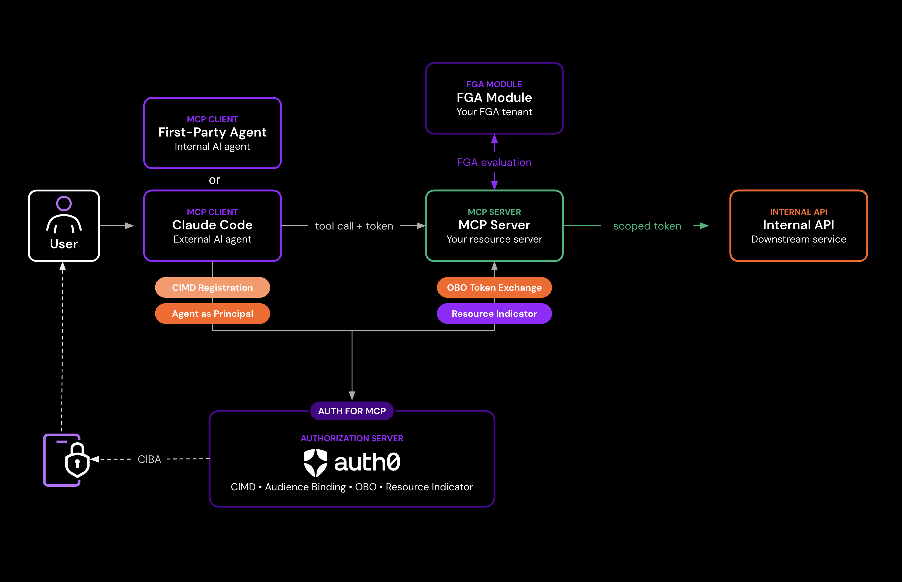

# Securing MCP Servers and AI Agents with Auth0: DevCamp (A4AA)

A hands-on workshop that takes a working enterprise document assistant (**Nexus**) and secures both its MCP server and the agents calling it, first-party and third-party alike. You'll wire up user authentication, Token Vault for CRM credentials, and the full **Auth for MCP** stack across six modules, delivered end-to-end with **Auth0 for AI Agents (A4AA)**. Fine-grained authorization (FGA) runs as a live demo against real Okta FGA.

The chat UI ships pre-built. Every line of code you write is on the identity and authorization layer. Your Auth0 tenant is provisioned for you when you launch, so you won't need any dashboard setup by hand beyond the specific toggles each module calls out.

## Why this lab exists

Nexus exposes four tools through an MCP server: document search, document retrieval, CRM logging, and external sharing. Multiple agents and clients call those tools on behalf of company employees. The server works. What it cannot do is tell those clients apart, prove which employee any of them is acting for, or enforce any policy downstream. This workshop closes that identity gap on both sides of the connection: the MCP server that exposes the tools and the agents calling them. The result is a deployment where every tool call is traceable to a specific employee, every access decision is auditable, and external sharing requires explicit approval.

## What you'll build

| Module | Title | Primitive | Outcome |
|---|--------|-----------|---------|
| 02 | Auth for MCP | RFC 9728 + RFC 8707 + RFC 8693 + Agent as Principal | MCP server becomes a spec-compliant resource server (PRM, 401/403 challenges, audience = its URL); the first-party agent calls it with an OBO token naming the employee (`sub`) and the agent (`act.sub`) |
| 03 | A second agent knocks (third-party onboarding) | Client ID Metadata Document (CIMD) import + reviewed per-app grant + consent + a second Agent as Principal identity | A partner's agent registers by URL, gets only the scopes an admin approves, and is independently auditable, with no shared credential |
| 04 | User Authentication | Auth0 Universal Login, `express-oauth2-jwt-bearer` | Employee logs in, JWT `sub` flows to every downstream tool call |
| 05 | Token Vault | Per-user federated CRM credentials | Agent calls the CRM with the employee's identity, refreshed automatically, never held in agent memory |
| 06 | Async Authorization (CIBA) | Client-Initiated Backchannel Authentication + Auth0 Guardian push | External document shares require out-of-band employee approval with a binding message |
| 07 | Fine-Grained Authorization (live demo) | Real Okta FGA, relationship-based access model | Employees read and share only the documents they are authorized to access, enforced live at the data boundary |

Module 01 covers environment setup and tenant provisioning. Module 07 is FGA. It's already provisioned and enforced live against a real Okta FGA store, so you can see allow and deny decisions land without touching the authorization code. A closing end-to-end run (Module 08) takes one document request through every control, with both agents and Token Vault, at once.

See [`lab-guide/`](./lab-guide/) for the step-by-step participant instructions.



## Repository layout

```
devcamp-a4aa/
├── README.md                     ← you are here
│
├── lab-guide/                    ← step-by-step participant guides
│   ├── overview.md               ← landing page (what you'll do)
│   ├── images/                   ← Dashboard screenshots referenced by the guides
│   ├── 00-introduction.md        ← mission briefing (read during kickoff)
│   ├── 01-prerequisites.md       ← Module 01 (environment setup + tenant provisioning)
│   ├── 02-one-trust-boundary-for-every-agent.md         ← Module 02, Auth for MCP (keystone)
│   ├── 03-a-second-agent-knocks.md                      ← Module 03, third-party agent onboarding (CIMD)
│   ├── 04-every-agent-action-has-an-owner.md            ← Module 04, User Authentication
│   ├── 05-the-agent-acts-as-the-employee,-not-a-shared-bot.md ← Module 05, Token Vault (CRM)
│   ├── 06-humans-approve-what-cant-be-undone.md         ← Module 06, CIBA
│   ├── 07-access-that-knows-where-it-ends.md            ← Module 07, FGA live demo (witnessed)
│   ├── 08-putting-it-all-together.md                    ← closing end-to-end run
│   └── 99-conclusion.md          ← wrap-up (what you shipped, next steps)
│
├── demo-app/                     ← the application, run via GitHub Codespaces
└── mock-crm-service/             ← standalone CRM OAuth2 mock, deployable to Vercel (Module 05 upstream)
```

There is a single living application tree: **`demo-app/`**. Each participant runs their own copy in GitHub Codespaces against their own provisioned Auth0 tenant. Participants work directly against `demo-app/`, guided by `lab-guide/`.

### `demo-app/`

The Nexus application: Express API + MCP server + React frontend, with a one-click in-app flow that provisions the Auth0 footprint for whichever tenant it's pointed at. See [`demo-app/README.md`](./demo-app/README.md) for the full architecture, environment variables, and running instructions.

### `mock-crm-service/`

A standalone, Vercel-deployable mock CRM OAuth2 server and activities API. `demo-app/` also has its own in-process CRM mock (`server/crm/app.js`, used for local/Codespace runs on `:3002`); `mock-crm-service/` is the externally-hosted alternative referenced as the "real upstream OAuth2 registration" in `demo-app/README.md` for anyone who wants the CRM connection to point at a separately running service rather than a co-located process.

## Setup

### Prerequisites

- Node 20+
- An Auth0 tenant (free dev tenant works)
- Optional: an OpenAI API key or LiteLLM proxy for real LLM responses. Without one, the server falls back to a deterministic pattern-matching simulator.

### First-time setup

The lab is built to run in **GitHub Codespaces**: open the repository, start a Codespace, and Node, the editor, and dependencies are already there. This is the only supported path. Auth0 needs a real, publicly reachable URL to call back into for some modules (Token Vault's live CRM exchange in particular), which a local `localhost` setup can't provide; see "Running locally" in [`demo-app/README.md`](./demo-app/README.md#running-locally-not-recommended) if you still want to run it that way for quick iteration.

```bash
cd demo-app
touch .env
# add AUTH0_DOMAIN, AUTH0_MGMT_CLIENT_ID, AUTH0_MGMT_CLIENT_SECRET
npm install
npm run dev
```

`npm run dev` boots:

- **:5173** — Vite dev server for the React app
- **:3000** — Express API
- **:3001** — MCP server
- **:3002** — CRM mock
- **:3003** — Acme Partner Agent (third-party MCP client, serves its CIMD)

See [`demo-app/README.md`](./demo-app/README.md) for the full environment variable reference and production/Docker instructions.

## Running the labs

Each module in `lab-guide/` is self-contained. The in-app lab guide (toggle via the **Lab guide** button in the UI) renders the same markdown with code-copy affordances. Follow them in order; every module builds on the previous one.

Typical loop:

1. Open `lab-guide/0X-...md`.
2. Make the Dashboard/code changes it calls for.
3. Hit the Checkpoint at the bottom of the guide to verify.
4. Move to the next module.

## Demo users

Two employees are seeded with intentionally different document access so the FGA live demo (Module 07) has something to bite on:

| User | Access | What they can do |
|---|---|---|
| `alice@docagent.demo` | Engineering team member; editor on `q3-roadmap` and `product-spec-v2` | Read and share all engineering docs; denied on HR and executive documents |
| `bob@docagent.demo` | All-company viewer only | Read handbook and security policy; denied on engineering, HR, and executive documents |

Confidential documents (`compensation-q3`, `board-deck-q3`) are intentionally unseeded for all demo users to produce clean deny paths.

## What's real vs. simulated

Your Auth0 tenant's footprint is provisioned with one click from inside the app (Module 01). Against that footprint, previously-simulated controls run live, with an in-memory fallback so the app still runs offline.

| Component | Status |
|---|---|
| Auth0 login, JWT validation, OAuth flows | **Real** |
| MCP protocol, OBO token exchange, audience enforcement | **Real** |
| Tenant provisioning (SPA, APIs, MCP server client, Auth for MCP tenant settings, CRM connection) | **Real**, one click from inside the app |
| FGA | **Live** against a real Okta FGA store provisioned per tenant. Witnessed as a live demo (Module 07); in-memory tuples as fallback |
| CIBA | **Real** via Auth0 Guardian push; in-memory approve/deny as fallback for anyone who skips device enrollment |
| Token Vault | **Live** when a CRM federated connection is provisioned for the tenant; in-memory mint and refresh as fallback |
| CRM API | Mocked on `:3002` (or via `mock-crm-service/` when deployed separately) |
| LLM | Real if key is set, simulator otherwise |

## Further reading

- [`demo-app/README.md`](./demo-app/README.md) — application architecture and environment variables
- [Auth0 for AI Agents overview](https://auth0.com/ai)
- [MCP authorization spec (2025-11-25)](https://modelcontextprotocol.io/specification)
- RFC 9728 (Protected Resource Metadata), RFC 8414 (AS Metadata), RFC 8693 (Token Exchange), RFC 8707 (Resource Indicators), RFC 9207 (Issuer Identification)
- OAuth Client ID Metadata Document (draft-ietf-oauth-client-id-metadata-document), as profiled by the MCP 2025-11-25 authorization spec

## TODO: 

- If something errors on provisioning. It should be immediately visible to the user and clear that something was not properly provisioned so they can resolve it
- FGA - FGA should use the always-on tenant by default. How we do that isn't super clear, but I want it to actually use FGA, not fake it unless it HAS to
- Crop out all of the super confusing text. Simple, clear terms.
- All of the one-off 'might happen' use cases should be in their own 'troubleshooting' section per module
- The introduction should have a flow to study and understand. perhaps the same flow from the slide deck. Every module after should highlight which section you're setting up.
- More screenshots and settings? Would that make it longer?
