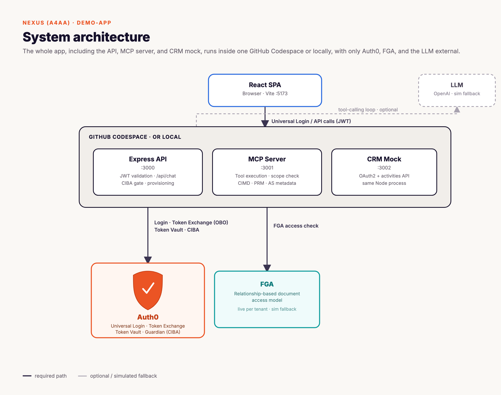

# Nexus (A4AA): demo-app

This is the Nexus devcamp lab's application code. Each participant runs their own copy, in GitHub Codespaces or locally, against their own Auth0 tenant provisioned with one click from inside the app. This is the only living copy of the app: there is no separate starter/solution tree, so participants read [`../lab-guide/`](../lab-guide/) and inspect this codebase directly.

The business case is straightforward: a participant opens a Codespace, clicks one button, and has a fully-configured Nexus environment in minutes rather than an afternoon of manual Dashboard setup.

An earlier local-dev iteration of this workshop (separate `starter/`/`solution/` trees under a different use case) has been retired to [`../archives/`](../archives/) and is no longer maintained.

## Design

| Concern | Behavior |
|---|---|
| Tenancy | One running instance per participant, one Auth0 tenant each |
| Frontend Auth0 config | Fetched at runtime from `GET /api/config` |
| API + MCP JWT validation | Validator built from the tenant's issuer + audience, read from environment |
| Auth0 objects | Provisioned with one click from the in-app **Provision Resources** screen |
| CIBA / FGA / Token Vault | Live Auth0 when provisioned, in-memory simulation as fallback |
| Serving | `npm run dev` in a GitHub Codespace or locally; `build` + `start` and a Dockerfile also available |

## Architecture



### Provisioning and runtime config

```
Browser (Codespace preview, or localhost)
   │  GET /api/config
   ▼
Express  ── Tenant (local-fallback path) ──► reads AUTH0_* from .env
   │                                          │
   │                                          ▼
   │                         Tenant { issuer, clientId, deploymentData{...} }
   ▼
/api/config → { domain, clientId, audience }  ► SPA initializes Auth0
```

The SPA fetches `/api/config` on mount (`src/config/runtimeConfig.jsx`) and gates render until it returns, so the same build initializes Auth0 correctly against whichever tenant this instance is pointed at. Provisioning Auth0 resources (Module 01's **Provision Resources** button) calls `server/platform/provision.js`, which creates the resource servers, M2M client, CIBA client, CRM connection, and, when credentials are supplied, the FGA store, directly against the tenant named in `.env`.

**What provisioning creates:**

1. **Resource servers**: `https://devcamp-docagent-api` (RBAC on, the four per-tool `mcp:*` scopes) and `https://devcamp-mcp-server` (the single `chat:send` scope).
2. **SPA application**: configured for the Codespace or localhost origin.
3. **CIBA client**: Regular web app with the `urn:openid:params:grant-type:ciba` grant, authorized against both resource servers (Module 05).
4. **CRM connection**: A federated OAuth2 connection pointing at the CRM mock (Module 04), created when CRM OAuth credentials are supplied.
5. **FGA store + model**: An Okta FGA store with the document authorization model written (Module 06), created only when FGA credentials are supplied.

Each optional step is wrapped in a `safe()` helper, so a missing credential logs a warning and falls back to simulation rather than aborting provisioning entirely. Two clients, the CIMD native app and the OBO M2M client, are deliberately left for participants to create by hand in Module 02, since walking through that Dashboard flow is the point of the module.

### FGA: live store vs. in-memory simulation

`server/fga/client.js` runs one of two authorization backends behind the same function signature, so `canReadDocument()` and `canShareDocument()` behave identically either way:

- **Live**: when the tenant has a provisioned FGA store (`deploymentData.fga_store_id` + credentials), checks and tuple writes go to a real Okta/Auth0 FGA store via `@openfga/sdk`.
- **Simulated**: otherwise, an in-memory relation-tuple store models the same graph in-process. There's no network call, just a JS array checked directly by the MCP server's tool handlers. This is what runs by default in the Codespace/local lab, since no FGA credentials are required to complete the workshop.

The simulated store is a real graph, not a stub. It holds `{ user, relation, object }` tuples and resolves the same relations the live model enforces: direct `owner` / `editor` / `viewer` grants, plus department membership (`user → member → department`, `department → viewer → document`):

```js
// server/fga/client.js
const tupleStore = [];

function hasDirect(user, relation, object) {
  return tupleStore.some(
    (t) => t.user === user && t.relation === relation && t.object === object
  );
}

function simCanRead(userKey, docKey) {
  if (hasDirect(userKey, "owner", docKey)) return true;
  if (hasDirect(userKey, "editor", docKey)) return true;
  if (hasDirect(userKey, "viewer", docKey)) return true;
  // via department membership
  const userDepts = departmentsUserIsMemberOf(userKey);
  const docDepts = departmentsWithViewerOnDoc(docKey);
  return userDepts.some((d) => docDepts.includes(d));
}
```

Tuples are seeded once per user on first login (`seedTuplesForUser()`), branched by email so the two demo users produce different access decisions: `alice@docagent.demo` gets `member` on `department:engineering` plus `editor` on the engineering docs, `bob@docagent.demo` gets only the all-company `viewer` tuples. `compensation-q3` and `board-deck-q3` are never seeded for anyone, so they're a clean FGA deny for both users. That's the intentional negative-test path in Module 06.

## Repository layout

```
demo-app/
├── README.md                     ← you are here
├── Dockerfile                    ← single-host production image
├── .env.sample                   ← all vars, documented
├── package.json                  ← dev / build / start scripts
│
├── scripts/
│   ├── find-port.js              ← auto-selects free ports at startup
│   ├── test-hooks.js             ← manual hook payload tester
│   └── test-provision.js         ← manual provisioning smoke test
│
├── server/
│   ├── index.js                  ← API :3000, mounts hooks + tenant middleware + /api/config + static SPA
│   ├── llm.js                    ← OpenAI tool-calling loop, tenant-threaded
│   ├── simulator.js              ← pattern-matching fallback when no API key
│   │
│   ├── platform/
│   │   ├── hooks.js              ← request / create / update / destroy lifecycle
│   │   ├── auth0Management.js    ← Management API helpers (resource servers, clients, grants, connections)
│   │   ├── fgaProvision.js       ← FGA store + model creation
│   │   ├── provision.js          ← Auth0 resource provisioning
│   │   ├── tenant.js             ← Tenant model + deploymentData shape
│   │   ├── tenantResolver.js     ← subdomain → bootstrap → cached Tenant, Express middleware
│   │   └── jwt.js                ← per-(issuer,audience) JWT validator cache + token decode helpers
│   │
│   ├── middleware/
│   │   ├── auth.js               ← [Module 03] JWT validation
│   │   ├── agent-auth.js         ← [Module 02] MCP bearer token validation
│   │   └── ciba.js               ← [Module 05] live /bc-authorize + poll, simulation fallback
│   │
│   ├── fga/
│   │   ├── model.js              ← [Module 06] document relationship model (sim) + FGA_AUTH_MODEL (live)
│   │   └── client.js             ← [Module 06] live OpenFGA checks, simulation fallback
│   │
│   ├── token-vault/
│   │   └── vault.js              ← [Module 04] live federated CRM token exchange, simulation fallback
│   │
│   ├── crm/
│   │   └── app.js                ← mock CRM OAuth2 server + activities API (:3002)
│   │
│   ├── mcp/
│   │   ├── server.js             ← [Module 02] MCP server :3001, token validation + scope enforcement
│   │   ├── client.js             ← [Module 02] OBO token exchange
│   │   ├── cimd.js               ← [Module 02] Client ID Metadata Document endpoint
│   │   ├── metadata.js           ← [Module 02] PRM (RFC 9728) + AS metadata (RFC 8414)
│   │   └── toolLog.js            ← structured tool call event log (streamed to the UI)
│   │
│   ├── tools/
│   │   └── registry.js           ← framework-agnostic tool definitions shared by llm.js + simulator.js
│   │
│   ├── utils/
│   │   └── port.js               ← port resolution helper
│   │
│   └── routes/guide.js           ← serves the in-app lab guide markdown
│
└── src/                          ← React frontend (Vite + JS)
    ├── App.jsx                   ← auth gate, layout shell, setup orchestration
    ├── main.jsx                  ← RuntimeConfigProvider → Auth0Provider → App
    ├── config/runtimeConfig.jsx  ← fetches /api/config, gates render
    ├── auth/Auth0Provider.jsx    ← consumes runtime config (no VITE_AUTH0_* at build time)
    ├── components/
    │   ├── Chat.jsx               ← chat surface
    │   ├── Message.jsx            ← user / assistant message bubbles
    │   ├── ToolApproval.jsx       ← CIBA binding-message approval card
    │   ├── ToolLogs.jsx           ← live tool call event panel
    │   ├── ToolTester.jsx         ← manual tool testing UI
    │   ├── MCPStatus.jsx          ← MCP server connection status indicator
    │   ├── LabGuide.jsx           ← in-app lab guide viewer
    │   ├── LoginScreen.jsx        ← pre-auth landing screen
    │   ├── SetupBanner.jsx        ← environment variable setup screen
    │   └── ProvisionPanel.jsx     ← Auth0 resource provisioning screen
    └── hooks/useChat.js          ← chat state + CIBA polling, uses runtime audience
```

## Running

### GitHub Codespaces or local

This is how the lab is actually delivered: one participant runs one Codespace (or a local checkout) against one Auth0 tenant.

```bash
cp .env.sample .env
# fill in AUTH0_DOMAIN, AUTH0_MGMT_CLIENT_ID, AUTH0_MGMT_CLIENT_SECRET
npm install
npm run dev
```

`npm run dev` boots Vite (frontend) plus the Express API on :3000, the MCP server on :3001, and the CRM mock on :3002. Without an `OPENAI_API_KEY` the agent uses the deterministic pattern-matching simulator. See [`../lab-guide/01-prerequisites.md`](../lab-guide/01-prerequisites.md) for the full participant-facing walkthrough, including where the initial `.env` values come from and the in-app **Provision Resources** step.

### Environment variables

Every variable is documented in [`.env.sample`](./.env.sample). The short version:

| Group | Vars |
|---|---|
| Ports | `PORT`, `MCP_SERVER_PORT`, `THIRD_PARTY_API_PORT` |
| Auth0 | `AUTH0_DOMAIN`, `AUTH0_MGMT_CLIENT_ID`, `AUTH0_MGMT_CLIENT_SECRET`, `AUTH0_AUDIENCE`, `MCP_AUTH0_AUDIENCE`, `AUTH0_OBO_CLIENT_ID`, `AUTH0_OBO_CLIENT_SECRET`, `AUTH0_CIBA_CLIENT_ID`, `AUTH0_CIBA_CLIENT_SECRET` |
| Resource servers | `BACKEND_API_IDENTIFIER`, `MCP_API_IDENTIFIER` |
| FGA (Module 06) | `FGA_API_URL`, `FGA_API_AUDIENCE`, `FGA_API_TOKEN_ISSUER`, `FGA_CLIENT_ID`, `FGA_CLIENT_SECRET` |
| CRM connection (Module 04) | `CRM_CLIENT_ID`, `CRM_CLIENT_SECRET` |
| LLM | `OPENAI_API_KEY`, `OPENAI_BASE_URL`, `LLM_MODEL` |

`.env*` is gitignored; only `.env.sample` is tracked.

## What's live vs. simulated

This app runs each previously-simulated module against real Auth0 once your tenant has the matching provisioned configuration, and gracefully falls back to in-memory simulation otherwise so the app continues to run offline.

| Component | Live when... | Fallback |
|---|---|---|
| Auth0 login, JWT validation, OBO token exchange | Always (real) | n/a |
| FGA | `FGA_*` credentials set and the store is provisioned | In-memory document tuples |
| Token Vault | A CRM federated connection is provisioned + employee access token present | Simulates minting and refresh |
| CIBA | `AUTH0_CIBA_CLIENT_ID` is set | In-memory approve/deny via `/api/ciba/*` |
| CRM API | Mocked on :3002 | same |
| LLM | `OPENAI_API_KEY` set | Pattern-matching simulator |

## Production and Docker

```bash
npm run build      # vite build → dist/
npm run start      # serves dist/ + /api + MCP + CRM mock on one host
```

When `dist/` exists, `server/index.js` serves the static SPA with a fallback that excludes `/api` and `/hooks`. The MCP server and CRM mock run on internal localhost ports within the same process.

The multi-stage `Dockerfile` builds the SPA and runs the server via `node`:

```bash
docker build -t nexus-a4aa .
docker run -p 3000:3000 --env-file .env nexus-a4aa
```

## Verifying the integration

1. **Runtime config**: Hit `GET /api/config` and confirm it returns your tenant's `domain`, `clientId`, and `audience`.
2. **End-to-end**: Provision resources, then verify login (SPA), `/api/chat` JWT validation, MCP OBO exchange (Module 02), FGA allow/deny (Module 06), a Token Vault CRM call (Module 04), and CIBA approve/deny (Module 05).

## Further reading

- [`../README.md`](../README.md): workshop overview and the modules
- [`../lab-guide/`](../lab-guide/): step-by-step participant guides
- [Auth0 for AI Agents](https://auth0.com/ai)
- RFC 9728 (Protected Resource Metadata), RFC 8414 (AS Metadata), RFC 8693 (Token Exchange), RFC 8707 (Resource Indicators)
