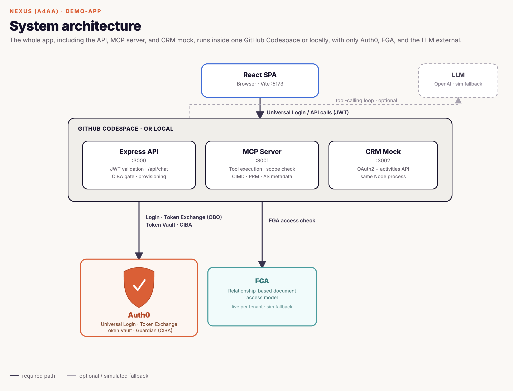

# Nexus (A4AA): demo-app

This is the Nexus devcamp lab's application code. Each participant runs their own copy in GitHub Codespaces against their own Auth0 tenant, provisioned with one click from inside the app. This is the only living copy of the app: there is no separate starter/solution tree, so participants read [`../lab-guide/`](../lab-guide/) and inspect this codebase directly. (Running locally instead of Codespaces is possible but not recommended; see "Running locally" below.)

The business case is straightforward: a participant opens a Codespace, clicks one button, and has a fully-configured Nexus environment in minutes rather than an afternoon of manual Dashboard setup.

An earlier local-dev iteration of this workshop (separate `starter/`/`solution/` trees under a different use case) has been retired to [`../archives/`](../archives/) and is no longer maintained.

## Design

| Concern | Behavior |
|---|---|
| Tenancy | One running instance per participant, one Auth0 tenant each |
| Frontend Auth0 config | Fetched at runtime from `GET /api/config` |
| API + MCP JWT validation | Validator built from the tenant's issuer + audience, read from environment |
| Auth0 objects | Provisioned with one click from the in-app **Provision Resources** screen |
| CIBA / FGA / Token Vault | Live Auth0 when provisioned, in-memory simulation as fallback |
| Serving | `npm run dev` in a GitHub Codespace (locally works but loses live Token Vault); `build` + `start` and a Dockerfile also available |

## Architecture



### Provisioning and runtime config

```
Browser (Codespace preview, or localhost)
   │  GET /api/config
   ▼
Express  ── Tenant (local-fallback path) ──► reads AUTH0_* from .env
   │                                          │
   │                                          ▼
   │                         Tenant { issuer, clientId, deploymentData{...} }
   ▼
/api/config → { domain, clientId, audience }  ► SPA initializes Auth0
```

The SPA fetches `/api/config` on mount (`src/config/runtimeConfig.jsx`) and gates render until it returns, so the same build initializes Auth0 correctly against whichever tenant this instance is pointed at. Provisioning Auth0 resources (Module 01's **Provision Resources** button) calls `server/platform/provision.js`, which creates the resource servers, the MCP server's Custom API client, CIBA client, CRM connection, and, when credentials are supplied, the FGA store, directly against the tenant named in `.env`.

**What provisioning creates:**

1. **Resource servers**:
   - **Nexus MCP Server**: identifier = the MCP server's public URL (Codespace port 3001; `AUTH0_TOOL_AUDIENCE`). RBAC on, the five per-tool `mcp:*` scopes, `agent_subject_claims: auth0-v1`, and per-app authorization for user-delegated access. This is the `resource` the server's PRM advertises and the `aud` it validates.
   - **Nexus Agent API**: `https://devcamp-nexus-agent-api` (`AUTH0_AUDIENCE`), the single `chat:send` scope. The SPA logs in for this audience; the Nexus backend exchanges it (OBO) for MCP server tokens.
   - **nexus-mcp-server-codespace**: the MCP server's own Custom API client with the Token Vault grant (`MCP_SERVER_CLIENT_ID`/`_SECRET`).
   - **Tenant settings**: Resource Parameter Compatibility Profile, Include Issuer in Authorization Responses, and Client ID Metadata Document Registration; `Username-Password-Authentication` promoted to a domain-level connection (required by third-party/CIMD clients).
2. **SPA application**: configured for the Codespace or localhost origin.
3. **CIBA client**: Regular web app with the `urn:openid:params:grant-type:ciba` grant, authorized against both resource servers (Module 05).
4. **CRM connection**: A federated OAuth2 connection pointing at the CRM mock (Module 04), created when CRM OAuth credentials are supplied.
5. **FGA store + model**: An Okta FGA store with the document authorization model written (Module 06), created only when FGA credentials are supplied.

Each optional step is wrapped in a `safe()` helper, so a missing credential logs a warning and falls back to simulation rather than aborting provisioning entirely. Both agent records (Agent as Principal), the OBO Custom API client, and Acme's CIMD client are deliberately left for participants to create by hand in Modules 02 and 03, since walking through those Dashboard flows is the point of the modules.

### FGA: live store vs. in-memory simulation

`server/fga/client.js` runs one of two authorization backends behind the same function signature, so `canReadDocument()` and `canShareDocument()` behave identically either way:

- **Live**: when the tenant has a provisioned FGA store (`deploymentData.fga_store_id` + credentials), checks and tuple writes go to a real Okta/Auth0 FGA store via `@openfga/sdk`.
- **Simulated**: otherwise, an in-memory relation-tuple store models the same graph in-process. There's no network call, just a JS array checked directly by the MCP server's tool handlers. This is what runs by default in the Codespace/local lab, since no FGA credentials are required to complete the workshop.

The simulated store is a real graph, not a stub. It holds `{ user, relation, object }` tuples and resolves the same relations the live model enforces: direct `owner` / `editor` / `viewer` grants, plus department membership (`user → member → department`, `department → viewer → document`):

```js
// server/fga/client.js
const tupleStore = [];

function hasDirect(user, relation, object) {
  return tupleStore.some(
    (t) => t.user === user && t.relation === relation && t.object === object
  );
}

function simCanRead(userKey, docKey) {
  if (hasDirect(userKey, "owner", docKey)) return true;
  if (hasDirect(userKey, "editor", docKey)) return true;
  if (hasDirect(userKey, "viewer", docKey)) return true;
  // via department membership
  const userDepts = departmentsUserIsMemberOf(userKey);
  const docDepts = departmentsWithViewerOnDoc(docKey);
  return userDepts.some((d) => docDepts.includes(d));
}
```

Tuples are seeded on first tool call per user (`seedTuplesForUser()`), branched by identity so the two demo users produce different access decisions: `alice@docagent.demo` gets `member` on `department:engineering` plus `editor` on the engineering docs, `bob@docagent.demo` gets only the all-company `viewer` tuples. `compensation-q3` and `board-deck-q3` are never seeded for anyone, so they're a clean FGA deny for both users. That's the intentional negative-test path in Module 06.

Access tokens for a custom API audience don't carry an `email` claim by default, so the branch can't rely on that. It matches the user's `sub` against `deploymentData.demo_users` (the demo user IDs recorded at provisioning time in `provision.js`), falling back to email only if a token happens to carry one. Seeding also self-corrects rather than caching a plain "already seeded" boolean: it re-derives the user's identity on every call and, if that identity differs from what was seeded last time, removes the stale tuples and writes the correct ones. That matters because `demoUsers.bob` only round-trips through `.env` after a provisioning run (see `deploymentDataToEnvVars()`), so a user seeded before that data existed would otherwise keep incorrect grants for the life of the process.

The current tuple graph is inspectable at runtime via the **FGA Tuples** tab in the app (`GET /api/fga/tuples`, `listTuples()` in `client.js`), which shows `live: true` with an empty list when a real FGA store is provisioned, since those tuples live in Okta FGA rather than this process.

## Repository layout

```
demo-app/
├── README.md                     ← you are here
├── Dockerfile                    ← single-host production image
├── package.json                  ← dev / build / start scripts
│
├── scripts/
│   ├── find-port.js              ← auto-selects free ports at startup
│   ├── test-hooks.js             ← manual hook payload tester
│   └── test-provision.js         ← manual provisioning smoke test
│
├── server/
│   ├── index.js                  ← API :3000, mounts hooks + tenant middleware + /api/config + static SPA
│   ├── llm.js                    ← OpenAI tool-calling loop, tenant-threaded
│   ├── llm/
│   │   ├── prompts.js             ← system prompt for the real-LLM path
│   │   └── tools.js               ← tool registry converted to OpenAI function-calling format
│   ├── simulator.js              ← pattern-matching fallback when no API key
│   │
│   ├── platform/
│   │   ├── hooks.js              ← request / create / update / destroy lifecycle
│   │   ├── auth0Management.js    ← Management API helpers (resource servers, clients, grants, connections)
│   │   ├── fgaProvision.js       ← FGA store + model creation
│   │   ├── provision.js          ← Auth0 resource provisioning
│   │   ├── tenant.js             ← Tenant model + deploymentData shape
│   │   ├── tenantResolver.js     ← subdomain → bootstrap → cached Tenant, Express middleware
│   │   └── jwt.js                ← per-(issuer,audience) JWT validator cache + token decode helpers
│   │
│   ├── middleware/
│   │   ├── auth.js               ← [Module 03] JWT validation for /api/*
│   │   ├── agent-auth.js         ← per-tool scope + CIBA consent check (checkToolAuthorization)
│   │   └── ciba.js               ← [Module 05] live /bc-authorize + poll, simulation fallback
│   │
│   ├── fga/
│   │   ├── model.js              ← [Module 06] document relationship model (sim) + FGA_AUTH_MODEL (live)
│   │   └── client.js             ← [Module 06] live OpenFGA checks, simulation fallback
│   │
│   ├── token-vault/
│   │   └── vault.js              ← [Module 04] live federated CRM token exchange, simulation fallback
│   │
│   ├── crm/
│   │   └── app.js                ← mock CRM OAuth2 server + activities API (:3002)
│   │
│   ├── acme/                     ← [Module 03] third-party agent, its own server (:3003)
│   │   ├── app.js                ← PRM discovery, Auth Code + PKCE with `resource`, tool calls
│   │   ├── cimd.js               ← Acme's Client ID Metadata Document (its client_id)
│   │   └── pkce.js               ← RFC 7636 helper
│   │
│   ├── mcp/
│   │   ├── server.js             ← [Module 02] MCP server :3001, token validation + scope enforcement
│   │   ├── client.js             ← [Module 02] OBO token exchange
│   │   ├── metadata.js           ← [Module 02] Protected Resource Metadata (RFC 9728); AS metadata comes from Auth0 itself
│   │   └── toolLog.js            ← structured tool call event log (streamed to the UI)
│   │
│   ├── tools/
│   │   └── registry.js           ← framework-agnostic tool definitions shared by llm.js + simulator.js
│   │
│   ├── utils/
│   │   ├── port.js               ← port resolution helper
│   │   ├── publicUrl.js          ← public origin per port (Codespace forwarded URLs vs localhost)
│   │   └── wrongPortPage.js      ← themed fallback page when the API/MCP/CRM ports are opened directly
│   │
│   └── routes/guide.js           ← serves in-app lab guide markdown; LABS maps file → internal module id → title
│
└── src/                          ← React frontend (Vite + JS)
    ├── App.jsx                   ← auth gate, layout shell, tab switcher
    ├── main.jsx                  ← RuntimeConfigProvider → Auth0Provider → App
    ├── config/runtimeConfig.jsx  ← fetches /api/config, gates render
    ├── auth/Auth0Provider.jsx    ← consumes runtime config (no VITE_AUTH0_* at build time)
    ├── components/
    │   ├── Chat.jsx               ← chat surface + suggested-prompt chips
    │   ├── Message.jsx            ← user / assistant bubbles, tool-call chips (success / denied / error)
    │   ├── ToolApproval.jsx       ← CIBA binding-message approval card
    │   ├── ToolLogs.jsx           ← live tool call event panel
    │   ├── ToolTester.jsx         ← manual tool testing UI (direct tool + params, bypasses NL intent)
    │   ├── FGATuples.jsx          ← live view of the simulated FGA tuple graph (/api/fga/tuples)
    │   ├── MCPStatus.jsx          ← MCP server connection status indicator
    │   ├── LabGuide.jsx           ← in-app lab guide viewer, renders lab-guide/*.md
    │   ├── ModuleChecks.jsx       ← per-module Run Checks verifier + the Module 06 FGA quiz
    │   ├── ProgressTracker.jsx    ← "Lab Progress" sidebar, one row per module, embeds ModuleChecks
    │   ├── Module01Panel.jsx      ← Agent as Principal + OBO client credential setup UI for Auth for MCP (Module 02)
    │   ├── VaultStatus.jsx        ← Connected Accounts / Token Vault link status + Connect button
    │   ├── LoginScreen.jsx        ← pre-auth landing screen
    │   ├── SetupBanner.jsx        ← environment variable setup screen
    │   ├── ProvisionPanel.jsx     ← Auth0 resource provisioning screen
    │   └── RestartLabButton.jsx   ← calls /api/setup/restart to deprovision + reset local progress
    ├── hooks/
    │   ├── useChat.js             ← chat state + CIBA polling, uses runtime audience
    │   └── useLabProgress.jsx     ← per-module pass/fail state, persisted to localStorage
    └── styles/
        ├── index.css              ← app theme (dark, purple accent) + all component styles
        └── lab-guide.css          ← styling for the rendered lab guide markdown
```

Module numbering note: `ModuleChecks`/`ProgressTracker` use an internal 0-indexed `moduleId` ("00".."06") that is one behind the lab guide files' own number prefix, since `00-introduction.md` has no automated check. `server/routes/guide.js`'s `LABS` array is the single source of truth mapping a real `lab-guide/*.md` filename to that internal id and to the display title shown in the guide viewer.

## Running

### GitHub Codespaces (recommended, and how the lab is delivered)

One participant runs one Codespace against one Auth0 tenant. This is the only supported path: Codespaces gives every process a real, publicly reachable HTTPS URL, which several modules depend on (see "Running locally" below for why that matters).

```bash
touch .env
# add AUTH0_DOMAIN, AUTH0_MGMT_CLIENT_ID, AUTH0_MGMT_CLIENT_SECRET
npm install
npm run dev
```

There's no `.env.sample` to copy; create the file yourself. If you start the app before adding these three values, the setup screen tells you exactly which ones are missing.

`npm run dev` boots Vite (frontend) plus the Express API on :3000, the MCP server on :3001, the CRM mock on :3002, and the Acme partner agent on :3003. Ports 3001, 3002, and 3003 must be **public** in the Codespace (the devcontainer tries to set this for you): Auth0 calls the CRM mock, fetches Acme's CIMD, and the MCP server's URL is its resource identifier. Without an `OPENAI_API_KEY` the agent uses the deterministic pattern-matching simulator. See [`../lab-guide/01-prerequisites.md`](../lab-guide/01-prerequisites.md) for the full participant-facing walkthrough, including where the initial `.env` values come from and the in-app **Provision Resources** step.

### Running locally (not recommended)

The same `npm install && npm run dev` works against `localhost`, but plan on losing functionality, not just convenience. Auth0 is a cloud service: it cannot open a connection to your laptop, so anything that depends on Auth0 (or a browser redirect flow) reaching *back into* the app breaks the moment there's no public URL for it to reach:

- **Token Vault's live federated CRM exchange (Module 04) does not work at all.** The CRM mock's OAuth2 endpoints run on `localhost:3002`, and Auth0 cannot call back to it to complete the flow. The app falls back to the in-memory simulation automatically, so the module still runs, but you're exercising the fallback path, not the real integration.
- Anyone testing from a different machine, or comparing notes with another participant, cannot reach your `localhost` origin at all.
- **Third-party onboarding (Module 03) does not work.** Auth0 rejects `localhost` CIMD URLs, so Acme's metadata can't be imported unless you expose it through a tunnel and set `ACME_CIMD_URL`.
- Every other module (login, MCP OBO exchange, CIBA, FGA) still works locally, since those don't require Auth0 to call back into the app.

Use this for quick edit-and-reload iteration on code that doesn't touch Token Vault, not as a substitute for the Codespace when actually working through the lab or demoing it end to end.

### Environment variables

Only `AUTH0_DOMAIN`, `AUTH0_MGMT_CLIENT_ID`, and `AUTH0_MGMT_CLIENT_SECRET` need to be set by hand; everything else below gets written to `.env` automatically by the in-app **Provision Resources** step. The full set:

| Group | Vars |
|---|---|
| Ports | `PORT`, `MCP_SERVER_PORT`, `CRM_PORT`, `ACME_SERVER_PORT` |
| Auth0 | `AUTH0_DOMAIN`, `AUTH0_MGMT_CLIENT_ID`, `AUTH0_MGMT_CLIENT_SECRET`, `AUTH0_AUDIENCE` (Nexus Agent API), `AUTH0_TOOL_AUDIENCE` (Nexus MCP Server identifier), `AUTH0_OBO_CLIENT_ID`, `AUTH0_OBO_CLIENT_SECRET`, `MCP_SERVER_CLIENT_ID`, `MCP_SERVER_CLIENT_SECRET`, `AUTH0_CIBA_CLIENT_ID`, `AUTH0_CIBA_CLIENT_SECRET` |
| Resource servers | `AGENT_API_IDENTIFIER` (default `https://devcamp-nexus-agent-api`), `MCP_RESOURCE_URI` (default: the MCP server's public URL) |
| Third-party agent | `ACME_CIMD_URL` (override Acme's CIMD URL, e.g. a tunnel when not in Codespaces), `ACME_MCP_SERVER_URL` |
| FGA (Module 06) | `FGA_API_URL`, `FGA_API_AUDIENCE`, `FGA_API_TOKEN_ISSUER`, `FGA_CLIENT_ID`, `FGA_CLIENT_SECRET` |
| CRM connection (Module 04) | `CRM_CLIENT_ID`, `CRM_CLIENT_SECRET` |
| LLM | `OPENAI_API_KEY`, `OPENAI_BASE_URL`, `LLM_MODEL` |

`.env*` is entirely gitignored; there is no sample file committed to the repo. Create `.env` yourself (see "Running" above).

## What's live vs. simulated

This app runs each previously-simulated module against real Auth0 once your tenant has the matching provisioned configuration, and gracefully falls back to in-memory simulation otherwise so the app continues to run offline.

| Component | Live when... | Fallback |
|---|---|---|
| Auth0 login, JWT validation, OBO token exchange | Always (real) | n/a |
| FGA | `FGA_*` credentials set and the store is provisioned | In-memory document tuples |
| Token Vault | A CRM federated connection is provisioned + employee access token present | Simulates minting and refresh |
| CIBA | `AUTH0_CIBA_CLIENT_ID` is set | In-memory approve/deny via `/api/ciba/*` |
| CRM API | Mocked on :3002 | same |
| LLM | `OPENAI_API_KEY` set | Pattern-matching simulator |

## Production and Docker

```bash
npm run build      # vite build → dist/
npm run start      # serves dist/ + /api + MCP + CRM mock on one host
```

When `dist/` exists, `server/index.js` serves the static SPA with a fallback that excludes `/api` and `/hooks`. The MCP server and CRM mock run on internal localhost ports within the same process.

The multi-stage `Dockerfile` builds the SPA and runs the server via `node`:

```bash
docker build -t nexus-a4aa .
docker run -p 3000:3000 --env-file .env nexus-a4aa
```

## Verifying the integration

1. **Runtime config**: Hit `GET /api/config` and confirm it returns your tenant's `domain`, `clientId`, and `audience`.
2. **End-to-end**: Provision resources, then verify login (SPA), `/api/chat` JWT validation, MCP OBO exchange (Module 02), FGA allow/deny (Module 06), a Token Vault CRM call (Module 04), and CIBA approve/deny (Module 05).

## Further reading

- [`../README.md`](../README.md): workshop overview and the modules
- [`../lab-guide/`](../lab-guide/): step-by-step participant guides
- [Auth0 for AI Agents](https://auth0.com/ai)
- RFC 9728 (Protected Resource Metadata), RFC 8414 (AS Metadata), RFC 8693 (Token Exchange), RFC 8707 (Resource Indicators)
