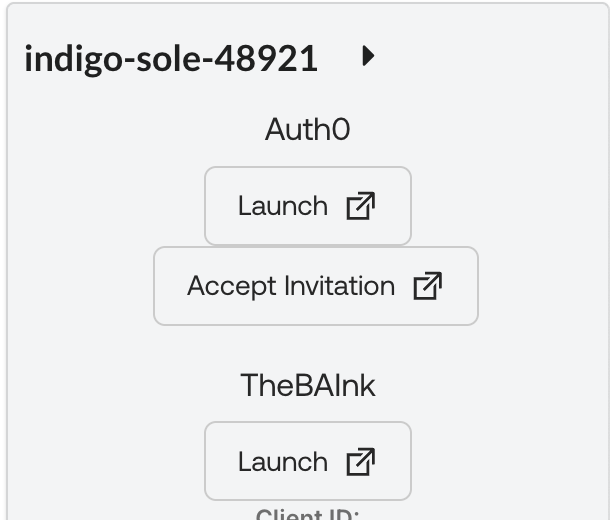
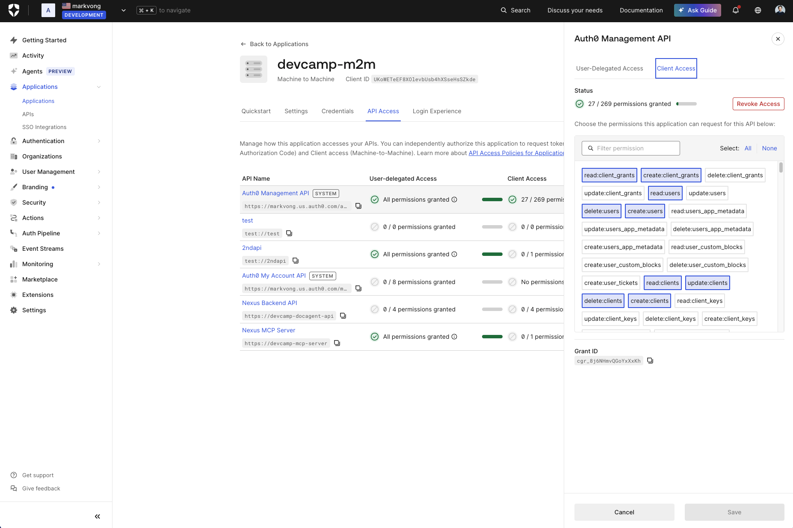
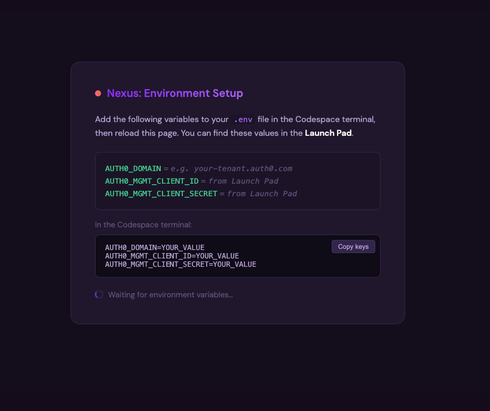
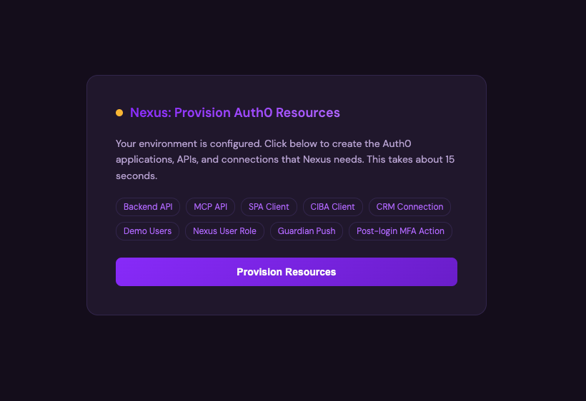
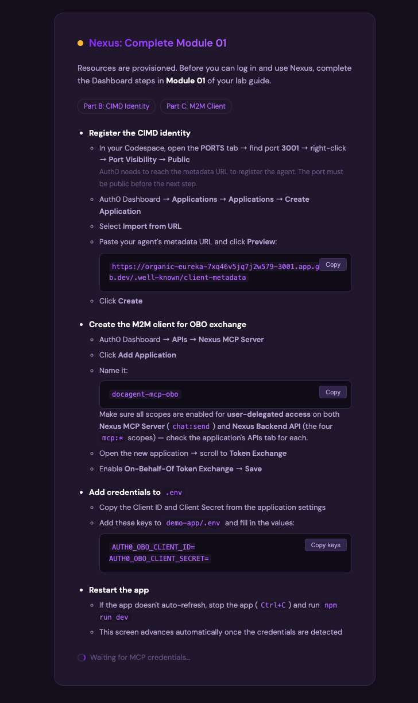
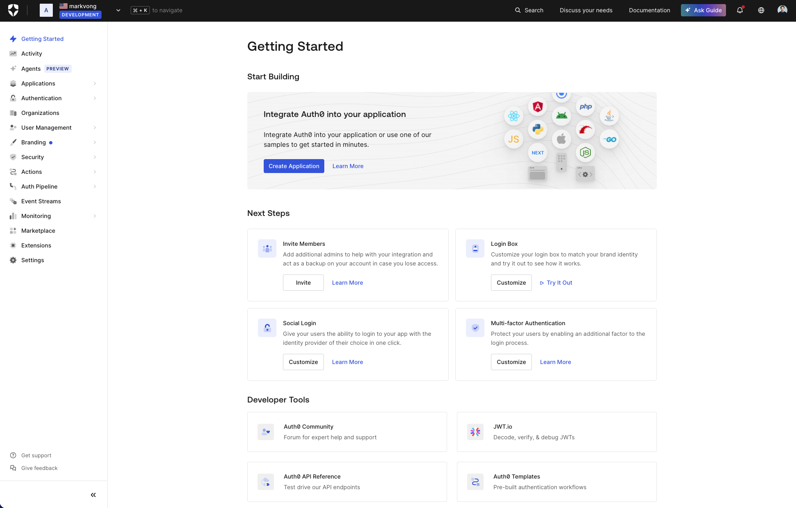

## Sign in to your Auth0 account

As part of the provisioning process for your Auth0 tenant, an Auth0 admin was created that corresponds to the email address you used to sign in to this very platform (https://labs.demo.okta.com).

> [!IMPORTANT]
> Your Auth0 tenant will be available for *thirty (30) days* for exploration and development.

To activate your tenant, follow these instructions:

1. From the Launch Pad on the right of the screen, click on **Accept Invitation**.
2. Follow the instructions to accept the invitation.
3. Upon successful acceptance of the invitation, you will land in your newly created Auth0 tenant.



> [!NOTE]
> Your Auth0 tenant is created for you when you launch the lab, and your management credentials are available in the Launch Pad. 
> You will provision the Nexus resources (backend API, MCP resource server, agent client, CRM OAuth2 connection, and where available, a Fine-Grained Authorization (FGA) store and a Client-Initiated Backchannel Authentication (CIBA) client) with one click directly from the app in the next section. 
> Three capabilities (**OBO token exchange**, **Token Vault on the CRM connection**, and **CIBA**) require a one-time toggle in the Auth0 Dashboard. 
> Each module guides you to the exact setting when you need it.

## Navigating your Lab Guide

Before we get started, here is some information about the **Labs.Demo.Okta** platform you are using today.

### Outline

On the left of the screen, you will find an outline of today's lab which also serves as your navigation control panel. This Dev{Camps} Agentic AI workshop consists of **seven interactive (7)** **modules**, where the final module is a closing end-to-end run. Each module contains **tasks** with **steps**. You can collapse the outline at any time by clicking on the arrow icon.

At the bottom of each section, there's a handy control to navigate forward and backward between sections. You can also simply click on different sections (and subsections) to navigate freely.

### Launch Pad

On the right of the screen, you will find an easy way to launch your lab resources. Each resource has its own launch button along with the tenant names and credentials (where applicable).

### Dynamic Lab Guide Variables

In addition to the ability to copy credentials from the Launch Pad, we've also produced this lab guide using *dynamic variables*. Some variables (*not all*) will display values *specific* to your lab environment. For example, your tenant domain: `{{idp.tenantDomain}}`.

> [!NOTE]
> If you see what appears as though it *should* be a dynamic variable, you'll be able to tell by the curly braces: <kbd>{{...}}</kbd>.
>
> Technology isn't perfect! Chances are something went awry and the variable did not populate.

### Need Help?

If at any point, you need guidance from any of our lab assistants, please click on the **Request Help** button from the Launch Pad. One of our assistants will be notified.


### Just a few things...

- Throughout the lab you will see various types of alerts/panels like the following.

  They provide useful information. Take a minute to familiarize yourself with their intent so you know which ones you should *really* pay attention to.

  > [!NOTE]
  > Useful information that might help you.

  > [!TIP]
  > Helpful advice for doing things better or more easily.

  > [!IMPORTANT]
  > Key information you may need to know to complete the lab.

  > [!WARNING]
  > Urgent info that needs your immediate attention to avoid problems.

  > [!CAUTION]
  > Advises about risks or negative outcomes of certain actions.

<br>

**Phew!** 😮‍💨 *Now that all of that is out of the way,* <span>let's set up your environment!</span>

## Your lab environment

Above, you activated your Auth0 tenant. The lab is designed to run in **GitHub Codespaces**, a cloud development environment that opens in your browser. There is nothing to install and everything should be pre-configured. *The application may run locally on your own machine if you prefer (Node.js 20+ required).* The steps below are the same either way.

> [!NOTE]
> **Running locally instead of Codespaces?** 
> 1. Clone the repository
> 2. Open a terminal in the `demo-app/` directory
> 3. Follow the same steps below. 
> All modules work locally **except the live Token Vault path in *The agent acts as the employee, not a shared bot***. Auth0 as a cloud service cannot reach `localhost:3002` to perform the CRM OAuth flow, so the vault falls back to the in-memory simulation. Everything else, including login, MCP, CIBA, and FGA, works exactly as described.

#### *It is important that the requirements are met in order for your participation in the lab to be successful.*

## Prerequisites

Because the environment lives in the cloud, the list is short. You need:

- **A GitHub account**, used to launch and run the Codespace.
- **A modern web browser** (a current version of Chrome, Edge, Firefox, or Safari).
- **A stable internet connection.** If you are typically on a corporate VPN that restricts access to GitHub or Auth0, *please disable the VPN for this lab.*
- **Access to your Auth0 tenant** (activated above).
- Download **Auth0 Guardian app** on your mobile device
    | App Store                                    | Google Play                                    |
    | -------------------------------------------- | ---------------------------------------------- |
    |  |  |

> [!NOTE]
> You do **not** need to install Node.js, a code editor, or any project dependencies on your own machine. The Codespace ships with all of them preconfigured. There are no laptop hardware or operating-system requirements beyond running a current browser.

## Launch your Codespace

1. From the Launch Pad in the Lab Guide, open the repository link for the lab.
2. Start a Codespace on the repository (**Code > Codespaces > Create codespace on the lab branch**).
3. Wait for the environment to finish building. When it is ready you will have a full VS Code editor and terminal in your browser, with the project already cloned and its dependencies installed.

> [!TIP]
> Prefer your own editor? You can connect the desktop VS Code app to a running Codespace, but it is not required. Everything in this lab works from the in-browser editor.

> [!TIP]
> **Already have a Codespace open?** If the lab material has been updated since you created it, make sure to pull the latest changes in the terminal before starting:
> ```bash
> git pull
> cd demo-app && npm install
> ```
> Then restart the app with `npm run dev`.

## Configure and provision your environment

Once the Codespace finishes building, open a terminal. Set up your credentials **before** starting the app, so you never have to stop a running server partway through to fix a file path.

### Step 1: install dependencies and add your credentials to the newly created `.env`

```bash
cd demo-app
npm install
touch .env
```

> [!NOTE]
> `npm install` will likely print a line like `X vulnerabilities (...)` when it finishes. This refers to pre-existing advisories in third-party lab dependencies. It's expected in this environment and safe to ignore. Do not run `npm audit fix`.

You already ran `cd demo-app` above, so the new file is at `demo-app/.env` on disk, but shows up simply as `.env` in your Codespace file tree and in any `cd demo-app`-relative terminal command.

Open `.env` in the editor and paste in the three values Nexus needs to connect to your Auth0 tenant, copying each from the **Launch Pad** on the right side of the screen:

```
AUTH0_DOMAIN=<your-tenant-name>.cic-demo-platform.auth0app.com
AUTH0_MGMT_CLIENT_ID=<management-client-id>
AUTH0_MGMT_CLIENT_SECRET=<management-client-secret>
```

> [!TIP]
> Your actual domain will look like `aquamarine-koala-16644.cic-demo-platform.auth0app.com`. The Launch Pad shows the exact value for your tenant, so copy it from there instead of typing it by hand.

**If the credentials are not shown in the Launch Pad,** navigate to the Auth0 dashboard and create a custom M2M client with the following permissions, then use its Client ID and Secret in place of the Launch Pad values above:

```
read:resource_servers
create:resource_servers
delete:resource_servers
read:clients
create:clients
update:clients
delete:clients
read:client_grants
create:client_grants
read:connections
create:connections
delete:connections
read:users
create:users
delete:users
read:roles
create:roles
update:roles
delete:roles
create:role_members
read:actions
create:actions
update:actions
delete:actions
update:guardian_factors
update:tenant_settings
read:tenant_settings
```



> [!NOTE]
> **Optional: bring your own OpenAI key.** Nexus can run on a real LLM or fall back to a built-in pattern-matching simulator, and every prompt, checkpoint, and negative test in this lab works either way, since every tool call is enforced by the same MCP, FGA, Token Vault, and CIBA layers regardless of which one chose the tool. If you have an OpenAI API key, add it to the same `.env` file:
> ```
> OPENAI_API_KEY=<your-openai-api-key>
> ```
> Leave it blank if you don't have one. Nexus detects a missing key automatically and uses the simulator instead, no other change needed.

### Step 2: start the app

```bash
npm run dev
```

The Codespace will open a browser preview automatically. Because `.env` already has valid credentials, the app skips straight to the **Provision Resources** screen (Step 3 below).

> [!NOTE]
> **Started the app before adding your `.env` values?** You'll see a **setup screen** instead, showing the three environment variable names with a **Copy keys** button. Open `demo-app/.env` in the editor, paste the names, fill in the values from the Launch Pad, then stop the server (`Ctrl+C` in the terminal running `npm run dev`) and restart it with `npm run dev` so it picks up the change. The app will reload and advance to the next step automatically.



### Step 3: provision Auth0 resources

The app shows the **Provision Resources** screen. Click the **Provision Resources** button.

Nexus calls the Auth0 Management API and creates the Auth0 API registrations your app will use throughout the lab: the backend API, MCP resource server, agent client, CRM connection, and where available, FGA store and CIBA client. This takes about 10 seconds.

When provisioning completes, the server restarts automatically and the app reloads into its normal state.



> [!NOTE]
> If provisioning fails, the error message will tell you which step failed. The most common cause is incorrect management credentials. Double-check the values from the Launch Pad and try again.

### Step 4: confirm the app is running

After the reload, you should see the Nexus chat interface. You are now ready to start *One trust boundary for every agent*.



> [!NOTE]
> Provisioning creates two demo employees in your Auth0 tenant. You will use both throughout the lab to observe access decisions:
> - **`alice@docagent.demo`**: engineering team member with access to engineering documents
> - **`bob@docagent.demo`**: all-company viewer only, denied on engineering and confidential documents
>
> Both users are created with the password **`DevCamp1!`**

> [!CAUTION]
> **Do not log in yet.** *Every agent action has an owner* walks you through logging in for the first time. Logging in now can trigger an early Guardian MFA enrollment prompt before the lab guide explains what it's for.

## Confirm access to your Auth0 tenant

If you have not already opened your Auth0 tenant (or if you closed it), launch into it from the Launch Pad in the Lab Guide. You will be using this throughout the lab, so we advise you keep a tab open.



> [!NOTE]
>
> If there are any issues, please make sure you have accepted the invitation above first.
>
> *If any issues continue to persist with accessing the Auth0 tenant, please flag down one of the lab assistants to troubleshoot.*

## Confirm Auth0 Guardian download

> [!NOTE]
> Auth0 Guardian is needed for **Humans approve what can't be undone** (CIBA), where you approve a document sharing action from your own device. Enrollment is optional; the in-memory fallback covers the full flow offline if you skip it.

| App Store                                    | Google Play                                    |
| -------------------------------------------- | ---------------------------------------------- |
|  |  |

#### <span style="font-variant: small-caps">Congrats!</span>

*You have completed this module.*

This module was entirely focused on activating your tenant, orienting you to the lab platform, and making sure your access and environment were all properly configured.

You should have successfully:

<ul>
  <li style="list-style-type:'✅ ';">
      Activated your Auth0 tenant by accepting the invitation;
  </li>
  <li style="list-style-type:'✅ '">
      Familiarized yourself with the Lab Guide outline, Launch Pad, and dynamic variables;
  </li>
  <li style="list-style-type:'✅ '">
      Confirmed you have a GitHub account and a modern browser;
  </li>
  <li style="list-style-type:'✅ '">
      Launched the lab's GitHub Codespace environment;
  </li>
  <li style="list-style-type:'✅ '">
      Understood that Node.js, the editor, and dependencies come preprovisioned in the Codespace;
  </li>
  <li style="list-style-type:'✅ '">
      Added your Auth0 management credentials to <code>.env</code> from the Launch Pad;
  </li>
  <li style="list-style-type:'✅ '">
      Provisioned Auth0 resources using the in-app Provision Resources button;
  </li>
  <li style="list-style-type:'✅ '">
      Confirmed the Nexus chat interface loaded after provisioning;
  </li>
  <li style="list-style-type:'✅ '">
      Downloaded the Auth0 Guardian application on your mobile device (for *Humans approve what can't be undone*, CIBA).
  </li>
</ul>

#### <span style="font-variant: small-caps">Let's move on to the next module!</span>
