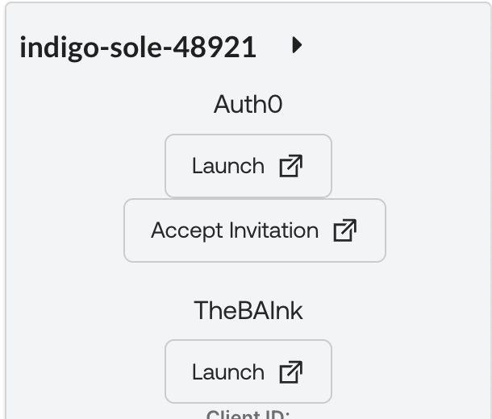
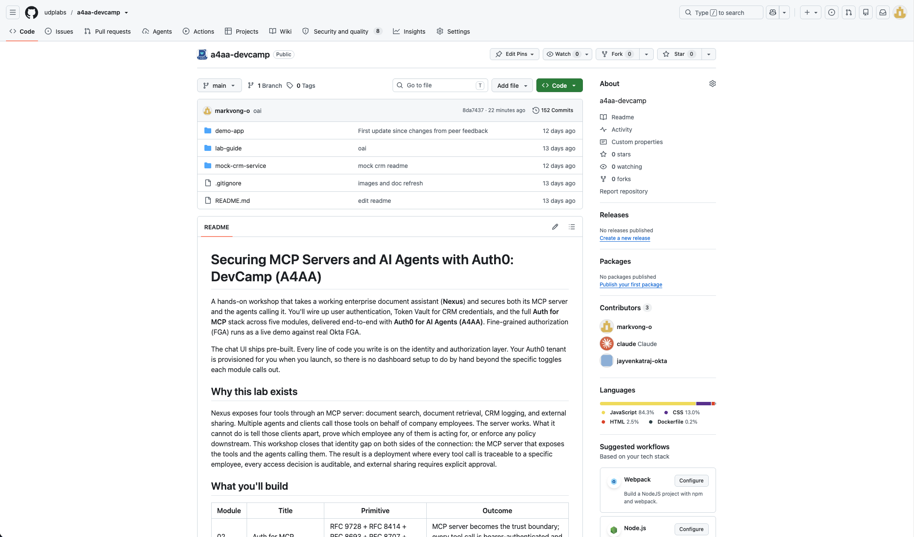
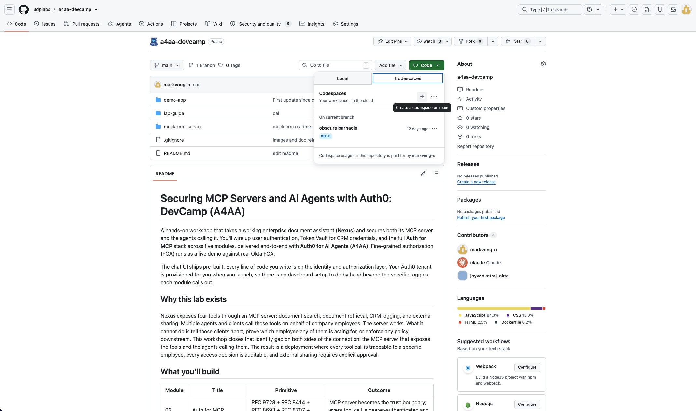
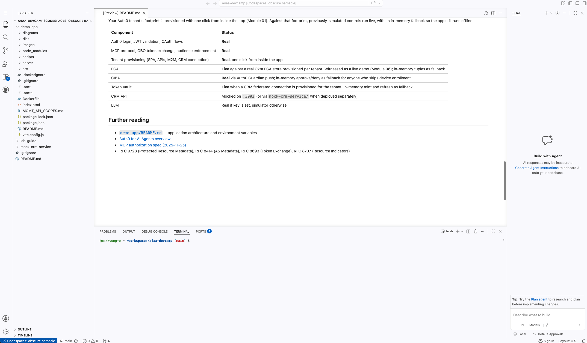
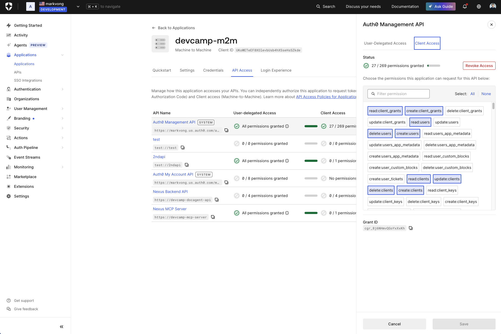
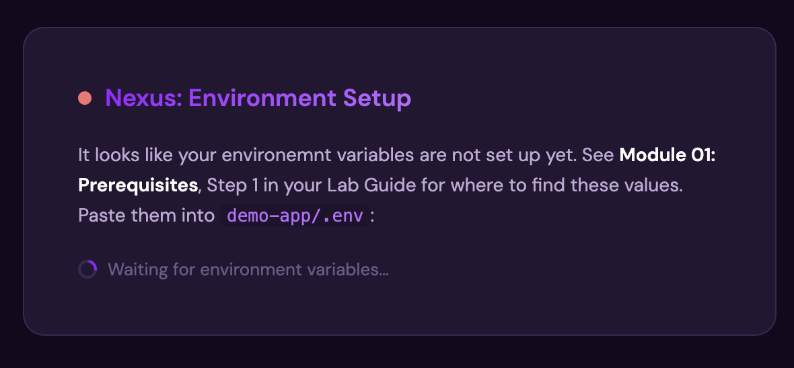
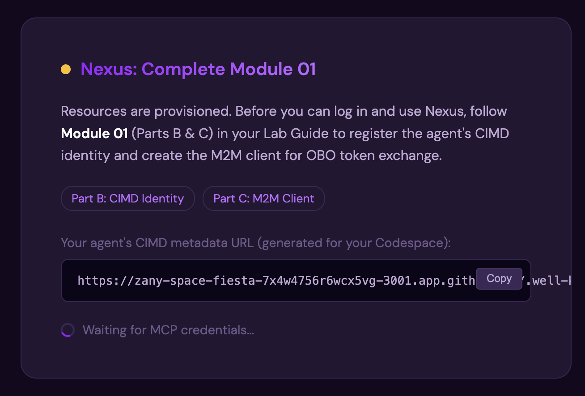
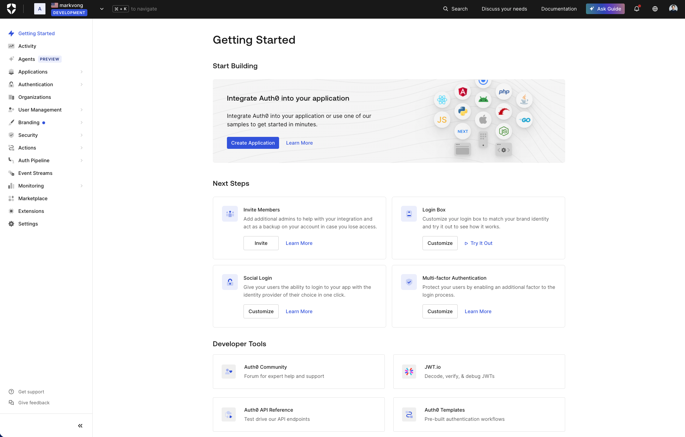

## Sign in to your Auth0 account *(~20 min)*

As part of the provisioning process for your tenant, an admin was created that corresponds to the email address you used to sign in (https://labs.demo.okta.com).

> [!IMPORTANT]
> Your Auth0 tenant is available for **30 days** for exploration and development.

To activate your tenant, follow these instructions:

1. From the Launch Pad on the right of the screen, click on **Accept Invitation**.
2. Follow the instructions to accept the invitation.
3. Once you accept the invitation, you'll land in your newly created Auth0 tenant.



> [!NOTE]
> - Your Auth0 management credentials are available in the Launch Pad after you launch your tenant.
> - You'll provision the Nexus resources in the next section.
> - Each module guides you to configure items in Auth0 as you need them.

## Navigating your Lab Guide

Here's some information about the **Labs.Demo.Okta** platform you're using today.

### Outline

On the left of the screen, you'll find an outline of today's lab, which also serves as your navigation control panel. This Dev{Camp} has **seven interactive modules**, and the final one is a closing end-to-end run. Each module contains **tasks** with **steps**. You can collapse the outline at any time by clicking the arrow icon.

Each section has a handy control at the bottom to navigate forward and backward. You can also click any section (or subsection) directly to navigate freely.

### Launch Pad

On the right of the screen, you'll find an easy way to launch your lab resources. Each resource has its own launch button along with the tenant names and credentials (where applicable).

### Dynamic Lab Guide variables

Beyond letting you copy credentials from the Launch Pad, this lab guide also uses *dynamic variables*. Some (*not all*) display values *specific* to your lab environment—your tenant domain, for example: `{{idp.tenantDomain}}`.

> [!NOTE]
> If something looks like it *should* be a dynamic variable, you can tell by the curly braces: <kbd>{{...}}</kbd>.
>
> Technology isn't perfect! Chances are something went awry and the variable didn't populate.

### Need help?

Need guidance at any point? Click the **Request Help** button in the Launch Pad, and we'll notify one of our lab assistants.


### Take note!

- Throughout the lab, you'll see various types of alerts and panels, like the following.

  They provide useful information. Take a minute to familiarize yourself with their intent so you know which ones you should *really* pay attention to.

  > [!NOTE]
  > Useful information that might help you.

  > [!TIP]
  > Helpful advice for doing things better or more easily.

  > [!IMPORTANT]
  > Key information you may need to know to complete the lab.

  > [!WARNING]
  > Urgent info that needs your immediate attention to avoid problems.

  > [!CAUTION]
  > Advises about risks or negative outcomes of certain actions.

<br>

## Your lab environment

You've already activated your Auth0 tenant above. The lab runs in **GitHub Codespaces**, with nothing to install—almost everything is pre-configured for you.


> [!NOTE]
> **Running locally instead of Codespaces?** (Node.js 20+ required)
> 1. Clone the repository
> 2. Open a terminal in the `demo-app/` directory
> 3. Follow the same steps below.
>
> All modules work locally **except the live Token Vault path in *The agent acts as the employee, not a shared bot***. Auth0, as a cloud service, can't reach `localhost:3002` to perform the CRM OAuth flow, so the vault falls back to the in-memory simulation. Everything else, including login, MCP, CIBA, and FGA, works exactly as described.

#### *Make sure you meet these requirements before you start.*

## Prerequisites

You need:

- **A GitHub account**, used to launch and run the Codespace.
- **A modern web browser** (a current version of Chrome, Edge, Firefox, or Safari).
- **A stable internet connection.** If you're typically on a corporate VPN that restricts access to GitHub or Auth0, *please disable the VPN for this lab.*
- **Access to your Auth0 tenant** (activated above).
- **Auth0 Guardian app**, installed on your mobile device
    | App Store                                    | Google Play                                    |
    | -------------------------------------------- | ---------------------------------------------- |
    |  |  |

> [!NOTE]
> Beyond a current browser, you don't need any particular laptop hardware or operating system.

## Launch your Codespace

> [!IMPORTANT]
> **Make sure you're logged into GitHub first.**

1. From the Launch Pad in the Lab Guide, open the repository link for the lab.



2. Start a Codespace on the repository (**Code > Codespaces > Create codespace on the lab branch**).



3. Wait for the environment to finish building **(it could take up to 20 minutes)**. Once it's ready, you'll have a full VS Code editor and terminal in your browser with the cloned project.



> [!TIP]
> **Already have a Codespace open?** If the lab material has been updated since you created it, make sure to pull the latest changes in the terminal before starting:
> ```bash
> git pull
> cd demo-app && npm install
> ```
> Then restart the app with `npm run dev`.

## Configure and provision your environment

Once the Codespace finishes building, open a terminal.

> [!IMPORTANT]
> ***Before*** starting the app, run the below commands.

### Step 1: install dependencies and add your credentials to the newly created `.env`

```bash
cd demo-app
npm install
touch .env
```
> [!IMPORTANT]
> Make sure you put the .env file ***inside*** the demo-app folder.

> [!NOTE]
> `npm install` prints a line like `X vulnerabilities (...)` when it finishes. That's expected in this environment and safe to ignore. Don't run `npm audit fix`.

Open `.env` in the editor and paste in the three values Nexus needs to connect to your Auth0 tenant, copying each from the **Launch Pad** on the right side of the screen:

> [!TIP]
> Your actual domain is `{{idp.tenantDomain}}`.

```
AUTH0_DOMAIN=<your-tenant-name>.cic-demo-platform.auth0app.com
AUTH0_MGMT_CLIENT_ID=<management-client-id>
AUTH0_MGMT_CLIENT_SECRET=<management-client-secret>
```

<details>
  <summary>
    If the credentials aren't shown in the Launch Pad on the right
  </summary>

Navigate to the Auth0 dashboard and create a custom M2M client with the following permissions, then use its Client ID and Secret in place of the Launch Pad values above:

```
read:resource_servers
create:resource_servers
delete:resource_servers
read:clients
create:clients
update:clients
delete:clients
read:client_grants
create:client_grants
read:connections
create:connections
delete:connections
read:users
create:users
delete:users
read:roles
create:roles
update:roles
delete:roles
create:role_members
read:actions
create:actions
update:actions
delete:actions
update:guardian_factors
update:tenant_settings
read:tenant_settings
```

  
</details>

<br>

<details>
  <summary> 
    Optional: bring your own OpenAI key.
  </summary>

If you have an OpenAI API key you would like to use, add it to the same `.env` file:

```
 OPENAI_API_KEY=<your-openai-api-key>
 ```

If you don't have one, no worries, leave it blank. Nexus detects a missing key automatically and uses the simulator instead so no other change needed.

</details>

### Step 2: start the app

```bash
npm run dev
```

The Codespace should open a browser preview automatically. Because `.env` already has valid credentials, the app skips straight to the **Provision Resources** screen (Step 3 below).

> [!TIP]
> **Preview not open automatically?**
>
> If no preview opens automatically, or you're running locally instead of in the Codespace, open the **Ports** tab, find port **5173**, and click the globe icon to open it manually.

> [!NOTE]
> **Started the app before adding your `.env` values?** You'll see a **setup screen** instead, showing the three environment variable names with a **Copy keys** button. Open `demo-app/.env` in the editor, paste the names, fill in the values from the Launch Pad, then stop the server (`Ctrl+C` in the terminal running `npm run dev`) and restart it with `npm run dev` so it picks up the change. The app reloads and advances to the next step automatically.
> 

### Step 3: provision Auth0 resources

The app shows the **Provision Resources** screen. Click the **Provision Resources** button.

This button has Nexus call the Auth0 Management API and create the other resources and `.env` variables your app uses throughout the lab:
- the backend API
- MCP resource server
- agent client
- CRM connection
- etc.

When provisioning completes, the server restarts automatically and the app reloads into its normal state.

> [!NOTE]
> If provisioning fails, the error message tells you which step failed. The most common cause is incorrect management credentials. Double-check the values from the Launch Pad and try again.

### Step 4: confirm the app is running

After the reload, you should see the Nexus chat interface. You're now ready to start *One trust boundary for every agent*.



## Confirm access to your Auth0 tenant

If you haven't already opened your Auth0 tenant, launch it from the Launch Pad in the Lab Guide. You'll use this throughout the lab, so keep a tab open.



> [!NOTE]
>
> If you run into issues, please make sure you've accepted the invitation above first.
>
> *If issues persist accessing the Auth0 tenant, please flag down one of the lab assistants to troubleshoot.*

## Confirm Auth0 Guardian download

> [!NOTE]
> Auth0 Guardian is needed for **Humans approve what can't be undone** (CIBA), where you approve a document sharing action from your own device. Enrollment is optional; the in-memory fallback covers the full flow offline if you skip it.

| App Store                                    | Google Play                                    |
| -------------------------------------------- | ---------------------------------------------- |
|  |  |

#### <span style="font-variant: small-caps">Congrats!</span>

*You've completed this module.*

This module activated your tenant, oriented you to the lab platform, and made sure your access and environment were properly configured.

You've successfully:

<ul>
  <li style="list-style-type:'✅ ';">
      Activated your Auth0 tenant by accepting the invitation;
  </li>
  <li style="list-style-type:'✅ '">
      Familiarized yourself with the Lab Guide outline, Launch Pad, and dynamic variables;
  </li>
  <li style="list-style-type:'✅ '">
      Confirmed you have a GitHub account and a modern browser;
  </li>
  <li style="list-style-type:'✅ '">
      Launched the lab's GitHub Codespace environment;
  </li>
  <li style="list-style-type:'✅ '">
      Understood that Node.js, the editor, and dependencies come preprovisioned in the Codespace;
  </li>
  <li style="list-style-type:'✅ '">
      Added your Auth0 management credentials to <code>.env</code> from the Launch Pad;
  </li>
  <li style="list-style-type:'✅ '">
      Provisioned Auth0 resources using the in-app Provision Resources button;
  </li>
  <li style="list-style-type:'✅ '">
      Confirmed the Nexus chat interface loaded after provisioning;
  </li>
  <li style="list-style-type:'✅ '">
      Downloaded the Auth0 Guardian application on your mobile device (for *Humans approve what can't be undone*, CIBA).
  </li>
</ul>

#### <span style="font-variant: small-caps">Let's move on to the next module!</span>
