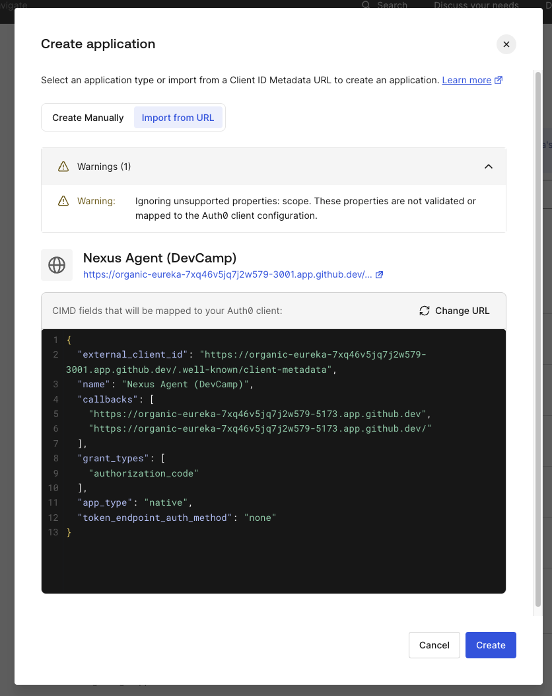
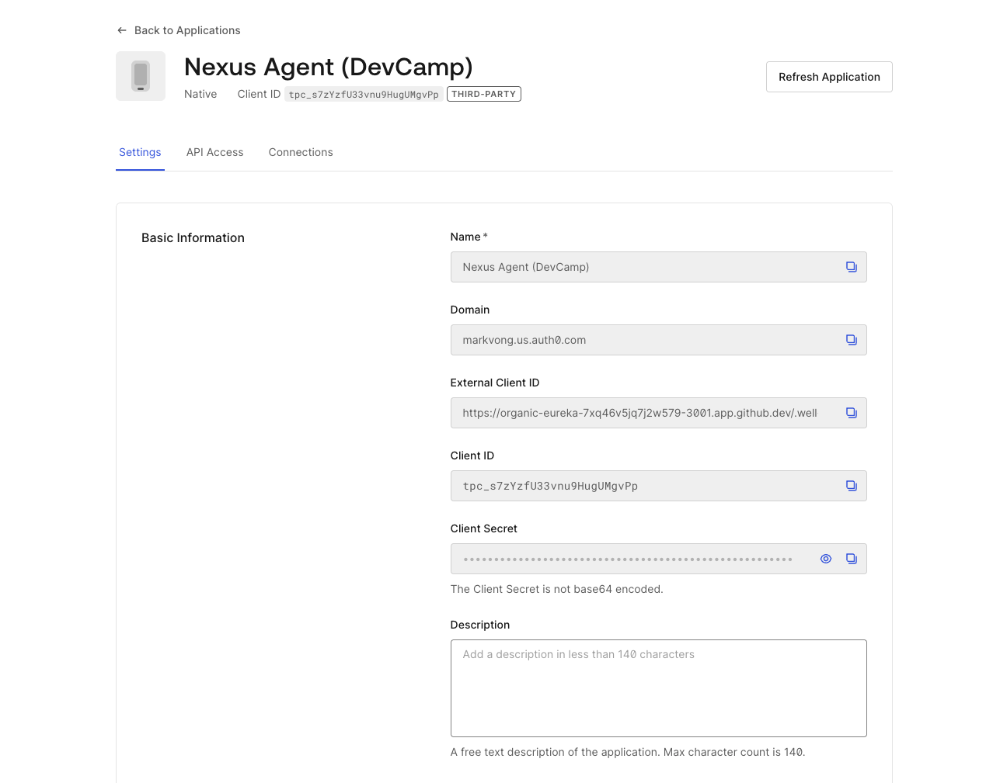
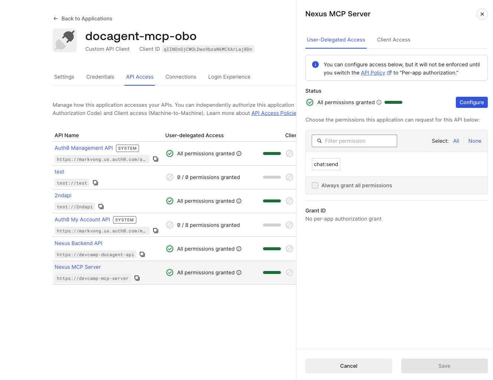
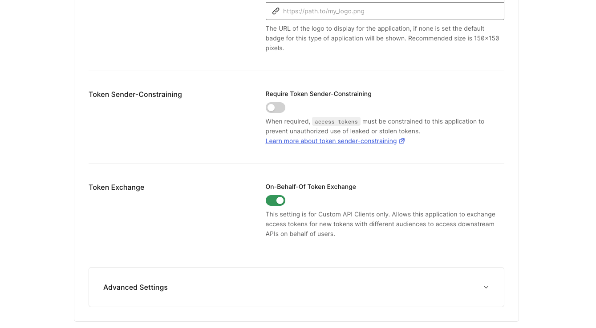

## Objective *(~25 min)*

This module wires the mechanism that makes everything downstream possible: registering Nexus's MCP server as an Auth0 resource and giving the first-party Nexus agent two things it needs to call tools on behalf of users. The first is a stable published identity via CIMD (Client ID Metadata Documents). The second is a confidential M2M client that performs the OBO token exchange. Once both are in place, every tool call carries the employee's **sub** all the way to tool execution, and Token Vault, CIBA, and FGA all have the identity they need to enforce policy.

By the end you will understand:

- How the MCP server is set up behind JWT validation on port 3001.
- How `/.well-known/oauth-protected-resource` (RFC 9728) and `/.well-known/oauth-authorization-server` (RFC 8414) enable zero-config client discovery.
- What CIMD is and why a URL-based agent identity is better than an ephemeral UUID from Dynamic Client Registration.
- How the M2M confidential client performs OBO token exchange, preserving the user's **sub** through the agent boundary.
- How a distinct scope per tool enforces least-privilege and enables **WWW-Authenticate** step-up hints for clients.

### Why we're building this

Without a defined trust boundary, every agent runtime connecting to your MCP server becomes an implicit authorization decision made by whoever wrote the agent rather than by your platform. A new agent framework means a new security review, a compromised client has no scope boundary, and an audit log entry that says "agent called tool" tells you nothing about which employee was responsible.

The commercial consequence is direct. CIMD-based agent identity and PRM/AS discovery (Protected Resource Metadata and Authorization Server Metadata, covered later in this module) let a client discover and connect to your server on its own. You can safely expose your MCP server to trusted third-party agents and partners without custom onboarding on either side, reaching new customers and revenue streams at the velocity of standardization rather than through the friction of one-off integrations. 

The trust boundary is standardized to a spec rather than hardcoded to one agent framework. You can ship a new runtime or model without rearchitecting security, freeing you from being trapped by today's choices when the ecosystem moves. An agent carries a distinct, auditable, and revocable identity through CIMD. A compromised or forged client becomes a contained incident on one identity's permissions rather than a lateral movement vector across your whole platform.

## Prerequisites

- No prior modules required. This module establishes the foundation everything else builds on.

## Premise

Your MCP server is a platform for agent clients of two kinds. The first-party Nexus agent connects with a stable published identity via CIMD, and uses a confidential M2M client to exchange user tokens for MCP-scoped tokens. 

For Nexus's implementation, third-party integrations discover the server through PRM and AS metadata and connect without any configuration on their side. All of them must present a valid token, and when they do, OBO token exchange carries the employee's identity through the agent boundary to every tool call downstream.

**MCP (Model Context Protocol)** is a standard surface for advertising tools. With Auth0 in front of it, every tool call is bearer-token-authenticated against a resource server that enforces FGA, Token Vault, and scope checks. The agent is simply a client. You can swap it, add a second one, or run Claude Agent SDK alongside a custom loop, while the guardrails live permanently on the MCP server regardless of which agent you connect.

> [!NOTE]
> Auth0's **Auth for MCP** went GA on April 29, 2026 as part of the Auth for AI Agents (A4AA) product line. It follows the MCP authorization spec (revision 2025-11-25) and layers it on top of OAuth 2.1 so any conformant MCP client can discover and call your tools with the user's actual identity. Product overview: [auth0.com/ai](https://auth0.com/ai).

This module wires six features in one flow:

| Part | Feature | RFC / Spec |
|---|---|---|
| A | Register MCP API + Backend API as Auth0 resource servers (per-tool scopes live on the Backend API) | OAuth 2.1 |
| B | CIMD: publish the agent's identity as a metadata document URL | Client ID Metadata Documents (draft) |
| C | Protected Resource Metadata (PRM) | RFC 9728 |
| D | Authorization Server Metadata | RFC 8414 |
| E | On-Behalf-Of token exchange with RFC 8707 resource indicator | RFC 8693 + RFC 8707 |
| F | Per-tool scope enforcement with **WWW-Authenticate** step-up hints | OAuth 2.1 + MCP 2025-11-25 |

## What's provisioned for you

Part A (registering the MCP API and Backend API resource servers) was handled automatically by Provision Resources. Your tenant already has:

- **The MCP API (resource server)**: `https://devcamp-mcp-server` (RS256), with one coarse scope, `chat:send`, which proves the user can access the Nexus chat interface.
- **The Nexus Backend API (resource server)**: `https://devcamp-docagent-api` (RS256), with the four fine-grained per-tool scopes the OBO exchange targets:
  - `mcp:docs:search`: search the document knowledge base
  - `mcp:docs:read`: retrieve a specific document
  - `mcp:crm:log`: log activity to the CRM via Token Vault
  - `mcp:docs:share`: share a document externally (CIBA-gated)

- **The Nexus SPA application**: your browser app for user login, already configured for your Codespace URL.

**Two clients are NOT provisioned for you.** You create both manually in this module. Your only manual Dashboard steps are Parts B and C below.

> [!NOTE]
> **Two clients, two purposes:**
> - **CIMD native app** (public, **is_first_party: false**): the agent's published identity document. Anyone can fetch the URL to learn what the agent is and what scopes it needs. This is what CIMD is: a stable, self-hosted identity that shows up in audit logs.
> - **M2M confidential app** (has a client_secret): performs the actual OBO token exchange server-side. Authorized against both the MCP API (the audience it exchanges from) and the Nexus Backend API (the audience it exchanges into, where the four per-tool scopes live).

## Dashboard Steps

### Part B: Register the agent's CIMD identity

The Nexus MCP server publishes a metadata document at **/.well-known/client-metadata** on port 3001. Auth0 can fetch this URL and register the agent from it, and the URL itself becomes the **client_id**.

**Step 1: Open the metadata document in your browser**

> [!TIP]
> **<your-codespace>** is the name shown in your Codespace's browser tab and URL bar (e.g. **fuzzy-space-potato-abc123**), or run `echo $CODESPACE_NAME` in the terminal to print it directly.

```
https://<your-codespace>-3001.app.github.dev/.well-known/client-metadata
```

You will see:

```json
{
  "client_id": "https://<your-codespace>-3001.app.github.dev/.well-known/client-metadata",
  "client_name": "Nexus Agent (DevCamp)",
  "allowed_scopes": ["mcp:docs:search", "mcp:docs:read", "mcp:crm:log", "mcp:docs:share"]
}
```

> [!IMPORTANT]
> The **client_id** field is the URL of this document. That is the point of CIMD: the agent's identity is self-described and self-hosted. Compare this to Dynamic Client Registration (DCR, RFC 7591), where a new opaque UUID is minted on every install and audit logs become meaningless across deploys.

**Step 2: Make port 3001 public in your Codespace**

Auth0 needs to fetch the metadata document to register the agent. Port 3001 is private by default, so Auth0 will receive a 302 redirect to GitHub's login page instead of the JSON.

1. In the Codespace VS Code editor, open the **PORTS** tab (bottom panel)
2. Find port **3001**
3. Right-click → **Port Visibility → Public**

*You should see: the visibility icon on port 3001 changes to show it is publicly accessible.*

> [!NOTE]
> Codespaces can reset port visibility back to Private after the Codespace restarts or rebuilds (for example, if you stop and restart the app later in the lab). If a step that depends on port 3001 or 3002 starts failing, re-check its visibility here before troubleshooting anything else.

**Step 3: Register in Auth0 using Import from URL**

1. Auth0 Dashboard → **Applications → Applications → Create Application**
2. Select **Import from URL**
3. Paste the metadata document URL and click **Preview**

*You should see: Auth0 fetches the document and shows a preview with **client_name** and **allowed_scopes** from your metadata.*



4. Click **Create**

*You should see: Auth0 creates a Native application with the metadata URL as the **client_id**. This is the agent's published identity. It plays no role in the OBO exchange itself, though it does show up in Auth0 logs wherever the agent's identity is referenced.*



### Part C: Create the M2M client for OBO token exchange

The OBO exchange takes a token scoped to the MCP API (the user's login audience) and exchanges it for one scoped to the Nexus Backend API (where the four per-tool scopes live). The client that performs this exchange needs authorization on **both** resource servers: the MCP API it exchanges *from*, and the Backend API it exchanges *into*.

**Step 1: Create the M2M client**

1. Auth0 Dashboard → **Applications → APIs → Nexus MCP Server**
2. Click **Add Application**
3. Name it `docagent-mcp-obo`

**Step 2: Confirm scopes on both APIs**

Creating the client from the Nexus MCP Server's Applications tab authorizes it there automatically. Confirm it also has access on the Nexus Backend API, since that's the API that actually holds the four per-tool scopes the OBO exchange targets:

- **Nexus MCP Server**: `docagent-mcp-obo` should already be authorized for `chat:send`.
- **Nexus Backend API**: Auth0 Dashboard → **Applications → APIs → Nexus Backend API → Applications tab** → confirm `docagent-mcp-obo` is listed with all four **mcp:\*** scopes (`mcp:docs:search`, `mcp:docs:read`, `mcp:crm:log`, `mcp:docs:share`) granted for **user-delegated access**, meaning the scopes a *user's* token can carry through this client, as opposed to scopes the client would use to act as itself.

Both APIs default to Application Access Policy "All apps allowed," so every scope is granted automatically the moment the client exists. There's nothing to individually toggle yet.

*You should see: `docagent-mcp-obo` listed in the Applications tab of both APIs, with its scopes granted on each.*



> [!IMPORTANT]
> **Enable On-Behalf-Of Token Exchange**
>
> This toggle is a security posture choice and must be opted in explicitly. It is not enabled by default.
>
> 1. Still on **`docagent-mcp-obo`**
> 2. Scroll to the **Token Exchange** section
>
> *You should see: the Token Exchange section with the On-Behalf-Of toggle off.*
>
> 3. Toggle on **On-Behalf-Of Token Exchange** → **Save**
>
> 
>
> Until this is enabled, the OBO exchange returns a **403** and every tool call fails. This is the deliberate first moment of insight in the module: the scaffolding is in place, but the capability requires an explicit trust decision.

**Step 3: Add the M2M credentials to `.env`**

From the `docagent-mcp-obo` application settings, copy the **Client ID** and **Client Secret**. Open `demo-app/.env` and add:

```
AUTH0_OBO_CLIENT_ID=<client-id-from-dashboard>
AUTH0_OBO_CLIENT_SECRET=<client-secret-from-dashboard>
```

**Step 4: Restart the app**

If the app doesn't auto-refresh, stop the running app (`Ctrl+C`) and restart:

```bash
npm run dev
```

The MCP client is now configured and can perform OBO token exchanges.

## Code Steps

> [!NOTE]
> This code is already implemented in the demo-app. The steps below are a structured walk-through. Open each file in your editor as you go. **You are not writing new code in this module.**

### Part B: CIMD metadata endpoint

The MCP server serves the agent's identity document at **/.well-known/client-metadata**. The **client_id** is derived from the request URL, since the endpoint returns itself as the identity.

**server/mcp/cimd.js** and **server/mcp/server.js**:

```js
app.get("/.well-known/client-metadata", (req, res) => {
  const proto = req.headers["x-forwarded-proto"] || req.protocol;
  const host  = req.headers["x-forwarded-host"]  || req.headers.host;
  const clientId = `${proto}://${host}/.well-known/client-metadata`;
  const frontendOrigin = /* derived from host, swapping 3001 → 5173 */;
  res.json({
    client_id:   clientId,   // the URL is the identity
    client_name: "Nexus Agent (DevCamp)",
    grant_types: ["authorization_code"],
    redirect_uris: [frontendOrigin, `${frontendOrigin}/`],
    token_endpoint_auth_method: "none",
    scope: "mcp:docs:search mcp:docs:read mcp:crm:log mcp:docs:share",
  });
});
```

This is what Auth0 fetched when you registered the CIMD app in Part B. The same URL appears in Auth0 logs wherever the agent's identity is referenced.

### Part C: Protected Resource Metadata (PRM, RFC 9728)

PRM enables an MCP client that knows only your server URL to discover which authorization server issues tokens for it, without any hardcoded configuration.

**server/mcp/metadata.js**:

```js
export function protectedResourceMetadata(_req, res) {
  res.json({
    resource: process.env.AUTH0_TOOL_AUDIENCE,
    authorization_servers: [`https://${process.env.AUTH0_DOMAIN}`],
    scopes_supported: ["mcp:docs:search", "mcp:docs:read", "mcp:crm:log", "mcp:docs:share"],
    bearer_methods_supported: ["header"],
    client_registration_types_supported: ["metadata"],
    resource_documentation: "https://auth0.com/ai",
  });
}
```

### Part D: Authorization Server Metadata

**server/mcp/server.js**:

```js
app.get("/.well-known/oauth-authorization-server", (_req, res) => {
  res.json({
    issuer: `https://${process.env.AUTH0_DOMAIN}/`,
    token_endpoint: `https://${process.env.AUTH0_DOMAIN}/oauth/token`,
    jwks_uri: `https://${process.env.AUTH0_DOMAIN}/.well-known/jwks.json`,
    scopes_supported: ["mcp:docs:search", "mcp:docs:read", "mcp:crm:log", "mcp:docs:share"],
    grant_types_supported: ["urn:ietf:params:oauth:grant-type:token-exchange"],
    client_registration_types_supported: ["metadata"],
  });
});
```

### Part E: OBO token exchange

The agent's backend holds the user's access token. To call the MCP server, it exchanges that token for one scoped to the Backend API. The user's **sub** is preserved so FGA and Token Vault evaluate identity against the human rather than the agent.

**server/mcp/client.js**:

```js
body: JSON.stringify({
  grant_type: "urn:ietf:params:oauth:grant-type:token-exchange",
  subject_token: userAccessToken,
  subject_token_type: "urn:ietf:params:oauth:token-type:access_token",
  requested_token_type: "urn:ietf:params:oauth:token-type:access_token",
  audience: cfg.audience,
  scope: "mcp:docs:search mcp:docs:read mcp:crm:log mcp:docs:share",
  client_id: cfg.clientId,         // M2M confidential client (opaque UUID)
  client_secret: cfg.clientSecret, // M2M client secret
}),
```

The `client_id` here is the M2M app's opaque UUID, the confidential exchanger you created in Part C. The CIMD native app's URL is the agent's *published identity*; the M2M client is its *exchange credential*. Both are necessary and serve different roles.

### Part E: route the agent's tool calls through MCP

**server/llm.js**, after the CIBA gate (explained in *Humans approve what can't be undone*), all tools route through **executeTool**:

```js
import { executeTool } from "./tools/registry.js";

// inside processMessage, after the CIBA gate (explained in Module 04):
result = await executeTool(toolName, parameters, user.accessToken);
```

**executeTool** calls **mcpClient.callTool**, which calls **getToken** (the OBO exchange) before every MCP request.

## Checkpoint

Use the **Run Checks** button at the bottom of this page. The in-app verifier confirms all five conditions automatically:

- The CIMD metadata document is reachable and **client_id** equals the URL itself.
- The Protected Resource Metadata endpoint returns **resource**, **authorization_servers**, and **scopes_supported**.
- The AS Metadata endpoint returns **issuer**, **token_endpoint**, the four scopes, and **"metadata"** in **client_registration_types_supported**.
- An unauthenticated **GET /mcp/tools** returns **401 with a **WWW-Authenticate** header.
- The On-Behalf-Of Token Exchange toggle is active on your M2M client.

> [!IMPORTANT]
> One step requires manual confirmation in the Dashboard rather than a chat prompt to Nexus. Go to **Applications → Applications → Nexus Agent (DevCamp)**. Confirm the **client_id** shown is the metadata document URL and not an opaque UUID. This confirms the CIMD registration succeeded.

> [!TIP]
> If a check fails, the result row shows the exact reason. Fix the flagged item and click **Re-run checks**.

## What you learned

Every tool call now leaves the agent runtime, crosses a bearer-authenticated boundary, and is evaluated against the user's actual identity on a resource server that enforces FGA, Token Vault, and scope. The trust boundary moves from the agent backend to the MCP server. Concretely, you just walked through the full A4AA "Auth for MCP" pattern:

- **CIMD: stable published identity.** The CIMD native app gives the agent a URL-based identity that survives redeploys. Anyone can fetch it to learn what the agent is. With DCR (RFC 7591), a new opaque UUID is minted on every install and audit logs become meaningless across deploys. CIMD avoids both problems.
- **M2M client: confidential OBO exchanger.** The M2M client is authorized against both the MCP API and the Backend API, and performs token exchanges with its own credentials. The **sub** from the user's token is preserved in the issued token so FGA and Token Vault evaluate identity against the human rather than the agent.
- **Discovery without config.** RFC 9728 PRM and RFC 8414 AS metadata let a new MCP client point at your server URL and resolve the issuer, scopes, and grant types on its own.
- **Graceful step-up.** **403 insufficient_scope** tells the client exactly which scope is missing, so the next OBO exchange can request it and retry.

Why this matters beyond the lab:

- **Opex.** Multiple agents (Claude Agent SDK, custom runtime, a future mobile client) inherit one authorization engine from one MCP server. You eliminate the burden of maintaining separate auth logic across each client.
- **GTM.** A resource server with PRM, scope enforcement, CIMD identity, and a verified M2M exchanger is what a procurement team wants to see in the security questionnaire. It shortens the review cycle from months to weeks.

### Further reading

- Auth for AI Agents product overview: [auth0.com/ai](https://auth0.com/ai)
- MCP authorization spec (2025-11-25): [modelcontextprotocol.io/specification](https://modelcontextprotocol.io/specification)
- RFC 9728 Protected Resource Metadata, RFC 8414 AS Metadata, RFC 8693 Token Exchange, RFC 8707 Resource Indicators

#### <span style="font-variant: small-caps">Congrats!</span>

*You have completed this module.*

You should have successfully:

<ul>
  <li style="list-style-type:'✅ ';">
      published the agent's CIMD identity by registering its metadata document URL in Auth0;
  </li>
  <li style="list-style-type:'✅ '">
      created an M2M confidential client from the MCP API resource server screen, authorized it on the Backend API, and enabled Token Exchange;
  </li>
  <li style="list-style-type:'✅ '">
      understood how RFC 9728 and RFC 8414 discovery documents enable zero-config client integration;
  </li>
  <li style="list-style-type:'✅ '">
      confirmed OBO token exchange preserves the user's <b>sub</b> all the way to tool execution.
  </li>
</ul>

The MCP server now has a trust boundary. Every caller is validated and every tool call is scoped to a resource and an identity. The next step is ensuring that identity is a verified employee, not just a token. *Every agent action has an owner* wires that.

#### <span style="font-variant: small-caps>Let's move on to the next module!</span>
