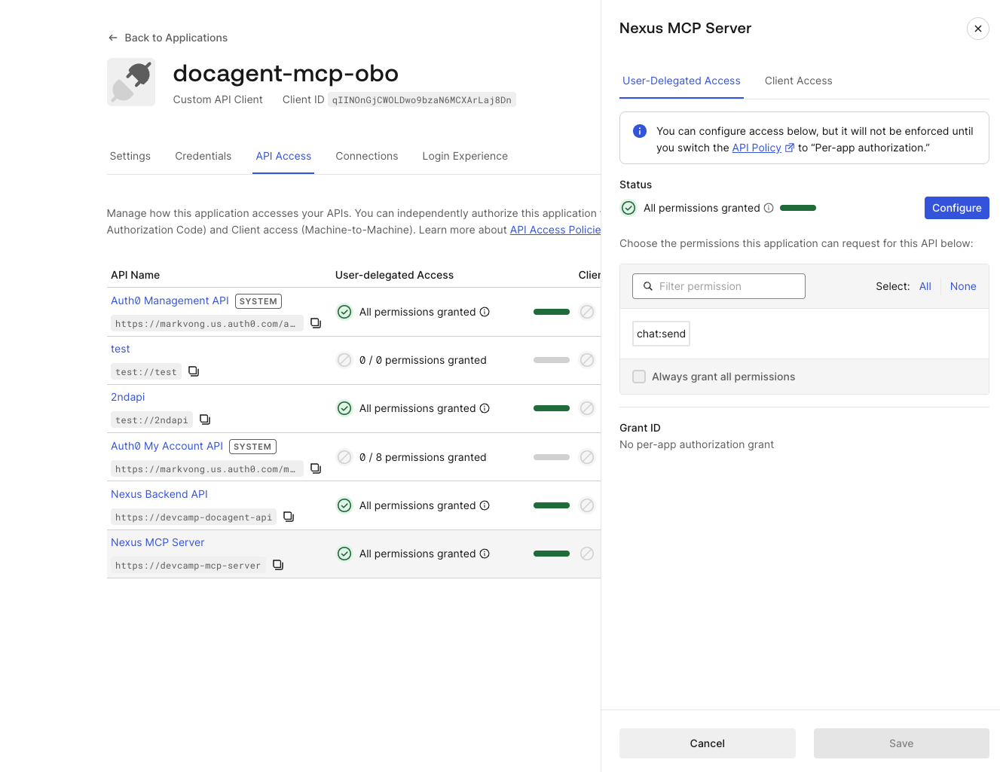
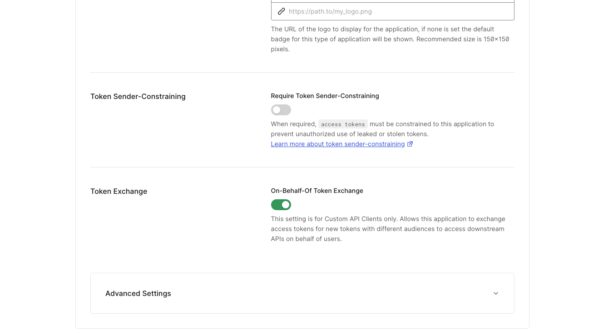

## Objective *(~20 min)*

<!-- TODO: Flow screenshot here - Agent Identity and MCP server with arrow between. -->

Here's what you'll do:
- Make your MCP server a standards-compliant OAuth resource server that any MCP client, yours or someone else's, can discover and call.
- Give your first-party agent the two things it needs to call tools on behalf of employees:
  - A first-class identity through **Agent as Principal**, with its own `agent_id`
  - A **Custom API client**, linked to that agent, that performs the On-Behalf-Of (OBO) token exchange

Once both are in place, every tool call carries the employee's **sub** *and* the agent's **agent_id** (as `act.sub`) all the way to tool execution.

That gives Token Vault, CIBA, and FGA the identity they need to enforce policy, and it gives you an agent identity that survives client credential rotation.

By the end, you'll understand:

- How the MCP server's identifier, its Protected Resource Metadata (PRM), the RFC 8707 `resource` parameter, and the token's `aud` claim are all the same value, and why that matters.
- How a 401 with **WWW-Authenticate: resource_metadata** lets an MCP client discover Auth0 knowing nothing but the server URL.
- What Agent as Principal is, and why a durable `agent_id` beats treating a client's credentials as the agent's identity.
- Why OBO requires a **Custom API client** linked to the API whose tokens it exchanges, and what the resulting nested `act` claim says.
- How a distinct scope per tool enforces least privilege, and how a **403 insufficient_scope** challenge tells clients what to step up to.

## Features shown by RFC

This module wires six features in one flow:

| Part | Feature | RFC / Spec |
|---|---|---|
| A | Two resource servers: the **Nexus Agent API** (login audience) and the **Nexus MCP Server** (identifier = the server's URL, per-tool scopes) | OAuth 2.1 + RFC 8707 |
| B | Agent as Principal: register the agent as a first-class Auth0 identity | Early Access ([auth0.com/docs/ai-agents-mcp/agent-as-principal](https://auth0.com/docs/ai-agents-mcp/agent-as-principal)) |
| C | Protected Resource Metadata (PRM), linked from every 401 | RFC 9728 + MCP 2025-11-25 |
| D | Authorization server discovery: Auth0 publishes its own metadata | RFC 8414 / OIDC Discovery |
| E | On-Behalf-Of token exchange by a Custom API client | RFC 8693 |
| F | Per-tool scope enforcement with **WWW-Authenticate** `insufficient_scope` challenges | OAuth 2.1 + MCP 2025-11-25 |

## What's provisioned for you

Provisioning in the previous module created:

- **Nexus Agent API (resource server)**: `https://devcamp-nexus-agent-api`, with one broad scope, `chat:send`. This is the audience employees log in for. Only the Nexus agent's own backend accepts these tokens.
- **Nexus MCP Server (resource server)**: its identifier is your MCP server's public URL (the Codespace URL for port **3001**, also in `.env` as `AUTH0_TOOL_AUDIENCE`). It carries the per-tool scopes:
  - `mcp:docs:search`: search the document knowledge base
  - `mcp:docs:read`: retrieve a specific document
  - `mcp:crm:log`: log activity to the CRM through Token Vault
  - `mcp:docs:share`: share a document externally (CIBA-gated)

  It's also set to:
  - `agent_subject_claims: "auth0-v1"`, so tokens from agent-linked clients carry `sub_profile`, `client_profile`, and `act.sub = agt_...`
  - **Per-app authorization** for user-delegated access. No application gets a token for it until you grant access, and that includes your own agent.
- **nexus-mcp-server-codespace**: the MCP server's own Custom API client. The MCP server uses it later for Token Vault, so it never borrows a caller's credentials.
- **Tenant settings** Auth for MCP relies on (**Settings → Advanced**):
  - **Resource Parameter Compatibility Profile**: Auth0 accepts the RFC 8707 `resource` parameter MCP clients send.
  - **Include Issuer in Authorization Responses**: RFC 9207 `iss`, which defends MCP clients against mix-up attacks.
- **The Nexus SPA application**: your browser app for employee login, already configured for your Codespace URL.

**Only two things aren't provisioned for you.** You'll create both in this module.

## Dashboard steps

> [!NOTE]
> **Two things:**
> - **Agent record (Agent as Principal)**: the agent's unique Auth0 identity. Its `agent_id` is what shows up in the exchanged token's `act.sub` claim and in Auth0 logs, independent of whichever client authenticates it.
> - **Custom API client `docagent-mcp-obo`**: performs the OBO exchange server-side. Auth0 only lets a Custom API client (`app_type: resource_server`) run OBO, and only on tokens issued for the API it's linked to, which here is the Nexus Agent API. It then needs a user-delegated grant on the API it exchanges *into*, the Nexus MCP Server.

### Part A: Register the agent as a first-class Auth0 identity

<!-- TODO: Need to validate that the Agent as principal is turned on for every tenant by default. -->

<!-- TODO: Flow screenshot here - Agent Identity -->

**Step 1: Create the agent record**

1. Auth0 Dashboard → **Agents** → **Create New Agent**
2. Name it ***exactly*** `Nexus Agent (DevCamp)`. The app looks it up by name.
3. Select **Create**.

*You should see: the new agent record with a generated **Agent ID** in the form `agt_...`.*

<!-- TODO: put in a screenshot here for what it looks like -->

**Step 2: Note the Agent ID**

Copy the **agt_...** value somewhere handy. You'll see it as `act.sub` on the exchanged token later in this module, once the client is linked to it (Part B, Step 4).

### Part B: Create the Custom API client for OBO token exchange

<!-- TODO: Flow screenshot here - MCP OBO token exchange-->

The OBO exchange takes the employee's token for the **Nexus Agent API** and exchanges it for one for the **Nexus MCP Server**.

**Step 1: Create the client from the Nexus Agent API**

1. Auth0 Dashboard → **Applications → APIs → Nexus Agent API**
2. Select **Add Application**.
3. Name it `docagent-mcp-obo` → **Add**.

Creating it from the API screen makes it a **Custom API Client** linked to the Nexus Agent API (open it and check **Application Properties → Application Type**). That link is how Auth0 knows this client may exchange tokens issued for that API.

**Step 2: Grant it user-delegated access on the Nexus MCP Server**

1. Auth0 Dashboard → **Applications → APIs → Nexus MCP Server → Application Access** tab
2. Find `docagent-mcp-obo` → **Edit**
3. Under **User-Delegated Access**, select **Grant Access** and select these scopes:
    - `mcp:docs:search`
    - `mcp:docs:read`
    - `mcp:crm:log`
    - `mcp:docs:share`
4. Select **Save**.

This is the ceiling on what an employee's token can carry through this client. The employee's own role (RBAC) narrows it further.



**Step 3: Turn on On-Behalf-Of Token Exchange for the client**

This toggle is a security posture choice and must be turned on explicitly. It's off by default.

1. Auth0 Dashboard → **Applications → Applications → docagent-mcp-obo → Settings**
2. Scroll to the **Token Exchange** section.
3. Turn on **On-Behalf-Of Token Exchange** → **Save**.



**Step 4: Link the client to the agent record**

1. Auth0 Dashboard → **Agents** → **Nexus Agent (DevCamp)** → **Applications** tab
2. Select **Add Application**.
3. Select `docagent-mcp-obo` and confirm.

<!-- TODO: this step needs a screenshot of the Agent's Applications tab with `docagent-mcp-obo` added. -->

**Step 5: Add the client's credentials to `.env`**

From the `docagent-mcp-obo` application settings, copy the **Client ID** and **Client Secret**. Open `demo-app/.env` and add:

```
AUTH0_OBO_CLIENT_ID=<client-id-from-dashboard>
AUTH0_OBO_CLIENT_SECRET=<client-secret-from-dashboard>
```

**Step 6: Restart the app**

If the app doesn't auto-refresh, stop the running app (`Ctrl+C`) and restart it:

```bash
npm run dev
```

The MCP client is now configured and can perform OBO token exchanges.

> [!CAUTION]
> # **Don't log in yet.** The next modules walk you through logging in for the first time.

## Code steps

> [!NOTE]
> This code is already implemented in the demo-app. **You aren't writing new code in this DevCamp.**

### One identifier, four places

The MCP server's identifier is its own public origin. Provisioning derives it from your Codespace URL:

**server/index.js** (`/api/setup/provision`):

```js
const mcpResourceUri = process.env.MCP_RESOURCE_URI || originForPort(appUrl, mcpPort());
```

That one value is:
1. the Auth0 API identifier of the **Nexus MCP Server**,
2. the `resource` the server advertises in its PRM,
3. the RFC 8707 `resource` parameter an MCP client sends when it asks Auth0 for a token (you'll see Acme do this in the next module), and
4. the `aud` the server requires on every token.

The MCP authorization spec requires clients to check that these match, which is why an arbitrary string like `https://devcamp-docagent-api` isn't good enough for a server real MCP clients connect to.

### Agent as Principal claims

**server/platform/provision.js**:

```js
await createResourceServer(ctx, {
  identifier: MCP_RESOURCE,
  name: "Nexus MCP Server",
  scopes: MCP_SERVER_SCOPES,
  rbac: true,
  agentSubjectClaims: true,   // agent_subject_claims: "auth0-v1"
  requireClientGrant: true,   // per-app authorization for user-delegated access
});
```

Once `docagent-mcp-obo` is linked to `Nexus Agent (DevCamp)`, every OBO token Auth0 issues for this API looks like this:

```json
{
  "sub": "auth0|alice...",
  "sub_profile": "user",
  "aud": "https://<codespace>-3001.app.github.dev",
  "client_id": "<docagent-mcp-obo client id>",
  "client_profile": "service ai_agent",
  "scope": "mcp:docs:search",
  "act": {
    "sub": "agt_...",
    "sub_profile": "ai_agent",
    "client_id": "<docagent-mcp-obo client id>",
    "act": { "sub": "<SPA client id>", "sub_profile": "browser_app" }
  }
}
```

The employee stays the subject. The outer `act` is the agent. The nested `act` is where the request started, the SPA. **server/mcp/server.js** logs the full decoded payload on every tool call, and the **Tool Logs** panel shows the caller block for each entry.

### Resource server validation

Every call to `/mcp/tools` and `/mcp/tools/call` runs through `validateMCPToken`. It checks signature, issuer, expiry, and `aud` equal to the server's resource identifier, and rejects anything else.

**server/mcp/server.js**:

```js
const validateMCPToken = (req, res, next) => {
  const token = bearerFromHeader(req);
  const payload = token ? decodeUnverified(token) : null;
  let issuer = `https://${process.env.AUTH0_DOMAIN}/`;
  let audience = mcpResource();
  // ...pick the tenant by `iss` in multi-tenant mode...
  return getJwtValidator(issuer, audience)(req, res, next);
};
```

A rejected request gets a 401 that points the client at the PRM, as RFC 9728 §5.1 and the MCP spec require:

```
HTTP/1.1 401 Unauthorized
WWW-Authenticate: Bearer resource_metadata="https://<codespace>-3001.app.github.dev/.well-known/oauth-protected-resource"
```

The server only uses the token it just validated. It never accepts a token issued for another API, and it never passes a caller's token on to anyone else.

### Protected Resource Metadata (PRM, RFC 9728)

PRM lets an MCP client that knows only your server URL find out which authorization server issues tokens for it.

**server/mcp/metadata.js**:

```js
export function protectedResourceMetadata(_req, res) {
  res.json({
    resource: mcpResource(),                                  // = AUTH0_TOOL_AUDIENCE
    authorization_servers: [`https://${process.env.AUTH0_DOMAIN}/`],
    scopes_supported: MCP_SCOPES_SUPPORTED,
    bearer_methods_supported: ["header"],
    resource_name: "Nexus MCP Server",
  });
}
```

### Authorization server metadata comes from Auth0

The client follows `authorization_servers` to Auth0 and reads **Auth0's own** metadata, `https://<tenant>/.well-known/oauth-authorization-server` (or `/.well-known/openid-configuration`). That document lists the real authorization and token endpoints, PKCE support (`code_challenge_methods_supported`), and, once you turn it on in the next module, `client_id_metadata_document_supported`.

The MCP server deliberately doesn't publish its own copy. Only the authorization server can describe its grant types and registration options truthfully, and a stale or partial copy would steer clients wrong.

### OBO token exchange

The agent's backend holds the employee's Nexus Agent API token. To call a tool, it exchanges that token for an MCP server token carrying *only the scope that tool needs*.

**server/mcp/client.js**:

```js
body: JSON.stringify({
  grant_type: "urn:ietf:params:oauth:grant-type:token-exchange",
  subject_token: userAccessToken,          // aud = Nexus Agent API
  subject_token_type: "urn:ietf:params:oauth:token-type:access_token",
  requested_token_type: "urn:ietf:params:oauth:token-type:access_token",
  audience: cfg.audience,                  // the Nexus MCP Server identifier
  scope,                                   // e.g. "mcp:docs:search" for search_documents
  client_id: cfg.clientId,                 // docagent-mcp-obo (Custom API client)
  client_secret: cfg.clientSecret,
}),
```

OBO uses Auth0's `audience` parameter. The RFC 8707 `resource` parameter belongs to authorization-code flows, which is how the third-party agent in the next module gets its token.

The `client_id` is the exchanger's credential. The agent record's `agent_id` is the agent's *durable identity*. Rotate the client's secret, or swap in a different client for another region, and the `agent_id` in tokens and logs stays the same.

### Per-tool scopes and step-up

If a token lacks the tool's scope, the server answers with a challenge a compliant client can act on:

```
HTTP/1.1 403 Forbidden
WWW-Authenticate: Bearer error="insufficient_scope", scope="mcp:docs:share",
                  resource_metadata="https://<codespace>-3001.app.github.dev/.well-known/oauth-protected-resource"
```

### Route the agent's tool calls through MCP

In **server/llm.js**, all tools route through **executeTool**:

```js
import { executeTool } from "./tools/registry.js";

// inside processMessage, after the CIBA gate (explained in a later module):
result = await executeTool(toolName, parameters, user.accessToken);
```

**executeTool** calls **mcpClient.callTool**, which runs the OBO exchange (`getToken`) before every MCP request.

## Checkpoint

<!-- TODO: screenshot - Run Checks panel with all conditions passing (reused UI, first appearance) -->

Use the **Run Checks** button on the left of the Nexus app page. The in-app verifier confirms these conditions automatically:

- An agent named **Nexus Agent (DevCamp)** exists and is linked (`agent_id`) to `docagent-mcp-obo`.
- `docagent-mcp-obo` is a Custom API client (`app_type: resource_server`) linked to the Nexus Agent API.
- The Nexus MCP Server API has **agent_subject_claims** set to `"auth0-v1"`.
- The tenant has the Resource Parameter Compatibility Profile and the `iss` response parameter turned on.
- PRM returns `resource` equal to `AUTH0_TOOL_AUDIENCE` and your Auth0 tenant as the authorization server.
- An unauthenticated **GET /mcp/tools** returns **401** with a `WWW-Authenticate` header carrying `resource_metadata`.
- On-Behalf-Of Token Exchange is on for `docagent-mcp-obo`, and it holds a user-delegated grant on the Nexus MCP Server.

> [!TIP]
> If a check fails, the result row shows the exact reason. Fix the flagged item and select **Re-run checks**.


<details>
  <summary style='font-size: 1.5rem;
  font-weight: bold;
  cursor: pointer;
  user-select: none;'>
    What we learned
  </summary>

Every tool call now leaves the agent runtime, crosses a bearer-authenticated boundary, and is evaluated against the employee's actual identity on a resource server that enforces scope. The trust boundary moves from the agent backend to the MCP server. That same boundary is where FGA and Token Vault plug in later.

The two sides of that boundary have different jobs:
- **The MCP server (resource server) publishes and validates.** It advertises its identity via PRM, points lost clients at it with a 401 challenge, and checks every token's `aud` and scope. It treats every caller the same way, whoever built it.
- **The agent's backend (client) exchanges.** Before it can call a tool, it exchanges the employee's Nexus Agent API token for an MCP server token with just the scope it needs.

Concretely, you walked through the A4AA "Auth for MCP" pattern for a first-party agent:

- **Agent as Principal: durable agent identity.** The agent record gives the agent an `agent_id` that survives credential rotation. It shows up as `act.sub` on every token its linked clients obtain, and as `event.agent` in Actions, so you can key audit and policy off a real identity. Multi-hop delegation is preserved in nested `act` claims.
- **Custom API client: the OBO exchanger.** Linked to the API whose tokens it exchanges, granted user-delegated access on the API it exchanges into. The issued token keeps the employee as `sub`, so FGA and Token Vault evaluate the human, and adds the agent as `act`.
- **Discovery without config.** A 401 challenge points to PRM, PRM points to Auth0, and Auth0's own metadata describes everything else.
- **Graceful step-up.** A **403 insufficient_scope** challenge tells the client exactly which scope is missing.

Why this matters beyond the lab:

- **Opex.** Multiple agents (Claude Agent SDK, a custom runtime, a partner's agent, a future mobile client) inherit one authorization engine from one MCP server. You don't maintain separate auth logic per client.
- **GTM.** A resource server with PRM, scope enforcement, and a durable agent identity is what a procurement team wants to see in the security questionnaire. It shortens the review cycle from months to weeks.

</details>

---

<details>
  <summary style='font-size: 1.5rem;
  font-weight: bold;
  cursor: pointer;
  user-select: none;'>
    Further reading
  </summary>

- Agent as Principal (Early Access): [auth0.com/docs/ai-agents-mcp/agent-as-principal](https://auth0.com/docs/ai-agents-mcp/agent-as-principal)
- Agent identity in tokens: [auth0.com/docs/ai-agents-mcp/agent-as-principal/agent-identity-in-tokens](https://auth0.com/docs/ai-agents-mcp/agent-as-principal/agent-identity-in-tokens)
- On-Behalf-Of Token Exchange: [auth0.com/docs/secure/call-apis-on-users-behalf/on-behalf-of-token-exchange](https://auth0.com/docs/secure/call-apis-on-users-behalf/on-behalf-of-token-exchange)
- Auth for MCP: [auth0.com/ai/docs/mcp/overview](https://auth0.com/ai/docs/mcp/overview)
- MCP authorization spec (2025-11-25): [modelcontextprotocol.io/specification/2025-11-25/basic/authorization](https://modelcontextprotocol.io/specification/2025-11-25/basic/authorization)
- RFC 9728 Protected Resource Metadata, RFC 8414 AS Metadata, RFC 8693 Token Exchange, RFC 8707 Resource Indicators, RFC 9207 Issuer Identification

</details>

---

#### <span style="font-variant: small-caps">Congrats!</span>

*You've completed this module.*

You've successfully:

<ul>
  <li style="list-style-type:'✅ ';">
      Registered the agent as a first-class Auth0 identity and linked it to its OBO client;
  </li>
  <li style="list-style-type:'✅ '">
      Created a Custom API client, granted it user-delegated access on the MCP server, and turned on OBO;
  </li>
  <li style="list-style-type:'✅ '">
      Seen how the 401 challenge, PRM, and Auth0's own metadata let any MCP client discover your server;
  </li>
  <li style="list-style-type:'✅ '">
      Confirmed OBO token exchange preserves the employee's <b>sub</b> and names the agent in <b>act</b> all the way to tool execution.
  </li>
</ul>

The MCP server now has a trust boundary.

It validates every caller and scopes every tool call to a resource and an identity.

The next module onboards a second agent, a third party's this time, through the path Auth0 and the MCP spec define for it: a Client ID Metadata Document, an admin import, a reviewed grant, and user consent.

#### <span style="font-variant: small-caps">Let's move on to the next module!</span>
