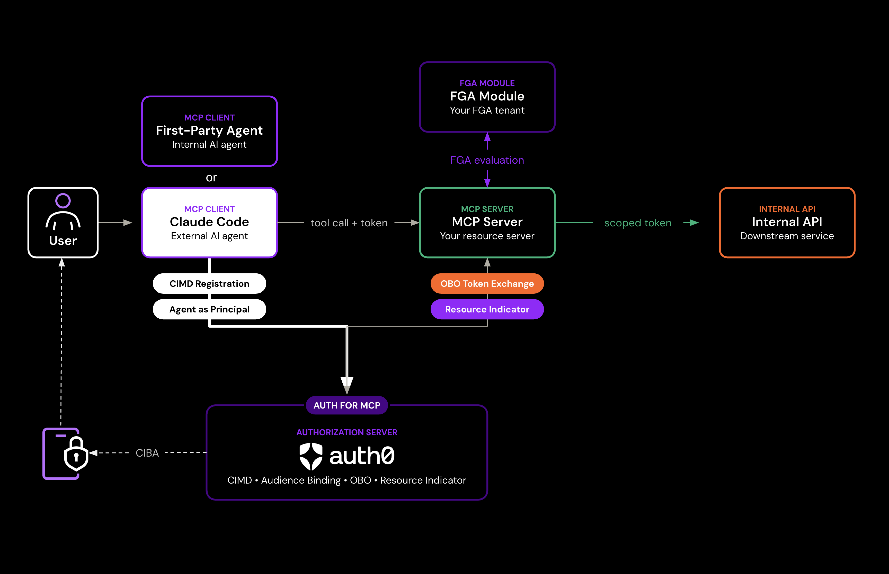
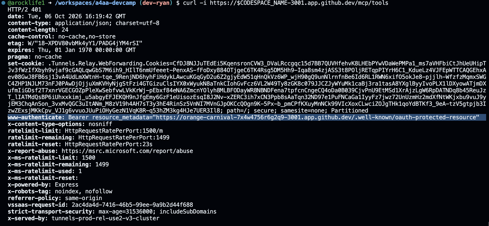
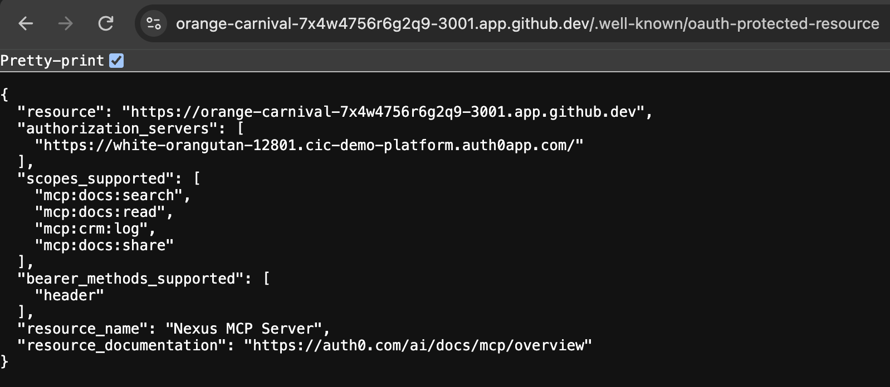
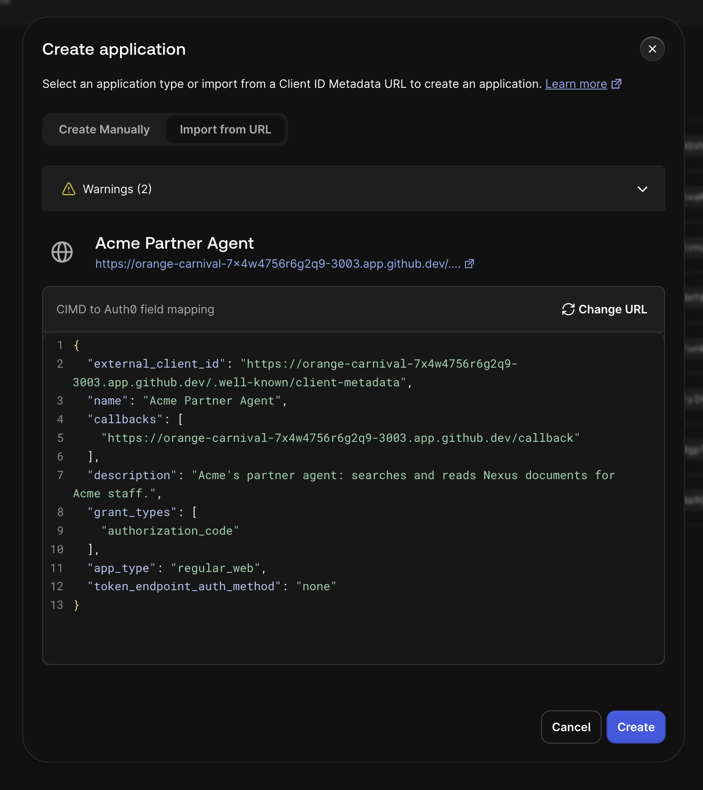
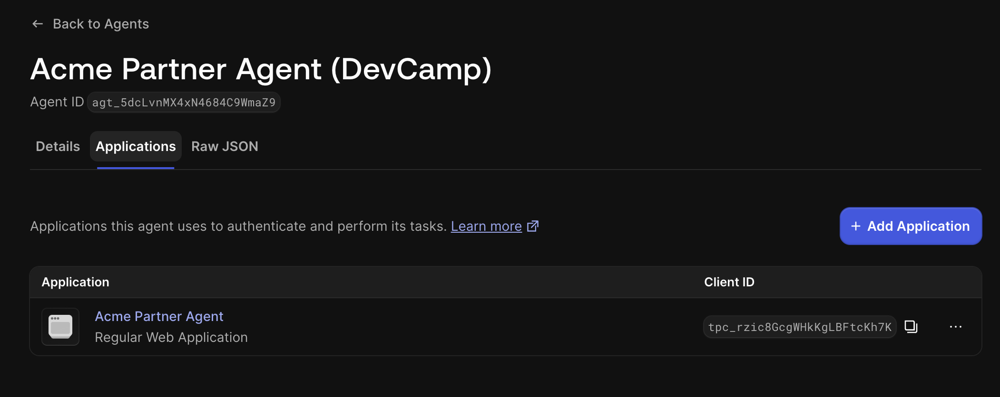
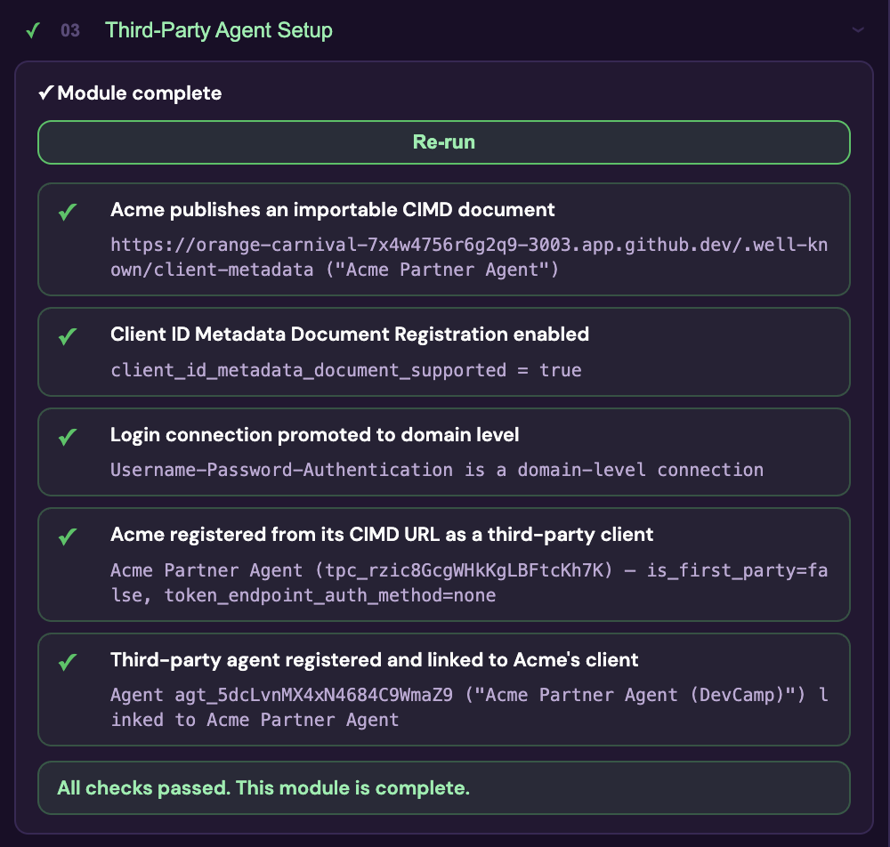

## Objective *(~10 min)*



Our Nexus MCP doesn't just want to talk to its own first-party agent. In the real world, third party agents might need to talk to it as well.

This module starts onboarding that second agent, **Acme Partner Agent**, the way the MCP authorization spec defines for third-party clients:
- the partner publishes a **Client ID Metadata Document (CIMD)**
- an admin imports it and gives it its own agent identity

Later modules finish the job: an admin grants it a deliberately smaller set of scopes, and each user consents before Acme acts for them.

By the end, you'll understand:

- What a CIMD is, why its URL *is* the client's `client_id`, and what proves it belongs to the partner.
- What an admin does to onboard a third-party agent: tenant toggles, import, a domain-level connection, and an agent record.
- How a third-party agent finds your MCP server and Auth0 on its own: a 401 or PRM, then Auth0's metadata, then Authorization Code + PKCE with the RFC 8707 `resource` parameter.

> [!NOTE]
> This module imports Acme's client and gives it an agent identity. **Auth for MCP** (the next module) is where you review and grant Acme's scopes, alongside your own agent's. **Every agent action has an owner** (the module after that) is where Acme actually connects and consents, once Universal Login is wired up for real employees.

## What's provisioned for you

Provisioning laid the groundwork every third-party client needs:

- **Client ID Metadata Document Registration** is on (**Settings → Advanced**). Auth0's authorization server metadata now advertises `client_id_metadata_document_supported: true`.
- **Username-Password-Authentication** is promoted to a **domain-level connection**. Third-party applications, including every CIMD client, can only sign users in through domain-level connections.
- The **Nexus MCP Server** API uses **per-app authorization** for user-delegated access. A newly imported client gets *nothing* until you grant it.
- The 'third party' agent (for demo purposes) with CIMD for you to connect to.

### First-party vs. third-party, at a glance

|  | First-party (Nexus Agent) | Third-party (Acme Partner Agent) |
|---|---|---|
| Who builds the agent | Your team | A partner, outside your tenant |
| How it's registered | You create a Custom API client | You **import** the partner's CIMD URL |
| `client_id` | Auth0-generated | The CIMD URL itself |
| Client authentication | Client secret (confidential) | None + PKCE (public); `private_key_jwt` if confidential; never a shared secret |
| Consent | Skipped (first-party) | Always shown on first auth (strict third-party) |
| How it gets an MCP server token | OBO exchange of the employee's Nexus Agent API token | Authorization Code + PKCE, with `resource` = the MCP server |
| `act` claim | Nested: the agent, then the SPA | Single level: Acme's agent |

The MCP server treats both the same way: validate `aud`, enforce per-tool scope, and act for `sub`.

## Dashboard steps

### Step 1: Walk through how Acme's agent will find Auth0

Any MCP client (Agent) that only knows your server's URL starts here. Let's call a tool endpoint with no token:

```bash
curl -i https://$CODESPACE_NAME-3001.app.github.dev/mcp/tools
```

*You should see: `401` with `WWW-Authenticate: Bearer resource_metadata="https://...-3001.app.github.dev/.well-known/oauth-protected-resource"`.*



This call points it to the `.well-known/oauth-protected-resource` endpoint:

```bash
curl https://$CODESPACE_NAME-3001.app.github.dev/.well-known/oauth-protected-resource
```

*You should see: `resource` (the MCP server's URL), `authorization_servers` (your Auth0 tenant), and the five `mcp:*` scopes.*



Then Auth0's own metadata, which the PRM points to:

`https://<your-auth0-tenant>/.well-known/openid-configuration`

*You can search with `ctl+f` and see: `code_challenge_methods_supported` including `S256`, and `client_id_metadata_document_supported: true`.* That's how an agent learns, without asking anyone, that it can register with a CIMD and must use PKCE.

### Step 2: read the partner's CIMD

Acme publishes its client metadata on its own server.

> [!NOTE]
> **Acme really is a separate server in this lab.** It runs as its own Express process (`demo-app/server/acme/`) on its own port and public URL, independent of Nexus. A real partner publishes its CIMD on its own domain. The document lives wherever the partner says, and its URL *is* the `client_id`.

> [!TIP]
> To find your codespace name, you can type `echo $CODESPACE_NAME` in your github codespace's terminal

```bash
https://<your-codespace-name>-3003.app.github.dev/.well-known/client-metadata
```

*You should see:*

```json
{
  "client_id": "https://<your-codespace-name>-3003.app.github.dev/.well-known/client-metadata",
  "client_name": "Acme Partner Agent",
  "application_type": "web",
  "grant_types": ["authorization_code"],
  "response_types": ["code"],
  "redirect_uris": ["https://<your-codespace-name>-3003.app.github.dev/callback"],
  "token_endpoint_auth_method": "none",
  "scope": "mcp:docs:search mcp:docs:read mcp:crm:log mcp:docs:share"
}
```

Notice three things:
- `client_id` equals the document's own URL. Controlling that HTTPS origin is the proof that this is Acme's document, the same proof a TLS certificate gives any website.
- `token_endpoint_auth_method: "none"` means Acme is a public client: We're not using a shared secret, we use PKCE instead. CIMD clients are public and thus can't use shared secrets at all. A confidential partner would use `private_key_jwt` with a `jwks_uri` on the same origin.
- Acme asks for **everything**, including `mcp:docs:share` and the Token Vault tools, but asking isn't the same as receiving.

### Step 3: import the CIMD

> [!IMPORTANT]
> CIMD must be used over the public internet, so Acme Agent's port must be **public**. In the Codespace **Ports** tab, confirm port **3003** (Acme) shows **Public** visibility. If not, right-click → **Port Visibility → Public**. Auth0 rejects `localhost` CIMD URLs, so this module needs Codespaces, or a tunnel URL in `ACME_CIMD_URL`.

1. Auth0 Dashboard → **Applications → Applications** → **Create Application** → **Import from URL**
2. Paste the CIMD URL from Step 2 → **Preview**.
3. Select **Create**.

*You should see: a new application named **Acme Partner Agent**. In **Settings**, its client is identified by the CIMD URL, it's a third-party application, and there's no client secret.*



Auth0 stores a copy of the metadata, but the partner's hosted document stays the source of truth. If Acme changes it (say, a new redirect URI), you pull the update with **Refresh Client Metadata** until dynamic CIMD is supported.

### Step 4: give Acme's agent its own identity

1. Auth0 Dashboard → **Agents** → **Create New Agent**
2. Name it ***exactly*** `Acme Partner Agent (DevCamp)` → **Create**
3. On the new agent, open the **Applications** tab → **Add Application** → select **Acme Partner Agent** → confirm.

*You should see: a second agent record with its own `agt_...` ID, distinct from your first-party agent's.*



Once linked, every token Acme obtains through a normal login carries `act.sub` = this agent's ID and `client_profile: "ai_agent"`. Tenant logs record the agent ID on every token issuance, so the partner's activity is auditable separately from your own agent's.

## Checkpoint



Use the **Run Checks** button on the left of the Nexus app page. The button confirms you completed the above steps correctly.

> [!TIP]
> If a check fails, the result should show the exact reason. Fix the flagged item and select **Re-run checks**.

<details>
  <summary style='font-size: 1.5rem;
  font-weight: bold;
  cursor: pointer;
  user-select: none;'>
    Further reading
  </summary>

- Register applications with CIMD: [auth0.com/docs/get-started/auth0-overview/create-applications/register-applications-with-cimd](https://auth0.com/docs/get-started/auth0-overview/create-applications/register-applications-with-cimd)
- Manual CIMD registration for MCP clients: [auth0.com/ai/docs/mcp/guides/registering-your-mcp-client-application/manual-cimd-registration](https://auth0.com/ai/docs/mcp/guides/registering-your-mcp-client-application/manual-cimd-registration)
- Third-party applications: [auth0.com/docs/get-started/applications/third-party-applications](https://auth0.com/docs/get-started/applications/third-party-applications)
- Agent identity in tokens: [auth0.com/docs/ai-agents-mcp/agent-as-principal/agent-identity-in-tokens](https://auth0.com/docs/ai-agents-mcp/agent-as-principal/agent-identity-in-tokens)
- MCP authorization spec (2025-11-25), Client ID Metadata Documents: [modelcontextprotocol.io/specification/2025-11-25/basic/authorization](https://modelcontextprotocol.io/specification/2025-11-25/basic/authorization)
- RFC 7591 Dynamic Client Registration (the alternative CIMD avoids; see `server/acme/cimd.js`)

</details>

---

#### <span style="font-variant: small-caps">Congrats!</span>

*You've completed this module.*

You've successfully:

<ul>
  <li style="list-style-type:'✅ ';">
      Discovered the MCP server and Auth0 the way any third-party MCP client does;
  </li>
  <li style="list-style-type:'✅ '">
      Imported a partner's CIMD as a third-party client;
  </li>
  <li style="list-style-type:'✅ '">
      Given the partner's agent its own Agent as Principal identity, distinct from your own.
  </li>
</ul>

Two agents now have fully separable identities, but neither has a scope grant and neither can call a tool yet. The next module, **Auth for MCP**, reviews and grants both agents' access to the MCP server.

#### <span style="font-variant: small-caps">Let's move on to the next module!</span>
