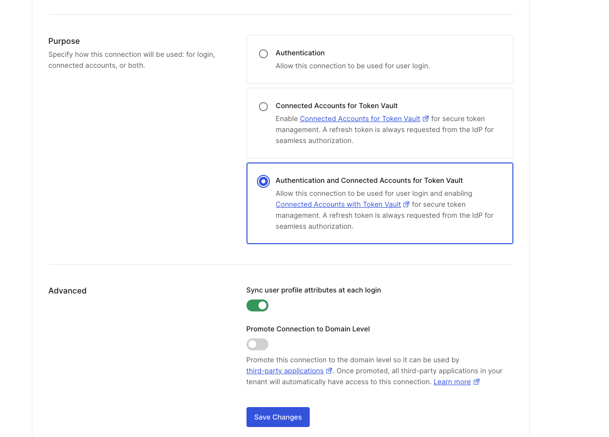
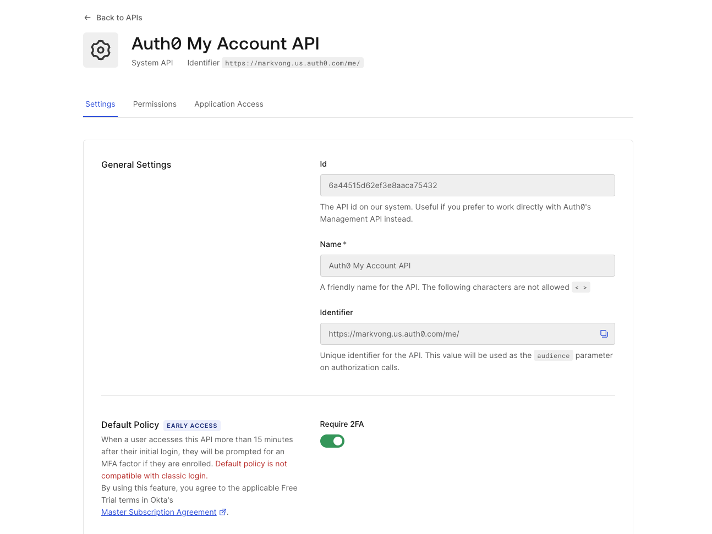
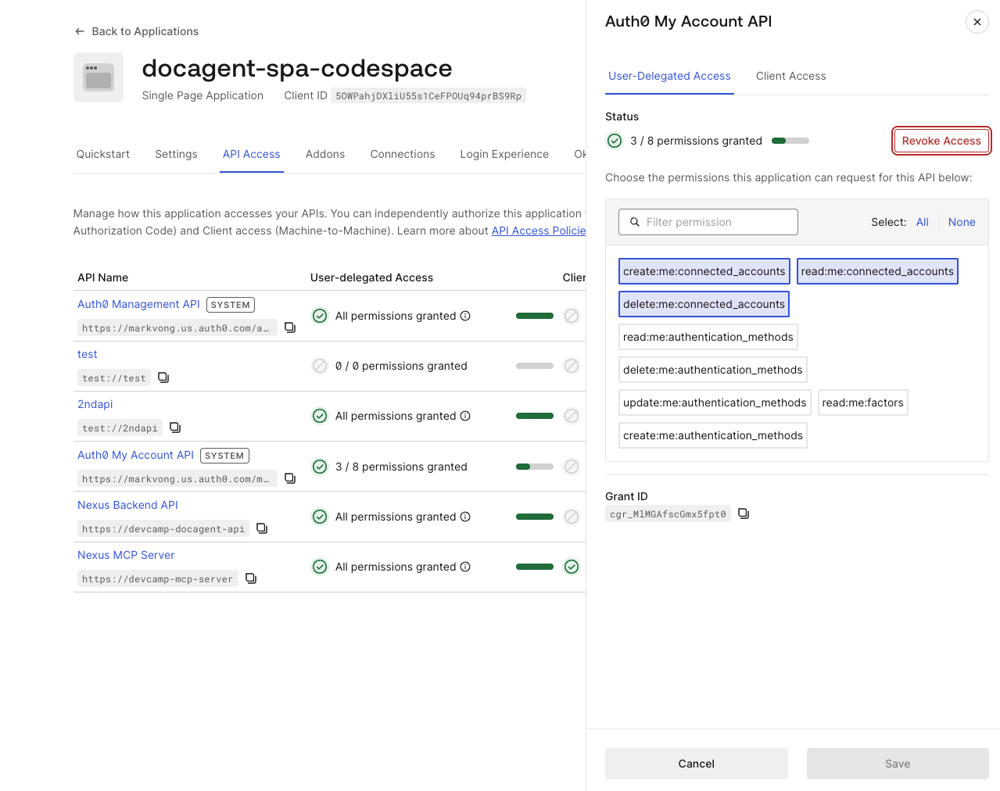

## Objective *(~20 min)*

Nexus needs to log document activity to the CRM under the employee's identity.

A bot token here creates real operational risk:
- One shared token means one blast radius for every user
- No audit trail ties back to the individual
- Every time someone leaves, you have to manually rotate those credentials

**Token Vault** solves this.

1. Auth0 stores each user's federated CRM credential.
2. Nexus then asks the vault (politely) for a short-lived, per-user access token scoped to the job at hand.
3. Nexus calls the CRM with that token, then discards it.
4. The vault handles refresh, and the user's actual refresh token never leaves Auth0.

In this module, you'll:

- Understand how **getToken(userSub, provider)** selects the live Token Vault path vs. the in-memory fallback.
- See how **log_crm_activity** calls the CRM API (port 3002) using the vaulted token.
- Enable Token Vault on the CRM connection in the Auth0 Dashboard.

<details>
  <summary style='font-size: 1.5rem;
  font-weight: bold;
  cursor: pointer;
  user-select: none;'>
    Why we're building this
  </summary>
Shared bot tokens are an operational liability that scales with your user base: one token means one blast radius, zero attribution, and a manual rotation process every time someone leaves. For an AI agent platform serving multiple employees, this pattern becomes unsustainable. It compounds both security risk and recurring operational cost.

The commercial consequence: Token Vault removes the bot-token management lifecycle entirely, freeing your developers from manually managing and auditing agent credentials so they spend that time building instead of babysitting tokens. Because the credential lives in Auth0's vault and never lands in your application database, the high-value CRM token never becomes a target sitting in agent memory. Per-user, short-lived credentials mean every CRM action is attributable to a specific employee. Offboarding becomes a single revocation instead of a coordination exercise across every system the agent touched. That reduction in operational overhead directly strengthens the security posture enterprise procurement evaluates.
</details>

## What's provisioned for you

- A CRM OAuth2 connection on your tenant pointing to the CRM mock running on port 3002 of your Codespace.
- The `docagent-mcp-obo` client you created in *One trust boundary for every agent* is a **Custom API Client** in Auth0. Custom API Clients have the **Token Vault** grant type enabled by default under Advanced Settings → Grant Types.
  - This means the same client that performs OBO token exchange for the MCP server also performs the Token Vault federated credential exchange for the CRM, so no additional client is required.

> [!WARNING]
> If you restart your Codespace, it gets a new public URL. The CRM connection registered in Auth0 points to the old URL, and the live Token Vault path fails. To fix this, reset your tenant using the reset button on the bottom right of the application, then click **Provision Resources** again from the Nexus setup screen to re-register the connection with the new URL.

## Codespace steps
### Make the CRM mock's port public
The Connected Accounts flow ("Connect" in the app header) redirects your browser through the CRM mock on port 3002 to authorize the connection.

 1. Open the **Ports** tab in your Codespace
 2. Find port **3002**
 3. Right-click the row → **Port Visibility** → **Public**

 *You should see: the **Visibility** column for port 3002 now reads **Public**.*

 Without this, clicking "Connect" fails partway through with a Content-Security-Policy error after briefly redirecting to **github.com/codespaces/auth/...**.

## Dashboard steps
### Enable Token Vault on the CRM connection
 1. Auth0 Dashboard → **Authentication → Social**
    - *You should see: the Social connections page with **crm-codespace** listed in the table.*
 2. Open **crm-codespace**
 3. Scroll down to the **Purpose** section
 4. Select **Authentication and Connected Accounts for Token Vault**
 5. Click **Save Changes**

> [!NOTE]
> *You may see an **"Offline Access Scope"** warning dialog appear at this point. This is expected.
>
> Token Vault needs a refresh token to maintain the stored credential, and this dialog is Auth0 confirming that tradeoff. Click through it to continue.*

Once turned on, Auth0 automatically requests a refresh token from the CRM on every OAuth2 flow, so it can maintain the stored credential without user re-authentication.



**Before you enable it**: the vault falls back to an in-memory mock CRM token, so the tool call still succeeds, but Auth0 isn't yet involved in storing the credential.

**After enabling it**: Auth0 stores the user's real CRM access token and refresh token, and the live federated exchange fires on every **log_crm_activity** call.

### Authorize the Nexus SPA for the Auth0 My Account API

Enabling Token Vault on the connection makes the *exchange* possible. But Auth0 still needs a refresh token, and that only gets stored once a user actually links the CRM connection via the **Connected Accounts** flow (the "Connect" button in the app header).

That flow runs against Auth0's My Account API, so you need to activate the API on your tenant and authorize the SPA to request a token for it.

1. Auth0 Dashboard → **Applications → APIs**
2. Find the **Auth0 My Account API** card and click **Activate**
    - *You should see: the card now shows the API as active (the **Activate** button is gone).*



3. Auth0 Dashboard → **Applications → Applications → docagent-spa-codespace**
4. Go to the **API Access** tab
    - *You should see: a list of first-party Auth0 APIs the application can request access to, including **Auth0 My Account API**.*
5. Click **Auth0 My Account API** in the list. In the panel that opens, stay on the **User-Delegated Access** tab and select scopes: `create:me:connected_accounts`, `read:me:connected_accounts`, `delete:me:connected_accounts`
6. Click **Grant Access**. It takes effect immediately. A separate **Save** button on this screen may appear grayed out. If so, there's nothing to save, and you can move on.
    - *You should see: "3 / 8 permissions granted" under User-delegated Access for Auth0 My Account API.*



At tool-call time, the backend asks Auth0 for a short-lived, per-user federated access token for exactly one downstream call, preserving the user's identity from *One trust boundary for every agent*.

The user's actual refresh token never leaves Auth0.

> [!NOTE]
> If Token Vault isn't yet enabled on the connection (or the user hasn't linked one), the vault falls back to an in-memory token with the same API shape, so **log_crm_activity** still completes offline.

> [!NOTE]
> Self-hosting **starter/**? Register the CRM as a custom OAuth2 social connection in your own tenant, enable Token Vault (refresh-token storage), and the same code retrieves stored tokens for the authenticated user.
>
> In production, the retrieval pattern is **GET /api/v2/users/{user_id}/tokens/{connection}** with an M2M token that has **read:user_tokens**.

## How Token Vault is wired

### The vault: **server/token-vault/vault.js**

**getToken(userId, provider)** tries the live federated path first. If the tenant has the CRM connection provisioned **and** Token Vault is enabled on it, it exchanges the user's access token with Auth0 to get a short-lived CRM credential.

If either condition isn't met, it falls back to the in-memory mock so the lab runs offline.

> [!NOTE]
> The grant type here:
> **urn:auth0:params:oauth:grant-type:token-exchange:federated-connection-access-token**
> 
> is Auth0's own variant, distinct from the RFC 8693 OBO grant you used in *One trust boundary for every agent* (**urn:ietf:params:oauth:grant-type:token-exchange**).
>
> Both are token exchanges but they serve different purposes:
> - OBO preserves user identity across the agent boundary.
> - This one retrieves a stored third-party credential from Token Vault.

```js
// Live path: Token Vault exchange
async function getLiveToken(userId, provider, tenant, userAccessToken) {
  const connection = connectionFor(tenant, provider); // resolves "crm" -> connection name
  const dd = tenant?.deploymentData;
  if (!connection || !userAccessToken || !tenant?.domain || !dd?.m2m_client_id) return null;

  const response = await fetch(`https://${tenant.domain}/oauth/token`, {
    method: "POST",
    headers: { "Content-Type": "application/json" },
    body: JSON.stringify({
      grant_type: "urn:auth0:params:oauth:grant-type:token-exchange:federated-connection-access-token",
      subject_token: userAccessToken,
      subject_token_type: "urn:ietf:params:oauth:token-type:access_token",
      requested_token_type: "http://auth0.com/oauth/token-type/federated-connection-access-token",
      connection,
      client_id: dd.m2m_client_id,
      client_secret: dd.m2m_client_secret,
    }),
  });
  // returns { token, provider } or null on failure
}
```

### The CRM API: **server/crm/app.js**

An OAuth2 authorization server and CRM activities API run on port 3002 in your Codespace.

Auth0 points the custom social connection at its **/crm/oauth/authorize** and **/crm/oauth/token** endpoints.

The CRM app signs its own JWTs and validates them on every **POST /crm/activities** call.

### The tool handler: **server/mcp/server.js**

```js
case "log_crm_activity": {
  const { action, documentId, documentTitle, notes } = args;
  const tokenResult = await getToken(userSub, "crm", tenant, userAccessToken);
  if (!tokenResult) {
    return { success: false, error: "No CRM account linked. Ask the user to connect their CRM." };
  }
  const apiBase = process.env.CRM_API_URL || `http://localhost:${process.env.CRM_PORT || 3002}`;
  const response = await fetch(`${apiBase}/crm/activities`, {
    method: "POST",
    headers: { Authorization: `Bearer ${tokenResult.token}`, "Content-Type": "application/json" },
    body: JSON.stringify({ action, documentId, documentTitle, notes, userId: userSub }),
  });
  if (!response.ok) return { success: false, error: `CRM API error: ${response.statusText}` };
  const data = await response.json();
  return { success: true, ...data };
}
```

> [!IMPORTANT]
> The **userId: userSub** in the request body is the user's Auth0 subject, so the CRM record is attributed to the *human*, not the *agent*.

## Checkpoint

Use the **Run Checks** button on the left of the Nexus app page. The in-app verifier confirms Token Vault is enabled on the CRM connection.

Before running checks, complete the parts you can do right now: Dashboard config and the Connected Accounts link, both independent of the chat interface.

1. Make the CRM mock's port (3002) public, enable Token Vault on the CRM connection, and authorize the SPA for the Auth0 My Account API (all three Dashboard steps above).
2. Click **Connect** next to "CRM" in the app header (this button is always available, even before the chat interface unlocks). This runs the real Connected Accounts flow against the CRM mock and redirects you back into the app.

> [!NOTE]
> Once chat unlocks after *Access that knows where it ends*, you'll send *"Find the Q3 roadmap"* (seeds an in-memory CRM credential the first time), then *"Log that I viewed the Q3 roadmap in the CRM."*
>
> The response includes a logged activity ID.
>
> Sending that same message again after linking the CRM flips the server log from the seeded mock to **[Token Vault] (live) federated token for …**.
>
> The **userId** in that activity record matches the Auth0 **sub** of the logged-in user rather than a service account, confirming the credential is scoped per-user.

<details>
  <summary style='font-size: 1.5rem;
  font-weight: bold;
  cursor: pointer;
  user-select: none;'>
    What you learned
  </summary>

Token Vault eliminates the operational and compliance burden of shared bot tokens. Instead of managing long-lived service credentials across teams, each call is scoped to the job and the individual. Every CRM record ties back to the employee's identity, and credential rotation becomes Auth0's responsibility.

In the lab, the vault was auto-seeded with a simulated credential on your first tool call. In production, a real employee would go through an OAuth2 consent flow the first time they link their CRM account. Auth0 stores the resulting refresh token, and Token Vault exchanges it for short-lived access tokens on every subsequent call. Offboarding just means revoking that connection in Auth0, with no token spreadsheet to maintain.
</details>

#### <span style="font-variant: small-caps">Congrats!</span>

*You've completed this module.*

You've successfully:

<ul>
  <li style="list-style-type:'✅ ';">
      Enabled Token Vault on the CRM connection in the Auth0 Dashboard;
  </li>
  <li style="list-style-type:'✅ '">
      Observed how <code>getToken</code> selects the live federated exchange vs. the in-memory fallback;
  </li>
  <li style="list-style-type:'✅ '">
      Logged a CRM activity attributed to the user's identity, not a shared service account;
  </li>
  <li style="list-style-type:'✅ '">
      Confirmed the CRM record shows the user's Auth0 <code>sub</code>, not an agent client ID.
  </li>
</ul>

Per-user credentials are now handled. One gap remains: the agent can share documents with external recipients without any confirmation. *Humans approve what can't be undone* adds the approval gate.

#### <span style="font-variant: small-caps">Let's move on to the next module!</span>
