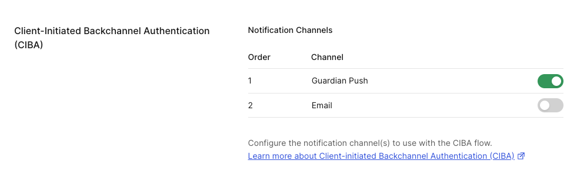

# Module 04: Async Authorization (CIBA)

## Objective *(~20 min)*

Not every tool call should execute without confirmation. This module wires CIBA (Client-Initiated Backchannel Authentication) so that irreversible actions — specifically, sharing a document with an external recipient — require explicit employee approval on their own device before they execute.

In this module you will:

- Understand how `share_document` triggers CIBA before calling the MCP server.
- See how the binding message ties the push notification to the exact action being approved.
- Trigger a real Guardian push notification and watch the approval resolve the pending tool call.

### Why we're building this

Fully automated irreversible actions, like sharing a confidential document with an external recipient, represent one of the highest-risk categories of AI agent behavior. Without a human approval gate, a single compromised session or a mistyped email address sends sensitive data outside the organization with no recourse.

The commercial consequence: CIBA lets the agent run everything else silently — no approval prompt for a document search, no interruption for a CRM lookup — and surfaces a mobile approval only for the action that's genuinely irreversible: sharing outside the organization. That eliminates execution friction everywhere except where it should exist, and it also stops rogue agent actions because no external share executes without an un-bypassable, device-bound human approval, whether the agent is behaving correctly or has been compromised. Compliance teams at enterprise customers block deployments that skip this control. CIBA turns a blocked feature into an approved one, with a timestamped approval record on every share.

## Prerequisites

- You completed **Modules 01–03**. Nexus already authenticates the user, vaults credentials, and routes every tool call through the secured MCP server. CIBA adds a device-level approval gate on top of that.
- The Auth0 Guardian app installed (see **Module 00**) and your user account enrolled. This module runs the live CIBA flow end-to-end, so enrollment is required to receive the approval push.

## Premise

A user wants to share a sensitive document with an external email address. External sharing is irreversible and subject to data policy, so Nexus should not execute that action without the user actively confirming on their own device.

The agent backend initiates an authorization request with a human-readable binding message. The user's device surfaces a push notification. The user approves, and only then does the share execute.

## What's provisioned for you

Provision Resources created a CIBA client on your tenant (`docagent-ciba-codespace`) — a confidential regular web app with the `urn:openid:params:grant-type:ciba` grant already enabled, authorized against the MCP API (`chat:send`) and the Nexus Backend API (`mcp:docs:share`). There are no required Dashboard steps to complete this module.

> [!NOTE]
> CIBA is configured at the **application level** only. There is no tenant-level CIBA toggle in Auth0. The provisioned client already has everything set.

### Enroll alice in Guardian push MFA

For CIBA push notifications to fire on a real device, the logged-in user must be enrolled in Guardian.

1. In the Auth0 Dashboard, go to **Security → Multi-factor Auth** and confirm Guardian is enabled.
2. Log out of Nexus and log back in as `alice@docagent.demo`.
3. Auth0 will prompt to enroll a second factor — open the **Auth0 Guardian** app and scan the QR code shown.
4. Once enrolled, triggering a document share sends a real Guardian push notification to your device.

The checkpoint verifier checks that `alice@docagent.demo` has a confirmed Guardian enrollment.

> [!NOTE]
> Self-hosting `starter/`? Create a confidential Regular Web Application, add the `urn:openid:params:grant-type:ciba` grant in **Advanced Settings → Grant Types**, authorize it against your backend and MCP APIs, and enroll your user in Guardian push MFA.

## Dashboard Steps

### Enable Guardian push notifications on the CIBA client

The CIBA client is provisioned with email as its notification channel. Enable Guardian push so the in-app approval request can trigger a real device notification.

1. Auth0 Dashboard → **Applications → Applications → docagent-ciba-codespace**
2. In the left-side section list, look for **Client-Initiated Backchannel Authentication (CIBA)** — that's the section header itself, easier to spot than the **Notification Channels** control that lives inside it
3. Toggle on **Guardian Push** → **Save**

*You should see: `guardian-push` listed as an active notification channel.*



> [!NOTE]
> Guardian push requires the user to be enrolled in Auth0 Guardian MFA — complete the enrollment step above before running the demo scenario below. The checkpoint verifier itself only checks that the channel is enabled on the client.

## Code Steps

> [!NOTE]
> This code is already implemented in the demo-app. The steps below walk you through the implementation — open each file in your editor as you go. You are not writing new code in this module.

Once the tenant has a provisioned CIBA client, `initiateCIBA` calls Auth0's `/bc-authorize` directly and `checkCIBAStatus` polls `/oauth/token` with the CIBA grant. The state machine is Auth0's own: `pending` → `approved | denied`, with the expiry and polling interval Auth0 returns from `/bc-authorize`.

### Step 1: the CIBA middleware

`server/middleware/ciba.js`:

```js
const CIBA_GRANT = "urn:openid:params:grant-type:ciba";
const cibaRequests = new Map();

function cibaClient(tenant) {
  const dd = tenant?.deploymentData;
  if (!dd?.ciba_client_id || !tenant?.domain) return null;
  return { domain: tenant.domain, clientId: dd.ciba_client_id, clientSecret: dd.ciba_client_secret };
}

export async function initiateCIBA(userId, userEmail, toolName, scope, bindingMessage = "", tenant) {
  const message = bindingMessage || `Approve use of ${toolName}`;
  const live = cibaClient(tenant);

  // login_hint identifies the rep to push to. Auth0 accepts an
  // iss_sub-formatted JSON hint resolved against the tenant issuer.
  const loginHint = JSON.stringify({ format: "iss_sub", iss: tenant.issuer, sub: userId });
  const body = new URLSearchParams({
    client_id: live.clientId,
    scope: `openid ${scope}`.trim(),
    binding_message: message,
    login_hint: loginHint,
  });
  if (live.clientSecret) body.set("client_secret", live.clientSecret);

  const res = await fetch(`https://${live.domain}/bc-authorize`, {
    method: "POST",
    headers: { "Content-Type": "application/x-www-form-urlencoded" },
    body,
  });
  const data = await res.json();
  cibaRequests.set(data.auth_req_id, {
    userId, toolName, status: "pending",
    authReqId: data.auth_req_id, bindingMessage: message, createdAt: Date.now(), live,
  });
  return { authReqId: data.auth_req_id, expiresIn: data.expires_in ?? 300, interval: data.interval ?? 5, bindingMessage: message };
}

export async function checkCIBAStatus(authReqId) {
  const request = cibaRequests.get(authReqId);
  if (!request) return { status: "denied" };

  // Poll Auth0 /oauth/token with the CIBA grant.
  const body = new URLSearchParams({
    grant_type: CIBA_GRANT,
    auth_req_id: authReqId,
    client_id: request.live.clientId,
  });
  if (request.live.clientSecret) body.set("client_secret", request.live.clientSecret);

  const res = await fetch(`https://${request.live.domain}/oauth/token`, {
    method: "POST",
    headers: { "Content-Type": "application/x-www-form-urlencoded" },
    body,
  });
  const data = await res.json();

  if (res.ok && data.access_token) {
    const { userId, toolName, bindingMessage } = request;
    cibaRequests.delete(authReqId);
    return { status: "approved", token: data.access_token, bindingMessage, userId, toolName };
  }
  // authorization_pending / slow_down -> still waiting on the device.
  if (data.error === "authorization_pending" || data.error === "slow_down") {
    return { status: "pending", bindingMessage: request.bindingMessage };
  }
  // access_denied / expired_token / invalid_request -> terminal.
  cibaRequests.delete(authReqId);
  return { status: "denied", bindingMessage: request.bindingMessage };
}
```

> [!NOTE]
> The full file also has `listPendingCIBA()` for the dev `/api/mcp/logs`-style introspection endpoint, and a `buildDocShareBindingMessage()` that sanitizes the title/recipient into Auth0's allowed binding-message character set (`alphanumerics, whitespace, +-_.,:#`).

### Step 2: the binding message

Same file, `buildDocShareBindingMessage`:

```js
export function buildDocShareBindingMessage(params) {
  const title = params.documentTitle || params.documentId || "document";
  const recipient = params.recipientEmail || "external recipient";
  // Auth0 allows only: alphanumerics, whitespace, +-_.,:#
  const safeTitle = title.replace(/[^a-zA-Z0-9 +\-_.,:#]/g, " ").trim();
  const safeRecipient = recipient.replace("@", " at ").replace(/[^a-zA-Z0-9 +\-_.,:#]/g, " ").trim();
  const msg = `Approve: share ${safeTitle} to ${safeRecipient}`;
  return msg.length > 64 ? msg.substring(0, 61) + "..." : msg;
}
```

The binding message is human-readable and surfaces exactly what the user is approving (title and recipient) in the Guardian push notification on their device. Auth0 restricts `binding_message` to a narrow character set, so emails and punctuation are sanitized before the `/bc-authorize` call.

### Step 3: the `share_document` gate in the LLM path

`server/llm.js` — when the authorization check returns `requiresConsent: true` for `share_document`, the gate fires before the tool reaches the MCP server:

```js
// checkToolAuthorization returns { authorized, requiresConsent, cibaInfo }
// when share_document is detected and no approval is in place yet.
const authResult = await checkToolAuthorization(user.sub, user.scope, toolName);

if (!authResult.authorized && authResult.requiresConsent) {
  const bindingMessage = buildDocShareBindingMessage({
    documentTitle: parameters.documentTitle,
    recipientEmail: parameters.recipientEmail,
  });
  const ciba = await initiateCIBA(user.sub, user.email, toolName, "mcp:docs:share", bindingMessage, tenant);
  return {
    message: `External sharing requires your approval. Check your device: "${bindingMessage}"`,
    pendingCIBA: { ...ciba, toolName },
  };
}
```

The same gate runs in `server/simulator.js` (the pattern-matching fallback used when the OpenAI call is unavailable), so every code path requires CIBA approval before the share executes.

### Step 4: the CIBA endpoints

`server/index.js`:

```js
import {
  initiateCIBA, checkCIBAStatus, approveCIBA, denyCIBA, listPendingCIBA,
} from "./middleware/ciba.js";

// The binding message is built upstream (in llm.js / simulator.js) and
// forwarded in the request body so this endpoint stays generic.
app.post("/api/ciba/initiate", validateAccessToken, async (req, res) => {
  const user = extractUser(req);
  const { toolName, scope, bindingMessage } = req.body;
  const result = await initiateCIBA(
    user.sub, user.email || "", toolName, scope, bindingMessage, req.tenant
  );
  res.json(result);
});

app.get("/api/ciba/status/:authReqId", validateAccessToken, async (req, res) => {
  res.json(await checkCIBAStatus(req.params.authReqId));
});

app.post("/api/ciba/approve/:authReqId", (req, res) => {
  const success = approveCIBA(req.params.authReqId);
  res.json({ approved: success });
});

app.post("/api/ciba/deny/:authReqId", (req, res) => {
  const success = denyCIBA(req.params.authReqId);
  res.json({ denied: success });
});

app.get("/api/ciba/pending", (_req, res) => {
  res.json(listPendingCIBA());
});
```

### Step 5: the frontend poll

`src/hooks/useChat.js` — `startPolling` checks `/api/ciba/status/:authReqId` when `data.pendingCIBA` comes back. The binding message surfaces in the pending card (wired in `Chat.jsx`).

## Checkpoint

**Step 1 — Verify setup.** Use the **Run Checks** button at the bottom of this page. The in-app verifier confirms the CIBA grant is active on your provisioned CIBA client.

> [!NOTE]
> **Preview — you'll run this live in Module 07 (End-to-End).** Once chat unlocks after Module 05, here's the demo scenario you'll drive yourself:
>
> 1. Prompt Nexus: *"Share the Q3 roadmap with external@partner.com."*
> 2. The response includes a pending-approval card with the binding message, e.g. `Approve: share Q3 Product Roadmap to external at partner.com`.
> 3. A Guardian push notification arrives on your enrolled device showing the same binding message.
> 4. Tap **Allow** in the Guardian app.
> 5. The frontend's poll resolves to `approved`, the UI updates, and the share executes.
>
> The approval window comes straight from Auth0's `/bc-authorize` response (`expires_in`, default 300 seconds). If you initiate a share and don't approve on your device in time, the next poll returns `denied` and the share is silently aborted.

## What you learned

Tool-level approvals tied to the user's device turn "agent shared a document nobody signed off on" into "user explicitly approved this share action, timestamped, with the exact document and recipient in the approval record." That audit artifact is what makes irreversible external sharing safe to automate at all. Without CIBA, every external share would require a manual review cycle, which defeats the point of having an agent do it.

#### <span style="font-variant: small-caps">Congrats!</span>

*You have completed this module.*

You should have successfully:

<ul>
  <li style="list-style-type:'✅ ';">
      identified <code>share_document</code> as an irreversible action requiring out-of-band approval;
  </li>
  <li style="list-style-type:'✅ '">
      built a human-readable binding message from the document title and recipient email;
  </li>
  <li style="list-style-type:'✅ '">
      initiated a CIBA request and gated the share on the user's device approval;
  </li>
  <li style="list-style-type:'✅ '">
      produced a timestamped approval record tying the external share to the authenticated user.
  </li>
</ul>

Irreversible actions are now gated. The final control — document-level access enforcement — has been running silently throughout. Module 05 shows you what it looks like in action.

#### <span style="font-variant: small-caps">Let's move on to the next module!</span>
