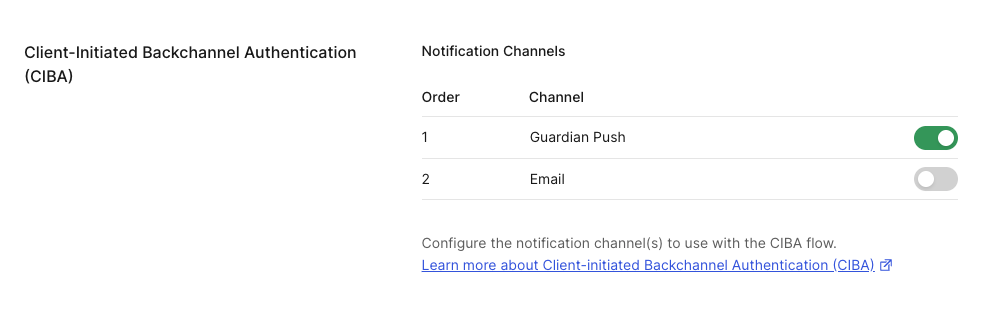

# Objective *(~20 min)*

This module wires CIBA (Client-Initiated Backchannel Authentication) so that specific actions (specifically sharing a document with an external recipient) require explicit employee approval before they execute. 

In this module you will:

- Understand how **share_document** triggers CIBA before calling the MCP server.
- See how the binding message ties the push notification to the exact action being approved.
- Trigger a real Guardian push notification and watch the approval resolve the pending tool call.

### Why we're building this

Fully automated irreversible actions represent one of the highest-risk categories of AI agent behavior. 

The commercial consequence: CIBA lets the agent run everything else silently. No approval prompts for document searches, no interruptions for CRM lookups.

It surfaces a mobile approval only for the action that's genuinely irreversible: sharing outside the organization. 

That eliminates execution friction everywhere except where it should exist, and it also stops rogue agent actions because no external share executes without an un-bypassable, device-bound human approval, whether the agent is behaving correctly or has been compromised. 

Compliance teams at enterprise customers block deployments that skip this control. CIBA turns a blocked feature into an approved one, with a timestamped approval record on every share.

## Prerequisites

- You completed all previous modules.
- The Auth0 Guardian app installed and your user is enrolled. This module runs the live CIBA flow end-to-end, so enrollment is required to receive the approval push.

## Premise

A user wants to share a sensitive document with an external email address. External sharing is irreversible and subject to data policy, so Nexus requires active confirmation from the user on their own device.

The flow looks like this; 
1. The agent backend will initiate an authorization request with a specific custom message
2. The user's device surfaces a push notification
3. Only after approval does the share execute.

## What's provisioned for you

- A CIBA client on your tenant (`docagent-ciba-codespace`)
  - This is a regular web app with:
    - The **urn:openid:params:grant-type:ciba** grant already enabled
    - Authorization against the MCP API (**chat:send**)
    - Authorization against the Nexus Backend API (**mcp:docs:share**). 

> [!NOTE]
> There are no required Dashboard steps to complete this module.

### Enroll alice in Guardian push MFA

For CIBA push notifications to fire on a real device, the logged-in user must be enrolled in Guardian.

Guardian push MFA is enforced tenant-wide (see *Every agent action has an owner*), so you most likely already enrolled a device the first time you logged in as Alice. If it did not:

1. In the Auth0 Dashboard, go to **Security → Multi-factor Auth** and confirm Guardian is enabled.
2. Log out of Nexus and log back in as **`alice@docagent.demo`**.
3. Auth0 will prompt to enroll a second factor. Open the **Auth0 Guardian** app and scan the QR code shown.
4. Once enrolled, triggering a document share sends a real Guardian push notification to your device.

The checkpoint verifier checks that **`alice@docagent.demo`** has a confirmed Guardian enrollment.

> [!NOTE]
> Self-hosting? 
>
>Create a confidential Regular Web Application, add the **urn:openid:params:grant-type:ciba** grant in **Advanced Settings → Grant Types**, authorize it against your backend and MCP APIs, and enroll your user in Guardian push MFA.

## Dashboard Steps

### Validate Guardian push notifications on the CIBA client

Enable Guardian push so the in-app approval request can trigger a real device notification.

1. Auth0 Dashboard → **Applications → Applications → docagent-ciba-codespace**
2. In the left-side section list, look for **Client-Initiated Backchannel Authentication (CIBA)**.
3. Validate that **Guardian Push** is turned on.



## Code Steps

> [!NOTE]
> This code is already implemented in the demo-app. **You are not writing new code in this module.**

Once the tenant has a provisioned CIBA client: 
- **initiateCIBA** calls Auth0's **/bc-authorize** directly
- **checkCIBAStatus** polls **/oauth/token** with the CIBA grant. 

The state machine is Auth0's own: **pending** > **approved | denied**, with the expiry and polling interval Auth0 returns from **/bc-authorize**.

### Step 1: the CIBA middleware

**server/middleware/ciba.js**:

```js
const CIBA_GRANT = "urn:openid:params:grant-type:ciba";
const cibaRequests = new Map();

function cibaClient(tenant) {
  const dd = tenant?.deploymentData;
  if (!dd?.ciba_client_id || !tenant?.domain) return null;
  return { domain: tenant.domain, clientId: dd.ciba_client_id, clientSecret: dd.ciba_client_secret };
}

export async function initiateCIBA(userId, userEmail, toolName, scope, bindingMessage = "", tenant) {
  const message = bindingMessage || `Approve use of ${toolName}`;
  const live = cibaClient(tenant);

  // login_hint identifies the rep to push to. Auth0 accepts an
  // iss_sub-formatted JSON hint resolved against the tenant issuer.
  const loginHint = JSON.stringify({ format: "iss_sub", iss: tenant.issuer, sub: userId });
  const body = new URLSearchParams({
    client_id: live.clientId,
    scope: `openid ${scope}`.trim(),
    binding_message: message,
    login_hint: loginHint,
  });
  if (live.clientSecret) body.set("client_secret", live.clientSecret);

  const res = await fetch(`https://${live.domain}/bc-authorize`, {
    method: "POST",
    headers: { "Content-Type": "application/x-www-form-urlencoded" },
    body,
  });
  const data = await res.json();
  cibaRequests.set(data.auth_req_id, {
    userId, toolName, status: "pending",
    authReqId: data.auth_req_id, bindingMessage: message, createdAt: Date.now(), live,
  });
  return { authReqId: data.auth_req_id, expiresIn: data.expires_in ?? 300, interval: data.interval ?? 5, bindingMessage: message };
}

export async function checkCIBAStatus(authReqId) {
  const request = cibaRequests.get(authReqId);
  if (!request) return { status: "denied" };

  // Poll Auth0 /oauth/token with the CIBA grant.
  const body = new URLSearchParams({
    grant_type: CIBA_GRANT,
    auth_req_id: authReqId,
    client_id: request.live.clientId,
  });
  if (request.live.clientSecret) body.set("client_secret", request.live.clientSecret);

  const res = await fetch(`https://${request.live.domain}/oauth/token`, {
    method: "POST",
    headers: { "Content-Type": "application/x-www-form-urlencoded" },
    body,
  });
  const data = await res.json();

  if (res.ok && data.access_token) {
    const { userId, toolName, bindingMessage } = request;
    cibaRequests.delete(authReqId);
    return { status: "approved", token: data.access_token, bindingMessage, userId, toolName };
  }
  // authorization_pending / slow_down -> still waiting on the device.
  if (data.error === "authorization_pending" || data.error === "slow_down") {
    return { status: "pending", bindingMessage: request.bindingMessage };
  }
  // access_denied / expired_token / invalid_request -> terminal.
  cibaRequests.delete(authReqId);
  return { status: "denied", bindingMessage: request.bindingMessage };
}
```

### Step 2: the binding message

Same file, **buildDocShareBindingMessage**:

```js
export function buildDocShareBindingMessage(params) {
  const title = params.documentTitle || params.documentId || "document";
  const recipient = params.recipientEmail || "external recipient";
  // Auth0 allows only: alphanumerics, whitespace, +-_.,:#
  const safeTitle = title.replace(/[^a-zA-Z0-9 +\-_.,:#]/g, " ").trim();
  const safeRecipient = recipient.replace("@", " at ").replace(/[^a-zA-Z0-9 +\-_.,:#]/g, " ").trim();
  const msg = `Approve: share ${safeTitle} to ${safeRecipient}`;
  return msg.length > 64 ? msg.substring(0, 61) + "..." : msg;
}
```

The message sent is human-readable and surfaces exactly what the user is approving in the Guardian push notification on their device. 

Auth0 restricts **binding_message** to a narrow character set, so emails and punctuation are sanitized before the **/bc-authorize** call.

### Step 3: the **share_document** gate in the LLM path

In **server/llm.js**, when the authorization check returns **requiresConsent: true** for **share_document**, the gate fires before the tool reaches the MCP server:

```js
// checkToolAuthorization returns { authorized, requiresConsent, cibaInfo }
// when share_document is detected and no approval is in place yet.
const authResult = await checkToolAuthorization(user.sub, user.scope, toolName);

if (!authResult.authorized && authResult.requiresConsent) {
  const bindingMessage = buildDocShareBindingMessage({
    documentTitle: parameters.documentTitle,
    recipientEmail: parameters.recipientEmail,
  });
  const ciba = await initiateCIBA(user.sub, user.email, toolName, "mcp:docs:share", bindingMessage, tenant);
  return {
    message: `External sharing requires your approval. Check your device: "${bindingMessage}"`,
    pendingCIBA: { ...ciba, toolName },
  };
}
```

The same gate runs in **server/simulator.js** (the pattern-matching fallback used when the OpenAI call is unavailable), so every code path requires CIBA approval before the share executes.

### Step 4: the CIBA endpoints

**server/index.js**:

```js
import {
  initiateCIBA, checkCIBAStatus, approveCIBA, denyCIBA, listPendingCIBA,
} from "./middleware/ciba.js";

// The binding message is built upstream (in llm.js / simulator.js) and
// forwarded in the request body so this endpoint stays generic.
app.post("/api/ciba/initiate", validateAccessToken, async (req, res) => {
  const user = extractUser(req);
  const { toolName, scope, bindingMessage } = req.body;
  const result = await initiateCIBA(
    user.sub, user.email || "", toolName, scope, bindingMessage, req.tenant
  );
  res.json(result);
});

app.get("/api/ciba/status/:authReqId", validateAccessToken, async (req, res) => {
  res.json(await checkCIBAStatus(req.params.authReqId));
});

app.post("/api/ciba/approve/:authReqId", (req, res) => {
  const success = approveCIBA(req.params.authReqId);
  res.json({ approved: success });
});

app.post("/api/ciba/deny/:authReqId", (req, res) => {
  const success = denyCIBA(req.params.authReqId);
  res.json({ denied: success });
});

app.get("/api/ciba/pending", (_req, res) => {
  res.json(listPendingCIBA());
});
```

### Step 5: the frontend poll

In **src/hooks/useChat.js**, **startPolling** checks **/api/ciba/status/:authReqId** when **data.pendingCIBA** comes back. The binding message surfaces in the pending card (wired in **Chat.jsx**).

## Checkpoint

Use the **Run Checks** button on the left of the Nexus app page. The in-app verifier confirms the CIBA grant is active on your provisioned CIBA client.

> [!NOTE]
> **For the preview: you'll run this live in *Putting it all together* (End-to-End).** Once chat unlocks after *Access that knows where it ends*.

## What you learned

Tool-level approvals tied to the user's device turn "agent shared a document nobody signed off on" into "user explicitly approved this share action, timestamped, with the exact document and recipient in the approval record." That audit artifact is what makes irreversible external sharing safe to automate at all. Manual review cycles would defeat the point of having an agent do this work, but CIBA lets you keep both the safety and the automation.

#### <span style="font-variant: small-caps">Congrats!</span>

*You have completed this module.*

You should have successfully:

<ul>
  <li style="list-style-type:'✅ ';">
      Identified <code>share_document</code> as an irreversible action requiring out-of-band approval;
  </li>
  <li style="list-style-type:'✅ '">
      Built a human-readable binding message from the document title and recipient email;
  </li>
  <li style="list-style-type:'✅ '">
      Initiated a CIBA request and gated the share on the user's device approval;
  </li>
  <li style="list-style-type:'✅ '">
      Produced a timestamped approval record tying the external share to the authenticated user.
  </li>
</ul>

Irreversible actions are now gated. The final control, document-level access enforcement, has been running silently throughout. *Access that knows where it ends* shows you what it looks like in action.

#### <span style="font-variant: small-caps">Let's move on to the next module!</span>
