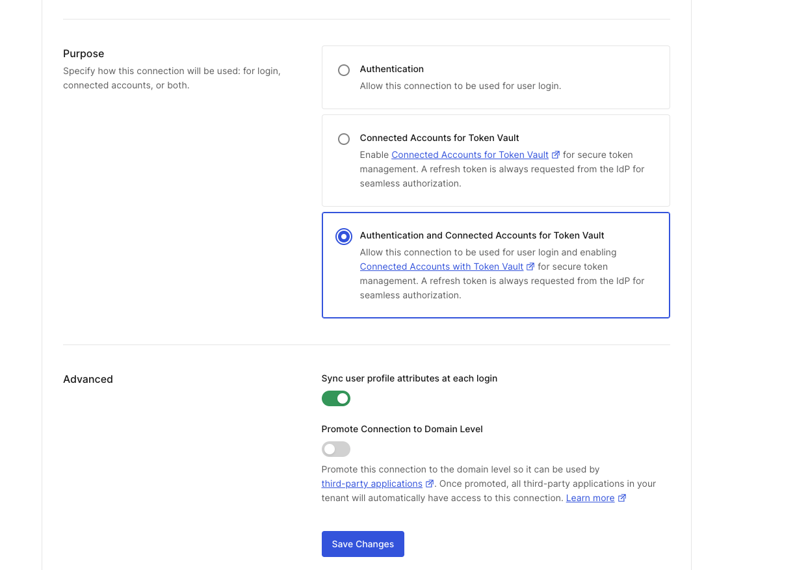
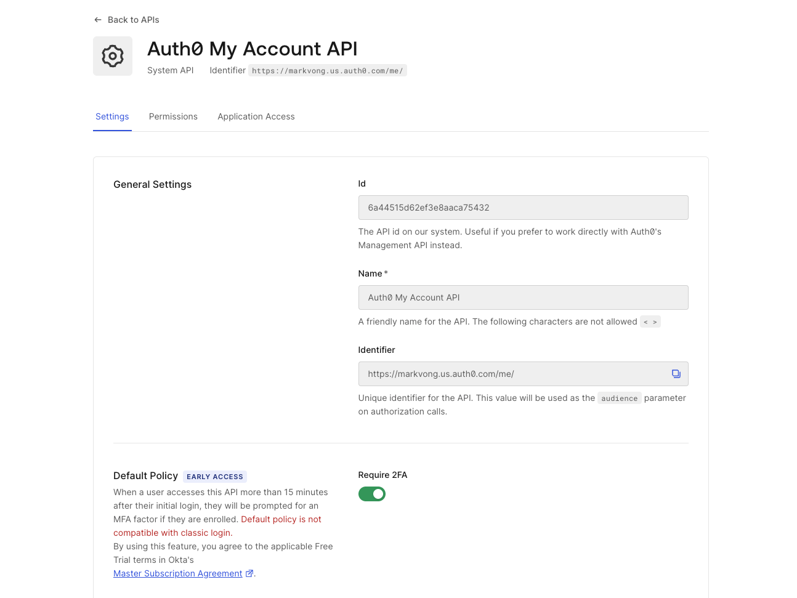
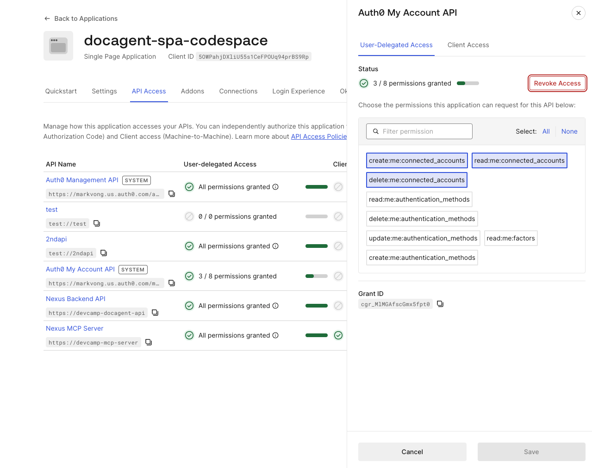

## Objective *(~25 min)*

<!-- TODO: Flow screenshot here - Agent Identity to auth0 (token vault) highlighted -->

Now that we have user and agent identities, we need Nexus to log document activity to the CRM under the user's identity.

**Token Vault** solves this.

1. Auth0 stores each user's federated credential for a connected provider.
2. Nexus then asks the vault (politely) for a short-lived, per-user access token scoped to the job at hand.
3. Nexus calls the provider's API with that token, then discards it.
4. The vault handles refresh, and the user's actual refresh token never leaves Auth0.

This module wires up the CRM, a custom OAuth2 connection, through Token Vault.

In this module, you'll:

- Understand how **getToken(userSub, provider)** selects the live Token Vault path vs. the in-memory fallback.
- See how **log_crm_activity** calls the CRM API (port 3002) using a vaulted CRM token.
- Enable Token Vault on the CRM connection in the Auth0 Dashboard.

## What's provisioned for you

- A CRM OAuth2 connection on your tenant pointing to the CRM mock running on port 3002 of your Codespace.
- **nexus-mcp-server-codespace**, the MCP server's own **Custom API Client**, linked to the Nexus MCP Server API, with the **Token Vault** grant type (Advanced Settings → Grant Types).
  - Auth0 only lets a client exchange a token at Token Vault if the client is linked to the API in that token's `aud`. Every tool call reaches the MCP server with a token for the Nexus MCP Server, from Nexus or from Acme, so the MCP server's own client is the one that can exchange it. The MCP server never borrows a caller's credentials.
- `docagent-mcp-obo`, the Custom API Client you created in *One trust boundary for every agent*, also has the Token Vault grant type by default. The Nexus backend uses it for the Connected Accounts status check in the app header, because those calls carry the employee's Nexus Agent API token.

## Codespace steps
### Make the CRM mock's port public

 1. Open the **Ports** tab in your Codespace
 2. Find port **3002**
 3. Right-click the row → **Port Visibility** → **Public**

 *You should see: the **Visibility** column for port 3002 now reads **Public**.*

<!-- TODO: screenshot - Codespace Ports tab with port 3002 set to Public -->

 Without this, clicking "Connect" fails partway through with a Content-Security-Policy error after briefly redirecting to **github.com/codespaces/auth/...**.

## Dashboard steps
### Enable Token Vault on the CRM connection
 1. Auth0 Dashboard → **Authentication → Social**
    - *You should see: the Social connections page with **crm-codespace** listed in the table.*
 2. Open **crm-codespace**
 3. Scroll down to the **Purpose** section
 4. Select **Authentication and Connected Accounts for Token Vault**
 5. Click **Save Changes**

> [!NOTE]
> *You may see an **"Offline Access Scope"** warning dialog appear at this point. This is expected.
>
> Token Vault needs a refresh token to maintain the stored credential, and this dialog is Auth0 confirming that tradeoff. Click through it to continue.*

Once turned on, Auth0 automatically requests a refresh token from the CRM on every flow, so it can maintain the stored credential without user re-authentication.



Before you enable it, the vault falls back to an in-memory mock CRM token, so the tool call still succeeds, but Auth0 isn't involved in storing the credential.

After enabling it, Auth0 stores the user's real CRM access token and refresh token, and the live federated exchange fires on every **log_crm_activity** call.

### Authorize the Nexus SPA for the Auth0 My Account API

Enabling Token Vault on the connection makes the *exchange* possible, but Auth0 still needs a refresh token, and that only gets stored once a user actually links the CRM.

That flow runs against Auth0's My Account API, so you need to activate the API on your tenant and authorize the SPA to request a token for it.

1. Auth0 Dashboard → **Applications → APIs**
2. Find the **Auth0 My Account API** card and click **Activate**



3. Auth0 Dashboard → **Applications → Applications → docagent-spa-codespace**
4. Go to the **API Access** tab
    
<!-- TODO: screenshot here -->

5. Click **Auth0 My Account API** in the list. In the panel that opens, stay on the **User-Delegated Access** tab and select scopes: `create:me:connected_accounts`, `read:me:connected_accounts`, `delete:me:connected_accounts`
6. Click **Grant Access**. This takes effect immediately. A separate **Save** button on this screen may appear grayed out. If so, there's nothing to save, and you can move on.
    - *You should see: "3 / 8 permissions granted" under User-delegated Access for Auth0 My Account API.*



Now at tool-call time, the backend asks Auth0's Token Vault for a short-lived, per-user federated access token for exactly one downstream call, preserving the user's identity.

The user's actual refresh token never leaves Auth0.

## How Token Vault is wired

### The vault: **server/token-vault/vault.js**

**getToken(userId, provider)** tries the live federated path first. If the tenant has a connection provisioned for that provider (`"crm"`) **and** Token Vault is enabled on it, it exchanges the user's access token with Auth0 to get a short-lived federated credential.

If either condition isn't met, it falls back to the in-memory mock so the lab can run offline. The fallback has a seeded fake credential for CRM.

> [!NOTE]
> The grant type here:
> **urn:auth0:params:oauth:grant-type:token-exchange:federated-connection-access-token**
> 
> is Auth0's own variant, distinct from the RFC 8693 OBO grant you used in *One trust boundary for every agent* (**urn:ietf:params:oauth:grant-type:token-exchange**).
>
> Both are token exchanges but they serve different purposes:
> - OBO preserves user identity across the agent boundary.
> - This one retrieves a stored third-party credential from Token Vault.
>
> There's also a role reversal worth noticing. In *One trust boundary for every agent*, the MCP server only validated tokens and the agent's backend did the exchanging. Here, the MCP server itself becomes a client. It exchanges the token it just validated, using its own Custom API client, for a CRM credential before calling the CRM API.
>
> **Token Vault and the `act` claim.** Both agents' tokens carry an `act` delegation chain once their clients are linked to Agent records. If your tenant refuses to exchange such a token at Token Vault, the MCP server can fall back, for the first-party agent only, to the employee's original Nexus Agent API token. It does so only after verifying that token's signature and audience, that it belongs to the same employee, and that it was issued to a client in the bearer's own `act` chain. Set `TOKEN_VAULT_FIRST_PARTY_FALLBACK=false` in `.env` to turn the fallback off and run strictly to the MCP spec's no-token-passthrough rule.

```js
// Pick the Custom API client linked to the API in the subject token's `aud`:
//   aud = Nexus MCP Server -> the MCP server's own client (MCP_SERVER_CLIENT_ID)
//   aud = Nexus Agent API  -> docagent-mcp-obo (AUTH0_OBO_CLIENT_ID)
function exchangerFor(tenant, subjectToken) { /* ... */ }

// Live path: Token Vault exchange
async function getLiveToken(userId, provider, tenant, userAccessToken) {
  const connection = connectionFor(tenant, provider); // resolves "crm" -> connection name
  const exchanger = userAccessToken ? exchangerFor(tenant, userAccessToken) : null;
  if (!connection || !userAccessToken || !tenant?.domain || !exchanger) return null;

  const response = await fetch(`https://${tenant.domain}/oauth/token`, {
    method: "POST",
    headers: { "Content-Type": "application/json" },
    body: JSON.stringify({
      grant_type: "urn:auth0:params:oauth:grant-type:token-exchange:federated-connection-access-token",
      subject_token: userAccessToken,
      subject_token_type: "urn:ietf:params:oauth:token-type:access_token",
      requested_token_type: "http://auth0.com/oauth/token-type/federated-connection-access-token",
      connection,
      client_id: exchanger.clientId,
      client_secret: exchanger.clientSecret,
    }),
  });
  // returns { token, provider } or null on failure
}
```

### The CRM API: **server/crm/app.js**

An OAuth2 authorization server and CRM activities API run on port 3002 in your Codespace.

Auth0 points the custom social connection at its **/crm/oauth/authorize** and **/crm/oauth/token** endpoints.

The CRM app signs its own JWTs and validates them on every **POST /crm/activities** call.

### The tool handler: **server/mcp/server.js**

```js
case "log_crm_activity": {
  const { action, documentId, documentTitle, notes } = args;
  // vaultSubject = { token: the bearer this server just validated, fallbackToken }
  const tokenResult = await getToken(userSub, "crm", tenant, vaultSubject);
  if (!tokenResult) {
    return { success: false, error: "No CRM account linked. Ask the user to connect their CRM." };
  }
  const apiBase = process.env.CRM_API_URL || `http://localhost:${process.env.CRM_PORT || 3002}`;
  const response = await fetch(`${apiBase}/crm/activities`, {
    method: "POST",
    headers: { Authorization: `Bearer ${tokenResult.token}`, "Content-Type": "application/json" },
    body: JSON.stringify({ action, documentId, documentTitle, notes, userId: userSub }),
  });
  if (!response.ok) return { success: false, error: `CRM API error: ${response.statusText}` };
  const data = await response.json();
  return { success: true, ...data };
}
```

> [!IMPORTANT]
> The **userId: userSub** in the request body is the user's Auth0 subject, so the CRM record is attributed to the *human*, not the *agent*.

## Checkpoint

1. Click **Connect** next to "CRM" in the app header. This runs the real Connected Accounts flow against the CRM mock and redirects you back into the app.

<!-- TODO: screenshot - app header with the CRM "Connect" button before linking -->
<!-- TODO: screenshot - app header after it's connected (Connect button replaced with connected state) -->

2. Use the **Run Checks** button on the left of the Nexus app page. The in-app verifier confirms Token Vault is enabled on the CRM connection.
3. In the **Tool Tester**, call **log_crm_activity**. It should succeed, and **/api/vault/providers** reports it as linked.

--- 

<details>
  <summary style='font-size: 1.5rem;
  font-weight: bold;
  cursor: pointer;
  user-select: none;'>
    What you learned
  </summary>

Token Vault eliminates the operational and compliance burden of shared bot tokens. Instead of managing long-lived service credentials across teams, each call is scoped to the job and the individual. Every record ties back to the employee's identity, and credential rotation becomes Auth0's responsibility.

In the lab, the vault was auto-seeded with a simulated credential on your first tool call. In production, a real employee would go through an OAuth2 consent flow the first time they link an account. Auth0 stores the resulting refresh token, and Token Vault exchanges it for short-lived access tokens on every subsequent call. Offboarding just means revoking that connection in Auth0, with no token spreadsheet to maintain.

The mechanism doesn't care who issued the credential — once a connection is configured, it's indistinguishable to `getToken` and to every downstream tool.
</details>

--- 

#### <span style="font-variant: small-caps">Congrats!</span>

*You've completed this module.*

You've successfully:

<ul>
  <li style="list-style-type:'✅ ';">
      Enabled Token Vault on the CRM connection in the Auth0 Dashboard;
  </li>
  <li style="list-style-type:'✅ '">
      Observed how <code>getToken</code> selects the live federated exchange vs. the in-memory fallback;
  </li>
  <li style="list-style-type:'✅ '">
      Logged a CRM activity attributed to the user's identity, not a shared service account;
  </li>
  <li style="list-style-type:'✅ '">
      Confirmed the record shows the user's Auth0 <code>sub</code>, not an agent client ID.
  </li>
</ul>

Per-user credentials are now handled. Now we need to worry about the agent sharing documents with external recipients without any confirmation. The next module adds the approval gate.

#### <span style="font-variant: small-caps">Let's move on to the next module!</span>
