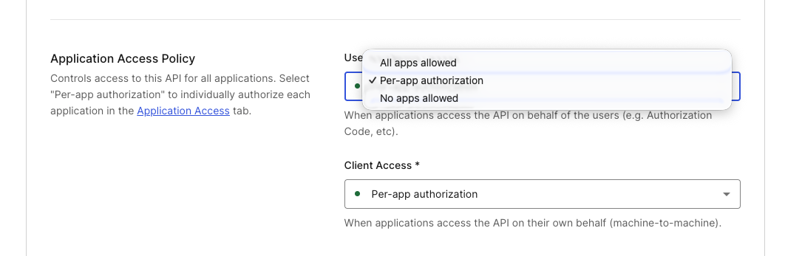
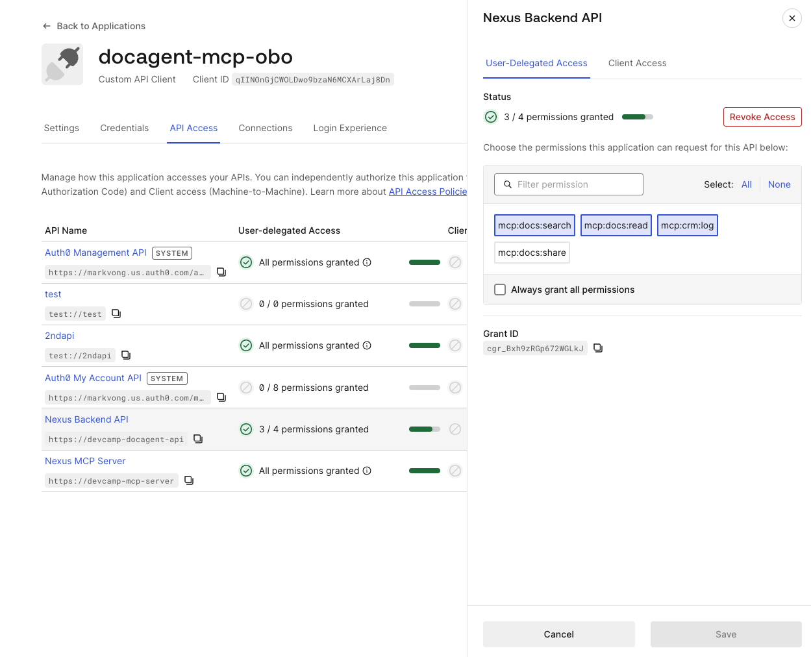
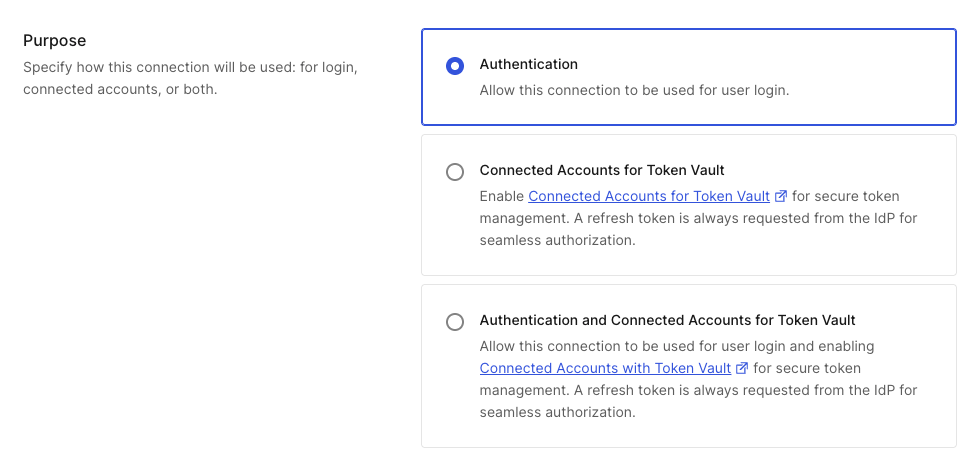

# Module 06: End-to-End

## Premise *(~15 min)*

Five core modules, five layers. This closing run drives the full Nexus workflow and confirms every control fires in one sequence.

## Objectives

- Drive Nexus through a happy-path document workflow as Alice.
- Drive a second sequence that trips CIBA (external document share).
- Run each negative test to confirm the guardrails hold.
- Read the logs and map each line to the layer that produced it.

## Prerequisites

- All Dashboard steps from Modules 01–04 completed (Token Exchange enabled, Token Vault enabled on the CRM connection, Auth0 My Account API activated and the SPA authorized for its Connected Accounts scopes, CIBA enabled at the tenant level).
- Codespace port 3002 (CRM mock) is set to **Public** visibility (see Module 03) — required for the CRM's OAuth redirect to complete.
- You have already clicked **Connect** next to "CRM" in the app header and completed the Connected Accounts link as Alice. Without this, `log_crm_activity` fails with "No CRM account linked" instead of returning a live federated token in step 7 below.
- Your tenant is provisioned, meaning the Nexus API, MCP API, SPA client, M2M client, and CRM connection are already in place.
- The app is running: API :3000, MCP :3001, CRM mock :3002, frontend :5173 (or the next available port — check the terminal output from `npm run dev` if the browser preview doesn't open automatically).
- Demo users: `alice@docagent.demo` (engineering team, editor on q3-roadmap), `bob@docagent.demo` (all-company docs only).

## Happy path: engineering document workflow

1. Log in as Alice.
2. Prompt: *"Find everything we have on the Q3 roadmap."*
3. Expected:
   - Tool call `search_documents` returns `q3-roadmap` (title "Q3 Product Roadmap", department engineering).
   - Badges on the tool card: **OBO**, **FGA**.
4. Prompt: *"Read the Q3 roadmap."*
5. Expected:
   - Tool call `get_document` with `documentId: q3-roadmap` returns full content.
   - Badges: **OBO**, **FGA**.
6. Prompt: *"Log in the CRM that I read the Q3 roadmap."*
7. Expected:
   - Tool call `log_crm_activity` triggers Token Vault to mint a CRM credential for Alice, logging the activity with her `sub`.
   - Badges: **OBO**, **Token Vault**.
   - Server log: `[Token Vault] (live) federated token for auth0|<alice-sub> @ crm`

## CIBA path: external document share

8. Prompt: *"Share the Q3 roadmap with external@partner.com."*
9. Expected: a push notification card appears in the chat — "Push notification sent — approve on your device" — showing the binding message `Approve: share Q3 Product Roadmap to external at partner.com`.
10. Approve the push on your enrolled Guardian device.
11. The UI flips; the share executes with a `sharedAt` timestamp.

## Negative tests

### FGA deny — outside department

- Log in as Bob.
- Prompt: *"Show me the Q3 roadmap."*
- Expected: `[FGA] Check: user:auth0|<bob_sub> can_read document:q3-roadmap -> DENIED`. No content returns.

### FGA deny — confidential document

- Logged in as Alice or Bob.
- Prompt: *"Find the compensation review."*
- Expected: `search_documents` returns zero results. `get_document` with `documentId: compensation-q3` returns `Access denied`.

### FGA deny — share as viewer

- Log in as Bob.
- Prompt: *"Share the employee handbook with external@partner.com."*
- A push notification card appears — approve it on your enrolled Guardian device.
- Expected after approval: `[FGA] Check: user:auth0|<bob_sub> can_share document:handbook -> DENIED`. The share is blocked at the data boundary. Bob can read the handbook but viewers do not meet `can_share`.

### CIBA timeout

- Initiate a share request. Do not approve it.
- Expected: after 300 seconds, `/api/ciba/status/:id` returns `denied` and the share is silently aborted.
- You do not need to wait the full 5 minutes — just confirm the pending state exists via `curl http://localhost:3000/api/ciba/pending`, then move on.

### Missing scope

- In the Auth0 Dashboard, go to **APIs → Nexus Backend API → Settings**, scroll to **Application Access Policy**, and set **User Access** to **Per-app authorization** (the API defaults to "All apps allowed," which grants every scope to every authorized app and makes individual scopes non-deselectable) → **Save**.

  
- Navigate to **Applications → Applications → `docagent-mcp-obo` → APIs tab → Nexus Backend API** and deselect `mcp:docs:share`.

  
- Prompt: *"Share the Q3 roadmap with external@partner.com."*
- A push notification card appears — approve it on your enrolled Guardian device.
- Expected after approval: `403 { "error": "Insufficient scope", "required": "mcp:docs:share" }`.
- Re-enable the scope when done.

### Token Vault disabled — fails closed

- In the Auth0 Dashboard, go to **Authentication → Social → crm-`{{demoName}}`** and turn off the **Authentication and Connected Accounts for Token Vault** purpose (back to plain Authentication).

  
- Prompt: *"Log in the CRM that I read the Q3 roadmap."*
- Expected: the tool call fails: `{ "success": false, "error": "No CRM account linked. Ask the user to connect their CRM." }`. The server log shows `[Token Vault] (live) exchange failed for crm: ...` right before it.
- There is no silent fallback to a mock credential here — once a real federated connection is provisioned for a user, Token Vault either returns a real per-user token or fails closed. That is the correct behavior for a production system: a missing credential should never be papered over with a fake one.
- Toggle the Token Vault purpose back on and re-confirm the Connected Accounts link (Module 03) when done.

## Reading the logs

For a single end-to-end prompt, the trace looks roughly like:

```
Authenticated request from user: auth0|<alice-sub>
[LLM] Tool call: search_documents { query: "Q3 roadmap" }
[MCP Client] Exchanging user token for MCP-scoped token...
[MCP Client] Token exchange successful -- MCP token acquired
[MCP Server] Tool call: search_documents, sub=auth0|<alice-sub>, scopes=mcp:docs:search,...
[FGA] Check: user:auth0|<alice-sub> can_read document:q3-roadmap -> ALLOWED
[MCP Server] Tool search_documents executed
```

> [!NOTE]
> `auth0|<alice-sub>` represents the full Auth0 subject identifier for alice — it will look like `auth0|65d7f2a3b4c5e6f7...`, not the email address.

The same user `sub` flows through every hop, giving you one audit key for every downstream decision.

## What you learned

Five controls are stacked behind one MCP server: MCP with CIMD, OBO, and PRM; Authentication; Token Vault; CIBA; and FGA. Each one mitigates a specific risk:

- MCP (Module 01) prevents anonymous callers and agent-framework lock-in on your authorization code.
- JWT validation (Module 02) prevents unauthenticated use and anchors every downstream decision to a person.
- Token Vault (Module 03) prevents shared-credential sprawl.
- CIBA (Module 04) prevents unilateral irreversible actions.
- FGA (Module 05) prevents cross-user document access.

The commercial payoff is substantial: a document agent that finds and shares information faster than manual workflow, with CIBA clearing every routine call silently and only interrupting a human for the irreversible share, is what driving revenue through a world-class experience looks like in practice. Because CIMD, OBO, and FGA gave you one standardized authorization layer instead of one-off logic per runtime, the next model or framework arrives without re-buying identity work — your architecture stays current instead of constantly chasing migrations. And because every decision traces back to a real employee, external shares are gated by approval, and no credential ever lived in agent memory, security review closes clean and the risk that would otherwise burden the platform team evaporates.

That is the full Nexus workshop. The implementation you just walked through is the reference pattern for production-ready AI agent identity.

#### <span style="font-variant: small-caps">Congrats!</span>

*You have completed the end-to-end run.*

You should have successfully:

<ul>
  <li style="list-style-type:'✅ ';">
      driven a full happy-path document workflow through every control;
  </li>
  <li style="list-style-type:'✅ '">
      tripped CIBA on an external share and approved it out-of-band;
  </li>
  <li style="list-style-type:'✅ '">
      run each negative test and confirmed the guardrails hold;
  </li>
  <li style="list-style-type:'✅ '">
      traced a single user <code>sub</code> through every hop in the logs.
  </li>
</ul>
