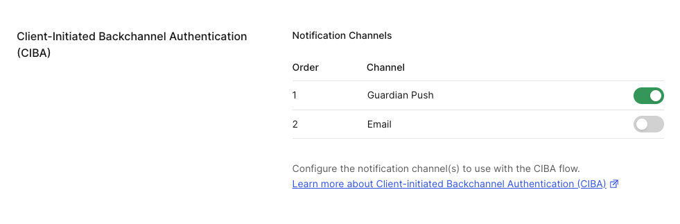

## Objective *(~30 min)*

<!-- TODO: Flow screenshot here - auth0 to user phone CIBA flow, and FGA area -->

This module closes the last two gaps, both of them add-on controls that sit inside the trust boundary you've already built:

- **Part A: Humans approve what can't be undone** wires in CIBA (Client-Initiated Backchannel Authentication), so one specific action, sharing a document with an external recipient, requires explicit employee approval before it executes. This part is hands-on: you'll validate the Guardian push configuration and trigger a real approval.
- **Part B: Access that knows where it ends** walks through Auth0 Fine-Grained Authorization (FGA), which has been enforcing document-level access silently throughout the lab. This part is **read-through only**; there's nothing to configure, you'll preview the expected behavior here and confirm it live in the end-to-end run.

---

## Part A: Humans approve what can't be undone (CIBA)

### In this part, you'll:

- Understand how **share_document** triggers CIBA before calling the MCP server.
- See how the binding message ties the push notification to the exact action being approved.
- Trigger a real Guardian push notification and watch the approval resolve the pending tool call.

### Prerequisites

- You completed all previous modules.
- The Auth0 Guardian app is installed, and your user is enrolled. This part runs the live CIBA flow end-to-end, so enrollment is required to receive the approval push.

### What's provisioned for you

- A CIBA client on your tenant (`docagent-ciba-codespace`)
  - This is a regular web app with:
    - The **urn:openid:params:grant-type:ciba** grant already enabled
    - Authorization against the Nexus Agent API (**chat:send**)
    - Authorization against the Nexus MCP Server (**mcp:docs:share**)

### Dashboard steps

#### Validate Guardian push notifications on the CIBA client

Validate Guardian push is enabled so the in-app approval request can trigger a real device notification.

1. Auth0 Dashboard → **Applications → Applications → docagent-ciba-codespace**
2. In the left-side section list, look for **Client-Initiated Backchannel Authentication (CIBA)**.
3. Validate that **Guardian Push** is turned on.



### Code steps

Once the tenant has a provisioned CIBA client:
- **initiateCIBA** calls Auth0's **/bc-authorize** directly
- **checkCIBAStatus** polls **/oauth/token** with the CIBA grant.

The state machine is Auth0's own: **pending** > **approved | denied**, with the expiry and polling interval Auth0 returns from **/bc-authorize**.

#### Step 1: the CIBA middleware

**server/middleware/ciba.js**:

```js
const CIBA_GRANT = "urn:openid:params:grant-type:ciba";
const cibaRequests = new Map();

function cibaClient(tenant) {
  const dd = tenant?.deploymentData;
  if (!dd?.ciba_client_id || !tenant?.domain) return null;
  return { domain: tenant.domain, clientId: dd.ciba_client_id, clientSecret: dd.ciba_client_secret };
}

export async function initiateCIBA(userId, userEmail, toolName, scope, bindingMessage = "", tenant) {
  const message = bindingMessage || `Approve use of ${toolName}`;
  const live = cibaClient(tenant);

  // login_hint identifies the rep to push to. Auth0 accepts an
  // iss_sub-formatted JSON hint resolved against the tenant issuer.
  const loginHint = JSON.stringify({ format: "iss_sub", iss: tenant.issuer, sub: userId });
  const body = new URLSearchParams({
    client_id: live.clientId,
    scope: `openid ${scope}`.trim(),
    binding_message: message,
    login_hint: loginHint,
  });
  if (live.clientSecret) body.set("client_secret", live.clientSecret);

  const res = await fetch(`https://${live.domain}/bc-authorize`, {
    method: "POST",
    headers: { "Content-Type": "application/x-www-form-urlencoded" },
    body,
  });
  const data = await res.json();
  cibaRequests.set(data.auth_req_id, {
    userId, toolName, status: "pending",
    authReqId: data.auth_req_id, bindingMessage: message, createdAt: Date.now(), live,
  });
  return { authReqId: data.auth_req_id, expiresIn: data.expires_in ?? 300, interval: data.interval ?? 5, bindingMessage: message };
}

export async function checkCIBAStatus(authReqId) {
  const request = cibaRequests.get(authReqId);
  if (!request) return { status: "denied" };

  // Poll Auth0 /oauth/token with the CIBA grant.
  const body = new URLSearchParams({
    grant_type: CIBA_GRANT,
    auth_req_id: authReqId,
    client_id: request.live.clientId,
  });
  if (request.live.clientSecret) body.set("client_secret", request.live.clientSecret);

  const res = await fetch(`https://${request.live.domain}/oauth/token`, {
    method: "POST",
    headers: { "Content-Type": "application/x-www-form-urlencoded" },
    body,
  });
  const data = await res.json();

  if (res.ok && data.access_token) {
    const { userId, toolName, bindingMessage } = request;
    cibaRequests.delete(authReqId);
    return { status: "approved", token: data.access_token, bindingMessage, userId, toolName };
  }
  // authorization_pending / slow_down -> still waiting on the device.
  if (data.error === "authorization_pending" || data.error === "slow_down") {
    return { status: "pending", bindingMessage: request.bindingMessage };
  }
  // access_denied / expired_token / invalid_request -> terminal.
  cibaRequests.delete(authReqId);
  return { status: "denied", bindingMessage: request.bindingMessage };
}
```

#### Step 2: the binding message

Same file, **buildDocShareBindingMessage**:

```js
export function buildDocShareBindingMessage(params) {
  const title = params.documentTitle || params.documentId || "document";
  const recipient = params.recipientEmail || "external recipient";
  // Auth0 allows only: alphanumerics, whitespace, +-_.,:#
  const safeTitle = title.replace(/[^a-zA-Z0-9 +\-_.,:#]/g, " ").trim();
  const safeRecipient = recipient.replace("@", " at ").replace(/[^a-zA-Z0-9 +\-_.,:#]/g, " ").trim();
  const msg = `Approve: share ${safeTitle} to ${safeRecipient}`;
  return msg.length > 64 ? msg.substring(0, 61) + "..." : msg;
}
```

The message sent is human-readable and surfaces exactly what the user is approving in the Guardian push notification on their device.

Auth0 restricts **binding_message** to a narrow character set, so emails and punctuation are sanitized before the **/bc-authorize** call.

#### Step 3: the **share_document** gate in the LLM path

In **server/llm.js**, when the authorization check returns **requiresConsent: true** for **share_document**, the gate fires before the tool reaches the MCP server:

```js
// checkToolAuthorization returns { authorized, requiresConsent, cibaInfo }
// when share_document is detected and no approval is in place yet.
const authResult = await checkToolAuthorization(user.sub, user.scope, toolName);

if (!authResult.authorized && authResult.requiresConsent) {
  const bindingMessage = buildDocShareBindingMessage({
    documentTitle: parameters.documentTitle,
    recipientEmail: parameters.recipientEmail,
  });
  const ciba = await initiateCIBA(user.sub, user.email, toolName, "mcp:docs:share", bindingMessage, tenant);
  return {
    message: `External sharing requires your approval. Check your device: "${bindingMessage}"`,
    pendingCIBA: { ...ciba, toolName },
  };
}
```

The same gate runs in **server/simulator.js** (the pattern-matching fallback used when the OpenAI call is unavailable), so every code path requires CIBA approval before the share executes.

#### Step 4: the CIBA endpoints

**server/index.js**:

```js
import {
  initiateCIBA, checkCIBAStatus, approveCIBA, denyCIBA, listPendingCIBA,
} from "./middleware/ciba.js";

// The binding message is built upstream (in llm.js / simulator.js) and
// forwarded in the request body so this endpoint stays generic.
app.post("/api/ciba/initiate", validateAccessToken, async (req, res) => {
  const user = extractUser(req);
  const { toolName, scope, bindingMessage } = req.body;
  const result = await initiateCIBA(
    user.sub, user.email || "", toolName, scope, bindingMessage, req.tenant
  );
  res.json(result);
});

app.get("/api/ciba/status/:authReqId", validateAccessToken, async (req, res) => {
  res.json(await checkCIBAStatus(req.params.authReqId));
});

app.post("/api/ciba/approve/:authReqId", (req, res) => {
  const success = approveCIBA(req.params.authReqId);
  res.json({ approved: success });
});

app.post("/api/ciba/deny/:authReqId", (req, res) => {
  const success = denyCIBA(req.params.authReqId);
  res.json({ denied: success });
});

app.get("/api/ciba/pending", (_req, res) => {
  res.json(listPendingCIBA());
});
```

#### Step 5: the frontend poll

In **src/hooks/useChat.js**, **startPolling** checks **/api/ciba/status/:authReqId** when **data.pendingCIBA** comes back. The binding message surfaces in the pending card (wired in **Chat.jsx**).

<!-- TODO: screenshot - pending CIBA card in chat showing binding message and "check your device" text -->
<!-- TODO: screenshot - Guardian push approval prompt on mobile device -->

### Part A checkpoint

Use the **Run Checks** button on the left of the Nexus app page. The in-app verifier confirms the CIBA grant is active on your provisioned CIBA client.

> [!NOTE]
> **Preview: you'll run this live in *Putting it all together* (End-to-End)**, once chat unlocks after Part B below.

<details>
  <summary style='font-size: 1.5rem;
  font-weight: bold;
  cursor: pointer;
  user-select: none;'>
    What you learned
  </summary>

Tool-level approvals tied to the user's device turn "agent shared a document nobody signed off on" into "user explicitly approved this share action, timestamped, with the exact document and recipient in the approval record." That audit artifact is what makes irreversible external sharing safe to automate at all. Manual review cycles would defeat the point of having an agent do this work, but CIBA lets you keep both the safety and the automation.

</details>

---

## Part B: Access that knows where it ends (FGA)

Nexus gives every user access to the company knowledge base, but not all of it.

Let's imagine that the company's policies say an engineer should read engineering documents, and someone in sales shouldn't read HR compensation data.

Role-based access control is too coarse for this problem. "Engineer" versus "HR" versus "executive" can't capture the real rules:
- Alice can read and share the Q3 roadmap because she owns it
- Bob can only read the employee handbook

Fine-grained authorization models this as relationships instead of roles:

- **user → viewer/editor/owner → document**
- **user → member → department**
- **department → viewer → document** (inherited via **department#member**)

From those relationships, FGA derives the two decisions Nexus actually needs:
1. Can this user **read** this document?
2. Can this user **share** it externally?

### What's provisioned for you

An Auth0/Okta FGA store with the authorization model already written.

Demo tuples are seeded on your first tool call so the allow and deny paths are ready to observe immediately.

> [!NOTE]
> If the tenant launches without FGA credentials, the app falls back to an in-memory tuple store with the same model and the same allow/deny behavior, so the demo still runs offline. Either way, what you observe below is identical.

--- 

### The authorization model (for reference)

**can_read** covers direct relations plus department membership, while **can_share** is tighter because only editors and owners may share:

```
type user

type department
  relations
    define member: [user]

type document
  relations
    define owner: [user]
    define editor: [user]
    define viewer: [user, department#member]
    define can_read: owner or editor or viewer
    define can_share: owner or editor
```

### The SDK operations

All three FGA operations use the **@openfga/sdk** client initialized with the tenant's FGA store and credentials.

The object format is always **type:id** and the user format is always **user:auth0_sub**.

**Write a tuple (grant access)**

```js
await fgaClient.write({
  writes: [
    { user: "user:auth0|abc123", relation: "editor", object: "document:q3-roadmap" },
  ],
});
```

**writes** is an array so multiple tuples can be created in one call. Writing a tuple that already exists is silently ignored.

**Check a relationship (authorization decision)**

```js
const { allowed } = await fgaClient.check({
  user: "user:auth0|abc123",
  relation: "can_read",
  object: "document:q3-roadmap",
});
// allowed: true | false
```

**can_read** is a computed relation: the store evaluates it against all direct and inherited paths in the model (owner, editor, viewer, department member). The call is point-in-time and non-caching.

**Delete a tuple (revoke access)**

```js
await fgaClient.write({
  deletes: [
    { user: "user:auth0|abc123", relation: "editor", object: "document:q3-roadmap" },
  ],
});
```

**writes** and **deletes** can appear in the same call for atomic grant-and-revoke operations.

### The seeded relationships

All demo users are seeded as **viewer** on **document:handbook** and **document:security-policy** (all-company public docs).

The table shows the additional tuples that differentiate alice and bob:

| User | Additional tuples | Net effect |
|---|---|---|
| **`alice@docagent.demo`** | **alice member department:engineering**, **alice editor document:q3-roadmap**, **alice editor document:product-spec-v2** | Reads all-company + all engineering docs; can share q3-roadmap and product-spec-v2 |
| **`bob@docagent.demo`** | *(no additional tuples)* | All-company docs only; denied on engineering, HR, and executive |

**document:compensation-q3** (HR) and **document:board-deck-q3** (Executive) are intentionally never seeded for demo users, so any query against them is always denied.

### Where the checks fire

FGA sits at the data boundary **inside** the MCP server you built in *Auth for MCP*.

The three tool handlers that call it are:

- **search_documents** filters results by FGA, so only documents the user can read appear in the response, regardless of the search query.
- **get_document** checks **can_read** before returning full document content.
- **share_document** checks **can_share** before proceeding, preventing viewers from sharing (only editors and owners can).

Because every check keys off the user's **sub**, the decision is always about the *human*, never the *agent*.

### What you'll observe in the end-to-end run

<!-- TODO: screenshot - Tool Logs panel showing an FGA ALLOWED/DENIED log line -->

Once chat is unlocked, open the **Tool Logs** panel on the right side of the Nexus UI and watch the FGA decision land in real time.

1. **Allow (all-company viewer).**
- Logged in as Alice:
  - `Find the security policy.`
  - FGA checks **can_read(alice, security-policy)**
  - Alice has a viewer tuple on all-company docs, so the document returns.
  - Expected log line: **[FGA] Check: user:auth0|<alice_sub> can_read document:security-policy -> ALLOWED**.

2. **Allow (department member).**
- Still Alice:
  - `Show me the Q3 roadmap.`
  - FGA resolves the path through **alice member department:engineering** and **department:engineering viewer document:q3-roadmap**
  - The content returns.
  - Expected log line: **[FGA] Check: user:auth0|<alice_sub> can_read document:q3-roadmap -> ALLOWED**.

3. **Deny (outside department).**
- Logged in as Bob:
  - `Show me the Q3 roadmap.`
  - Bob has no membership in **department:engineering** and no direct viewer tuple on **document:q3-roadmap**
  - No content returned
  - Expected log line: **[FGA] Check: user:auth0|<bob_sub> can_read document:q3-roadmap -> DENIED**.

4. **Deny (confidential).**
- Bob or Alice:
  - `Find the compensation review.`
  - Neither user has any tuple on **document:compensation-q3**.
  - Clean deny on both sides, with the document never surfacing in search results or as a retrievable ID.

5. **Share allowed for editor, denied for viewer.**
- Bob or Alice:
  - Prompt Nexus to share a document
  - **Approval Required** card first, then CIBA initiates.
  - After approval, Alice's share of **q3-roadmap** succeeds because she has an editor tuple (**[FGA] Check: user:auth0|<alice_sub> can_share document:q3-roadmap -> ALLOWED**).
  - Bob's share of **security-policy** is denied at the data boundary, since viewers don't meet the **can_share** condition, even though he can read it (**[FGA] Check: user:auth0|<bob_sub> can_share document:security-policy -> DENIED**).

### Part B checkpoint
> [!NOTE]
> This part has no **Run Checks** button. Instead, the Nexus app asks a short knowledge-check question about *why* Alice can read the Q3 roadmap and Bob can't. Answer it correctly to unlock the module.

<!-- TODO: screenshot - self-report knowledge-check question UI for this module -->

---

#### <span style="font-variant: small-caps">Congrats!</span>

*You've completed this module.*

You've successfully:

<ul>
  <li style="list-style-type:'✅ ';">
      Identified <code>share_document</code> as an irreversible action requiring out-of-band approval;
  </li>
  <li style="list-style-type:'✅ '">
      Built a human-readable binding message from the document title and recipient email, initiated a CIBA request, and approved it on your Guardian device;
  </li>
  <li style="list-style-type:'✅ '">
      Seen FGA allow a read for a direct viewer and for a department member;
  </li>
  <li style="list-style-type:'✅ '">
      Seen a clean deny when a user queries a document outside their access, and confidential documents stay invisible to all demo users;
  </li>
  <li style="list-style-type:'✅ '">
      Understood that <code>can_share</code> is stricter than <code>can_read</code>, and why.
  </li>
</ul>

Irreversible actions are gated and document-level access is enforced. Every control is now in place. The next module runs the full end-to-end flow.

#### <span style="font-variant: small-caps">Let's move on to the next module!</span>
