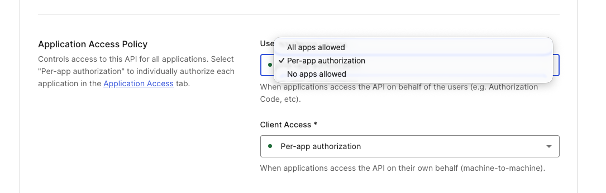
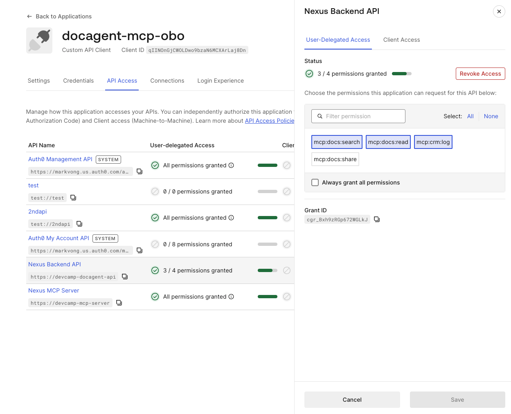
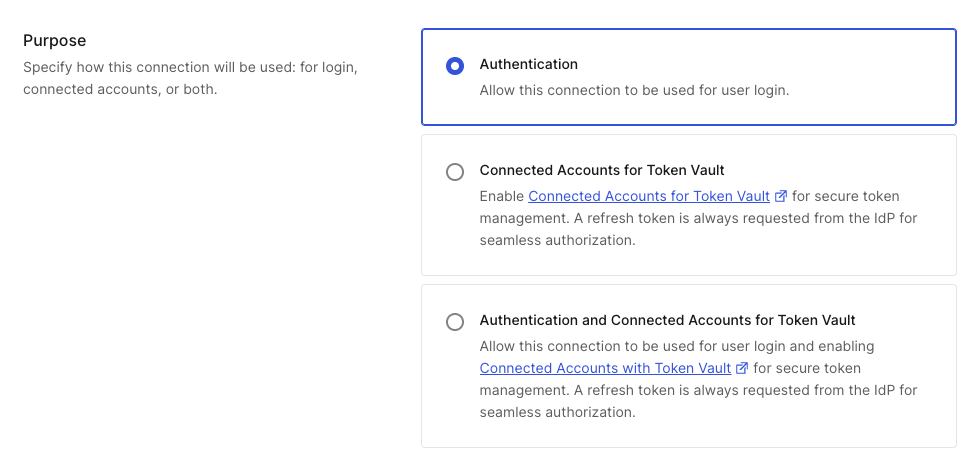

## Objectives *(~20 min)*

- Drive Nexus through a happy-path document workflow as Alice.
- Drive a second sequence that trips CIBA (external document share).
- Run each negative test to confirm the guardrails hold.
- Read the logs and map each line to the layer that produced it.

## Prerequisites

- All steps from all previous modules are completed.
- Codespace port 3002 (CRM mock) is set to **Public** visibility, required for the CRM's OAuth redirect to complete.
- You have already clicked **Connect** next to "CRM" in the app header and completed the Connected Accounts link as Alice. Without this,**log_crm_activity** fails with "No CRM account linked" instead of returning a live federated token in step 7 below.
- Demo users: **`alice@docagent.demo`** (engineering team, editor on q3-roadmap), **`bob@docagent.demo`** (all-company docs only).

## Reading the logs

For a single end-to-end prompt, the trace looks roughly like:

```
Authenticated request from user: auth0|<alice-sub>
[LLM] Tool call: search_documents { query: "Q3 roadmap" }
[MCP Client] Exchanging user token for MCP-scoped token...
[MCP Client] Token exchange successful -- MCP token acquired
[MCP Server] Tool call: search_documents, sub=auth0|<alice-sub>, scopes=mcp:docs:search,...
[FGA] Check: user:auth0|<alice-sub> can_read document:q3-roadmap -> ALLOWED
[MCP Server] Tool search_documents executed
```

> [!NOTE]
> **auth0|<alice-sub>** represents the full Auth0 subject identifier for alice. It will look like **auth0|65d7f2a3b4c5e6f7...** rather than the email address.

The same user **sub** flows through every hop, giving you one audit key for every downstream decision.
- All **'Server logs'** Will be in your codespaces terminal
- For every prompt below, open the **Tool Logs** panel on the right side of the Nexus UI first. It shows the exact tool call the agent made, which is the fastest way to confirm you got the expected result instead of parsing the chat reply text alone.

## Happy path: engineering document workflow

1. Log in as Alice (**`alice@docagent.demo`** / **`DevCamp1!`**).
2. Prompt: `Find everything we have on the Q3 roadmap.`
  - Expected:
    - Tool call **search_documents** returns **q3-roadmap** (title "Q3 Product Roadmap", department engineering).
    - Badges on the tool card: **OBO**, **FGA**.
3. Prompt: `Read the Q3 roadmap.`
  - Expected:
    - Tool call **get_document** with **documentId: q3-roadmap** returns full content.
    - Badges: **OBO**, **FGA**.
4. Prompt: `Log in the CRM that I read the Q3 roadmap.`
  - Expected:
    - Tool call **log_crm_activity** triggers Token Vault to mint a CRM credential for Alice, logging the activity with her **sub**.
    - Badges: **OBO**, **Token Vault**.
    - Server log: **[Token Vault] (live) federated token for auth0|<alice-sub> @ crm**

## CIBA path: external document share

1. Prompt: `Share the Q3 roadmap with external@partner.com.`
  - Expected: 
    - Push notification card appears in the chat reading "Push notification sent Approve on your device" and showing the binding message **Approve: share Q3 Product Roadmap to external at partner.com**.
2. Approve the push on your enrolled Guardian device.
3. The UI flips; the share executes with a **sharedAt** timestamp.

## Negative tests

### FGA deny: outside department

1. Log in as Bob (**`bob@docagent.demo`** / **`DevCamp1!`**). You might be required to setup Guardian if you haven't already.
2. Prompt: `Show me the Q3 roadmap.` (Clicking the **Find the Q3 roadmap** suggestion chip also works, but routes to a different tool, per the note below.)
- Expected: 
  - Server log: **[FGA] Check: user:auth0|<bob_sub> can_read document:q3-roadmap -> DENIED**. No content returns.

> [!NOTE]
> Depending on the exact wording, this can route to either **get_document** or **search_documents**, and they handle denial differently by design. When you call **get_document** (triggered by "show", "open", "read", etc. plus a specific document name), it returns an explicit **{ success: false, error: "Access denied..." }** and logs the **DENIED** line. When you call **search_documents** (triggered by "find", "search", or the **Find the Q3 roadmap** chip), it never returns an explicit error. Instead, it silently filters denied documents out of the results, so you see **{ success: true, results: [], total: 0 }** with no "Access denied" message.
>
> This difference is intentional. A search that explicitly denies a match would leak information to Bob by confirming that a document exists matching his query. He would only know it's one he cannot access. By filtering silently, "nothing found" becomes indistinguishable from "nothing exists," which protects information without surfacing an error. **get_document**, by contrast, is asking for one specific, named resource. A clear explicit denial on a known, named document does not disclose anything Bob did not already know to ask for.

### FGA deny: confidential document

1. Logged in as Alice or Bob.
2. Prompt: `Find the compensation review.`
- Expected: **search_documents** returns zero results (**{ success: true, results: [], total: 0 }**, same silent-filtering behavior as above, no explicit error).
- To see the explicit **get_document** denial for the same document, either prompt *"Show me the compensation review"* instead, or open the **Tool Tester** tab and call **get_document** directly with **documentId: compensation-q3**.
- Expected there: **{ success: false, error: "Access denied..." }** and an **[FGA] Check: ... can_read document:compensation-q3 -> DENIED** log line on the server.

### FGA deny: share as viewer

1. Log in as Bob (**`bob@docagent.demo`** / **`DevCamp1!`**).
2. Prompt: `Share the employee handbook with external@partner.com`
3. A push notification card appears. Approve it on your enrolled Guardian device.
  - Expected server log after approval: **[FGA] Check: user:auth0|<bob_sub> can_share document:handbook -> DENIED**. 
  - The share is blocked at the data boundary. Bob can read the handbook but viewers do not meet **can_share**.

### CIBA timeout

1. Initiate a share request as before, but do not approve it.
  - Expected: after 300 seconds, **/api/ciba/status/:id** returns **denied** and the share is silently aborted.

>[!TIP]  
> You do not need to wait the full 5 minutes. Just confirm the pending state exists by runnin this in the codespaces terminal `curl http://localhost:3000/api/ciba/pending`, then move on.

### Missing scope

- In the Auth0 Dashboard, go to **APIs > Nexus Backend API > Settings**, scroll to **Application Access Policy**, and set **User Access** to **Per-app authorization** > **Save**
- You need to do this because the API defaults to "All apps allowed," which grants every scope to every authorized app and makes individual scopes non-deselectable 



- Navigate to **Applications > Applications > `docagent-mcp-obo` > APIs tab > Nexus Backend API** and deselect **mcp:docs:share**.



- Prompt: `Share the Q3 roadmap with external@partner.com`
- A push notification card appears. Approve it on your enrolled Guardian device.
- Expected after approval: **403 { "error": "Insufficient scope", "required": "mcp:docs:share" }**.
- If the share still succeeds, the OBO-scoped token from an earlier call may still be cached (it's cached for up to 5 minutes). Wait a few minutes and retry, or restart the dev server to force a fresh token exchange.
- Re-enable the scope when done.

### Token Vault disabled: fails closed

- In the Auth0 Dashboard, go to **Authentication > Social > crm-`{{demoName}}`** and turn off the **Authentication and Connected Accounts for Token Vault** purpose (back to plain Authentication).

  
- Prompt: `Log that I read the Q3 roadmap in the CRM.`
- Expected: the tool call fails: **{ "success": false, "error": "CRM connection does not allow API access (it's set to authentication-only). Ask the user to enable API access for this connection, or reconnect via Connected Accounts." }**. The server log shows **[Token Vault] (live) exchange failed for crm: ...** right before it.
- This is a real deny, not a fallback: once a real federated connection exists for a user, Auth0 rejecting the exchange is treated as a hard denial and surfaces as this specific error. It never silently succeeds via the in-memory mock credential, which only exists for the fully-offline case where no live connection is provisioned at all. A missing or disabled credential should never be papered over with a fake one.
- Toggle the Token Vault purpose back on and re-confirm the Connected Accounts link (*The agent acts as the employee, not a shared bot*) when done.

## What you learned

Five controls are stacked behind one MCP server: MCP with CIMD, OBO, and PRM; Authentication; Token Vault; CIBA; and FGA. Each one mitigates a specific risk:

- MCP, from *One trust boundary for every agent*, prevents anonymous callers and agent-framework lock-in on your authorization code.
- JWT validation, from *Every agent action has an owner*, prevents unauthenticated use and anchors every downstream decision to a person.
- Token Vault, from *The agent acts as the employee, not a shared bot*, prevents shared-credential sprawl.
- CIBA, from *Humans approve what can't be undone*, prevents unilateral irreversible actions.
- FGA, from *Access that knows where it ends*, prevents cross-user document access.

The commercial payoff is substantial. A document agent that finds and shares information faster than manual workflow, with CIBA clearing every routine call silently and only interrupting a human for the irreversible share, drives revenue through a world-class experience. Because CIMD, OBO, and FGA gave you one standardized authorization layer instead of one-off logic per runtime, the next model or framework arrives without re-buying identity work. Your architecture stays current instead of constantly chasing migrations. Because every decision traces back to a real employee, external shares are gated by approval, and no credential ever lived in agent memory, security review closes clean. The risk that would otherwise burden the platform team evaporates.

That is the full Nexus workshop. The implementation you just walked through is the reference pattern for production-ready AI agent identity.

#### <span style="font-variant: small-caps">Congrats!</span>

*You have completed the end-to-end run.*

You should have successfully:

<ul>
  <li style="list-style-type:'✅ ';">
      Driven a full happy-path document workflow through every control;
  </li>
  <li style="list-style-type:'✅ '">
      Tripped CIBA on an external share and approved it out-of-band;
  </li>
  <li style="list-style-type:'✅ '">
      Run each negative test and confirmed the guardrails hold;
  </li>
  <li style="list-style-type:'✅ '">
      Traced a single user <code>sub</code> through every hop in the logs.
  </li>
</ul>
